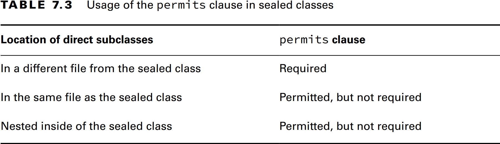
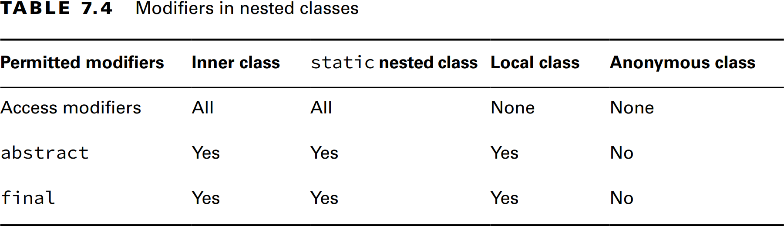
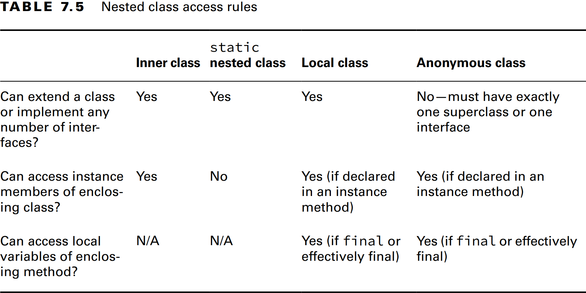

### _Chapter 07: Beyond Classes_

---
### `Interfaces`
- _Implicit Modifiers_
1. _Interface_'ler implicit olarak **abstract**'tır.
2. _Interface_ değişkenleri implicit olarak **public**, **static** ve **final**'dır.
3. Gövdesi olmayan _Interface_ metholdarı implicit olarak **abstract**'tır.
4. **private** olmayan _Interface_ methodları implicit olarak **public**'tir.
5. _Interface_ değişkenleri varsayılan olarak **public static final**'dır. Bu yüzden değişkenlerde **public** dışına bir
   _access modifier_ kullanılamaz.
6. **final** anahtar kelimesi _Interface_ içerisinde sadece değişkenler ile kullanılabilir. Methodlar ile birlikte 
   kullanılamaz.
7. Methodlar sadece **public** ve **private** _access modifier_ alabilirler.
```java
public interface Soar {
    int MAX_HEIGHT = 10;
    boolean UNDERWATER = true;
    void fly(int speed);
    void takeoff();
    double dive();

    default void move() {
        System.out.println("This is a default method");
    }

    static void ok() {
        System.out.println("This is a static method");
    }

    private void info() {
        System.out.println("This is a private method");
    }
}

// 1. Kural
public abstract interface Soar {
    // 2. Kural   
    public static final int MAX_HEIGHT = 10;
    public final static boolean UNDERWATER = true;

    // 3. Kural
    public abstract void fly(int speed);
    public abstract void takeoff();
    public abstract double dive();

    // 4. Kural
    public default void move() {
        System.out.println("This is a default method");
    }

    public static void ok() {
        System.out.println("This is a static method");
    }

    private void info() {
        System.out.println("This is a private method");
    }
}
```

---
- _**default** Interface Method Kuralları_
1. **default** methodlar sadece **interface**'ler içerisinde tanımlanabilirler.
2. **default** method **default** anahtar kelimesi ile işaretlenmeli ve method gövdesi olmalı.
3. **default** method implicit olarak **public**'tir
4. **default** method **abstract**, **final** veya **static** olarak işaretlenemezler.
5. **default** method **interface**'i uygulayan sınıf tarafından _override_ edilebilir.
6. Eğer bir sınıf aynı method imzasına sahip iki veya daha fazla **default** method'u uygularsa, kalıtan sınıf methodu
   mutlaka _override_ etmeli.

---
- _**static** Interface Methodları_
1. **static** method **static** anahtar kelimesi ile işaretlenmeli ve method gövdesi olmalıdır.
2. **static** methodun _access modifier_'ı yoksa implicit olarak **public**'tir.
3. **static** method **abstract** veya **final** olarak işaretlenemez.
   - _Not: **class** içerisinde bulunan **static** method **final** olarak işaretlenebilir._
4. **static** method miras alınamaz. Arayüzü uygulayan bir sınıfta **interface** adı olmadan erişilemez.
```java
public interface Hop {
    static int getJumpHeight() {
        return 8;
    }
}
```
- _getJumpHeight()_ methodu implicit olarak **public**'tir.

```java
public class Skip {
    public int skip() {
        return Hop.getJumpHeight();
    }
}

public class Bunny implements Hop {
    public void printDetails() {
        System.out.println(getJumpHeight()); // DOES NOT COMPILE
        System.out.println(Hop.getJumpHeight());
    }
}
```
- Interface methoduna **interface** ismi ile erişebilir. Kalıtan sınıf bile olsa **interface** ismi kullanılmalıdır.
  - _Not: **class** içerisinde bulunan **static** method kalıtan sınıf tarafından sınıf ismi belirtilmeden doğrudan 
  kullanılabilir._
  ```java
  class Skip {
    public static int skip() {
        return Hop.getJumpHeight();
    }
  }

  class Bunny extends Skip {
      public void printDetails() {
          System.out.println(skip());
      }
  }
  ```

---
### `Enums`
- Her **enum** değeri _JVM_ üzerinde sadece bir kez başlatılır. Bu yüzden _equals()_ ve _==_ ile karşılaştırma yapılabilir.
- **enum** sınıfı başka bir sınıfı **extends** edemez ve hiçbir sınıf **enum** sınıfını **extends** edemez.
- **enum** sınıfı bir **interface**'i **implements** edebilir.
- Tüm **enum** _constructor_'ları implicit olarak **private**'dır.

```java
enum Season {
    WINTER, SPRING, SUMMER, FALL;
}
```

- _Enums_' lar ve _**switch** Statements_

```java
Season summer = Season.SUMMER;
var message = switch (summer) {
    case Season.WINTER -> "Get out the sled!"; // DOES NOT COMPILE
    case SUMMER -> "It is summer";
    case 0 -> "Time for the poll";             // DOES NOT COMPILE
    default -> "Is it summer yet?";
}
```

- _Enum_ sınıfının herhangi bir değeri ilk kez çağrıldığında Java tüm _enum_ değerlerini yükler. Sonraki çağrımlarda Java zaten 
  yüklenmiş olan _enum_ değerlerini döndürür.
  - _Enum_ sınıfı içerisinde _main()_ method çalıştırılırsa Java yine tüm _enum_ değerlerini yükler.
```java
enum NumberEnum {
    ONE(1),
    TWO(2),
    THREE(3);

    private NumberEnum(int number) {
        System.out.println("This is " + number);
    }
}

public class Test {
    public static void main(String[] args) {
        NumberEnum one = NumberEnum.ONE;      // This is 1
        NumberEnum two = NumberEnum.TWO;      // This is 2
        NumberEnum three = NumberEnum.THREE;  // This is 3

        NumberEnum one1 = NumberEnum.ONE;     // Hiç bir şey bastırmaz. JVM üzerinde yüklü olan mevcut enum değeri kullanılır.
        NumberEnum two1 = NumberEnum.TWO;     // Hiç bir şey bastırmaz. JVM üzerinde yüklü olan mevcut enum değeri kullanılır.
        NumberEnum three1 = NumberEnum.THREE; // Hiç bir şey bastırmaz. JVM üzerinde yüklü olan mevcut enum değeri kullanılır.
    }
}
```

- **enum** sınıfı bir **interface**'i **implements** edebilir.
- _Enum_ sınıfı içerisinde _concrete_ bir method tanımlanabilir.
- _Enum_ sınıfı içerisinde **abstract** method tanımlanabilir.
- Eğer _enum_ sınıfı içerisinde **abstract** bir method tanımlanırsa ve bir **interface**'i **implements** ederse 
  mevcut _soyut method_'ların mutlaka gövdesini yazmalıdır.
```java
public interface Weather {
    // Tüm enum değerleri bu methoda gövde vermek zorunda.
    double getAverageTemperature();
}

public enum Season implements Weather {
    WINTER(101) {
        @Override
        public String getHours() {
            return "10am-3pm";
        }

        @Override
        public String getRules() {
            return super.getRules() + " plus extra winter rules";
        }

        @Override
        public double getAverageTemperature() {
            return -12.5;
        }
    },
    SPRING(102) {
        @Override
        public String getHours() {
            return "9am-7pm";
        }

        @Override
        public double getAverageTemperature() {
            return 8.7;
        }
    },
    SUMMER(103) {
        @Override
        public String getHours() {
            return "9am-7pm";
        }

        @Override
        public double getAverageTemperature() {
            return 33.5;
        }
    },
    FALL(104) {
        @Override
        public String getHours() {
            return "9am-5pm";
        }

        @Override
        public double getAverageTemperature() {
            return 17.9;
        }
    };


    private final int code;

    Season(int code) {
        this.code = code;
    }

    // Tüm enum değerleri bu methoda gövde vermek zorunda.
    public abstract String getHours();

    // Tüm enum değerleri bu methoda gövde vermek zorunda değil.
    public String getRules() {
        return "Be careful!";
    }
}
```

```java
enum Season implements Weather {
    WINTER, SPRING, SUMMER, FALL;

    public String getHours() {
        return "9am-5pm";
    }
    
    public String getRules() {
        return "Be careful!";
    }

    public double getAverageTemperature() {
        return 30;
    }
}
```


---
### `Sealing Classes`
**_Sealed_ Sınıf Oluşturma**
  - **permits** listesinde olan her sınıf **sealed** sınıfı **extends** etmelidir.
  - **sealed** ifadesi ve **abstract** anahtar kelimesi yaygın olarak birlikte kullanılır fakat zorunlu değildir.
  - **sealed** sınıfı doğrudan kalıtan sınıflar mutlaka **final**, **sealed** veya **non-sealed** ifadelerinden
    birini mutlaka kullanmalıdır.
  - **sealed** sınıflar ile onu kalıtan _subclass_'ları aynı paket veya aynı _named module_ içerisinde olmalıdır. 
```java
public abstract sealed class Bear permits Kodiak, Panda {
}

public final class Kodiak extends Bear {
}

public non-sealed class Panda extends Bear {
}
```

**_Subclass Modifier_ Belirleme**
- **sealed** sınıfı doğrudan kalıtan sınıflar mutlaka **final**, **sealed** veya **non-sealed** ifadelerinden
birini mutlaka kullanmalıdır.


- A **final** Subclass
```java
public sealed class Antelope permits Gazelle {}

public final class Gazelle extends Antelope {}

public class George extends Gazelle {} // DOES NOT COMPILE
```

- A **sealed** Subclass
```java
public sealed class Mammal permits Equine {}

public sealed class Equine extends Mammal permits Zebra {}

public final class Zebra extends Equine {}
```

- A **non-sealed** Subclass
```java
public sealed class Wolf permits Timber {}

public non-sealed class Timber extends Wolf {}

public class MyWolf extends Timber {}

public class MyFurryWolf extends MyWolf {}
```

**Omitting the permits Clause**
- **permits** ifadesini kullanmak her zaman zorunlu değildir.
  - Eğer **sealed** sınıf ve onu kalıtan alt sınıf aynı _.java_ dosyası içerisinde ise kullanmak opsiyoneldir.
```java
public sealed class Snake /*permits Cobra*/ {}

final class Cobra extends Snake {}
```
  - **permits** ifadesi _nested_ alt sınıflar içinde opsiyoneldir.
```java
public sealed class Snake /*permits Snake.Cobra*/ {
    final class Cobra extends Snake {}
}
```

- Eğer aynı sınıf dosyası içerisinde bile olsa, bir _child_ sınıf **permits** listesine eklenirse diğer tüm _child_ 
  sınıflarda **permits** listesine eklenmeli.
```java
public sealed class Snake permits Cobra, /*Python*/ {}

final class Cobra extends Snake {}
non-sealed class Python extends Snake {} // DOES NOT COMPILE
```

_**Table 7.3** Usage of the permits clause in sealed classes_



### `Sealing Interfaces`
```java
public sealed interface Swims permits Duck, Swan, Floats {}

public final class Duck implements Swims {}

public final class Swan implements Swims {}

// Interface permitted to extend sealed interface
public non-sealed interface Floats extends Swims {}
```
> _Note: _Interface_'ler implicit olarak **abstract**'tır. Bu yüzden **sealed interface**'i **implements** eden 
> bir **interface** sadece **sealed** ve **non-sealed** ifadeleri ile işaretlenebilir._

**Sealed Sınıf Kuralları**
1. _Sealed_ sınıf **sealed** ve **permits** ifadeleri ile birlikte tanımlanır.
2. _Sealed_ sınıflar doğrudan alt sınıflarıyla aynı pakette veya _named module_'de bildirilmelidir.
3. _Sealed_ sınıfın doğrudan alt sınıfları **final**, **sealed** veya **non-sealed** ile işaretlenmelidir.
4. _Sealed_ sınıf ile doğrudan alt sınıfları aynı dosya içerisindeyse veya alt sınıf _nested_ ise **permits** opsiyoneldir.
5. _Interface_'ler **sealed** olarak tanımlanabilirler.

---
### `Records`
```java
public record Crane() {}

public record Crane(int numberEggs, String name) {}

Crane mommy = new Crane(4, "Cammy");
System.out.println(mommy.numberEggs()); // 4 
System.out.println(mommy.name());       // Cammy
System.out.println(mommy);              // Crane[numberEggs=4, name=Cammy]
```

- **Record'lara Otomatik Eklenen Alanlar**
1. **Constructor**
2. **Access method**
3. **equals()**
4. **hashCode()**
5. **toString()**

```java
Crane mommy = new Crane(4, "Cammy");

Crane mommyCopy = new Crane(4, "Cammy");
System.out.println(mommyCopy);                                      // Crane[numberEggs=4, name=Cammy]
System.out.println(mommyCopy.equals(mommy));                        // true
System.out.println(mommyCopy.hashCode() + ", " + mommy.hashCode()); // 64874007, 64874007
```

- **record**'lar ve **record** fieldları implicit olarak **final**'dir. Yani kalıtılamazlar.
```java
public record BlueCrane() extends Crane {} // DOES NOT COMPILE
```

- **record**'lar başka bir sınıfı kalıtamaz.
```java
public class Dobby {}

public record BlueCrane() extends Dobby {} // DOES NOT COMPILE
```

- **record**'lar başka bir **interface**'i **implements** edebilirler.
```java
public interface Bird {}

public record Crane(int numberEggs, String name) implements Bird {}
```
**Constructor Oluşturma**
- **Long (Canonical) Constructor**
  - Tüm fieldlar implicit olarak **final**'dır. Bu yüzden tün fieldlara değer atanmalıdır.
```java
public record Crane(int numberEggs, String name) {
    // Long constructor
    public Crane(int numberEggs, String name) {
        this.numberEggs = numberEggs;
        this.name = name;
    }
}

public record Crane(int numberEggs, String name) {
    public Crane(int numberEggs, String name) {} // DOES NOT COMPILE
}
```

- **Compact Constructor**
    - Özel bir _constructor_ tipidir. Hiç parametre almaz. _Record_'un aldığı parametreleri dönüştürmek veya
      valide etmek için kullanılır.
```java
public record Crane(int numberEggs, String name) {
    public Crane{
        if (numberEggs < 0) {
            throw new IllegalArgumentException();
        }
        // this.name = name.toUpperCase(); // DOES NOT COMPILE
        name = name.toUpperCase();
    }
}
```

- **Overloaded Constructor**
    - _Overloaded Constructor_ **this()** ile başka bir _constructor_'u çağırmalıdır.
```java
public record Crane(int numberEggs, String name) {
    public Crane(String firstName, String lastName) {
        this(0, firstName, lastName);
    }

    public Crane(int numberEggs, String firstName, String lastName) {
        this(numberEggs, firstName + " " + lastName);
        numberEggs = 10;      // NO EFFECT
        this.numberEggs = 20; // DOES NOT COMPILE
    }
}
```

- **Customizing Records**
    - Long, Overloaded ve Compact constructor oluşturabiliriz.
    - Accessors, _equals()_, _hashCode()_, _toString()_ methodlarını override edebiliriz.
    - Accessors methodları override ettiğimizde _@Override_ anotasyonunu kullanabiliriz.
    - **static** değişken tanımlayabiliriz.
    - _instance_ değişken tanımlayamayız. (**private** olsa bile)
    - _instance initializer block_ tanımlayamayız.
```java
public record Crane(int numberEggs, String name) {
    private static int type = 10;
    public int size;          // DOES NOT COMPILE
    private boolean friendly; // DOES NOT COMPILE
    { size = 10; }            // DOES NOT COMPILE

    @Override
    public int numberEggs() {
        return 10;
    }

    @Override
    public String toString() {
        return name;
    }
}
```

---
### `Nested Classes`
- Başka bir sınıfın içinde tanımlanan sınıflara _nested class_ denir.
- 4 tip _nested class_ vardır.
  1. **_Inner class_**: _class member_ seviyesinde **static** olmayan bir sınıftır.
  2. **_Static nested class_**: _class member_ seviyesinde **static** bir sınıftır.
  3. **_Local class_**: Method içerisinde tanımlanmış bir sınıftır.
  4. **_Anonymous class_**: İsmi olyan bir _local class_'ın özel durumudur.


- **Inner Class**
  - Member level.
  - Enclosing sınıfın nesnesi olmadan enclosing sınıf dışında nesnesi yaratılamaz.
  - **public**, **protected**, _package_ veya **private** olarak tanımlanabilir.
  - **abstract** veya **final** olarak işaretlenebilir.
  - Başka bir **class** veya **interface**'i kalıtabilir.
  - _Outer class_'ın **private** dahil tüm üyelerine erişebilir.
```java
public class Home {
    private String greeting = "hi";

    protected class Room {
        public int repeat = 3;

        public void enter() {
            for (int i = 0; i < repeat; i++) {
                greet(greeting);
            }
        }

        private static void greet(String message) {
            System.out.println(message);
        }
    }

    public void enterRoom() {
        var room = new Room();
        room.enter();
    }

    public static void main(String[] args) {
        new Home().enterRoom();
    }
}
```

- _Inner Class Nesnesi Oluşturmak_
```java
public class Test {
    public static void main(String[] args) {
        Home.Room room = new Home().new Room();
        room.enter();

        var home = new Home();
        Home.Room room1 = home.new Room();
        room1.enter();
    }
}
```

- _Inner Class Üyelerine Ulaşmak_
  - _Inner class_ dış sınıfın üyeleri ile aynı isimde değişken tanımlayabilir.
```java
public class A {
    private int x = 10;

    class B {
        private int x = 20;

        class C {
            private int x = 30;

            public void allTheX() {
                System.out.println(x);        // 30
                System.out.println(this.x);   // 30
                System.out.println(B.this.x); // 20
                System.out.println(A.this.x); // 10
            }
        }
    }

    public static void main(String[] args) {
        A a = new A();
        A.B b = a.new B();
        A.B.C c = b.new C();
        c.allTheX();

        A a = new A();
        B b = a.new B();   // OK çünkü B sınıf seviyesinde
        B.C c = b.new C(); // Java C'nin nerde olduğunu bilmiyor. Bu yüzden B.C'e ihtiyaç var
        c.allTheX();
    }
}
```
> - Inner class için instance gerekir. Inner sınıfları static methodlar içerisinden doğrudan erişemeyiz. Çünkü bu sınıflar
> nesneye bağlı sınıfa değil.
> ```java
> public class Fox {
>     private class Den {
>     }
> 
>     public void goHome() {
>         new Den(); // OK
>     }
> 
>     public static void visitFriend() {
>         new Den();           // DOES NOT COMPILE
>         new Fox().new Den(); // OK
>     }
> }
> 
> class Squirrel {
>     public void visitFox() {
>         new Den();           // DOES NOT COMPILE
>         new Fox().new Den(); // DOES NOT COMPILE
>     }
> }
> ```

- **_static_ Nested Class**
  - Member level.
  - _Enclosing_ sınıfın nesnesi olmadan nesnesi yaratılabilir.
  - _Outer sınıf_'ın instance değişken ve methodlarına erişemez.
  - **public**, **protected**, _package_ veya **private** olarak tanımlanabilir.
  - **abstract** veya **final** olarak işaretlenebilir.
  - Başka bir **class** veya **interface**'i kalıtabilir.
  
```java
public class Park {
    private abstract static class Horse {
    }
    
    public static class Ride extends Horse {
        private final int price = 6;

        public int getPrice() {
            return price;
        }
    }

    public static void main(String[] args) {
        var ride = new Ride();
        System.out.println(ride.price);
    }
}

class Test {
    public static void main(String[] args) {
        Park.Ride ride = new Park.Ride();
        System.out.println(ride.getPrice());
    }
}
```

- **Local Class**
  - Method, initializer block veya constructor içinde tanımlanabilir.
  - Tanımlandığı blok içerisinde geçerlidir. Blok tamamlandığında kullanım dışıdır.
  - _Access modifier_ alamaz.
  - **final** veya **abstract** olarak işaretlenebilir.
  - Instance method içerisinde tanımlanırsa enclosing sınıfın tüm alan ve methodlarına erişebilir.
  - **final** ve _effectively final_ olan lokal değişkenlere erişebilirler.
```java
public class PrintNumbers {
    private int length = 5;

    private void print(int result) {
        System.out.println(result);
    }

    public void calculate() {
        final int width = 20;

        class Calculator {
            public int multiply() {
                return length * width;
            }
        }

        var calculator = new Calculator();
        print(calculator.multiply());
    }

    public static void main(String[] args) {
        PrintNumbers printer = new PrintNumbers();
        printer.calculate(); // 100
    }
}
```
> Java her bir _inner class_ için ayrı bir _.class_ doyası oluşturur. Eğer lokal değişkenler **final** veya
> _effectively final_ ise Java o değişkenleri basitçe kopyalayıp yeni sınıfı oluşturur.
> ```java
> public void processData(int initial) {
>   final int length = 5;
>   int width = 10;
>   int height = 2;
> 
>   class VolumeCalculator {
>     public int multiply() {
>       return initial * length * width * height; // DOES NOT COMPILE
>     }
>   }
>   // Not compile because of width
>   // not final or effectively final
>   width = 2;
> }
> ```

- **Anonymous Class**
  - _Local class_'ın özel bir türü.
  - Bir **class**'ı veya **interface**'i kalıtmak zorunda.
  - _Interface_ ile **class** arasında ki fark; **interface**'in tüm methodları varsayılan olarak **public**.
  - _Anonim sınıf_ method dışında da tanımlanabilir.
```java
// Soyut sınıf örnek
public class ZooGiftShop {
    abstract class SaleTodayOnly {
        protected abstract int dollarsOff();
    }

    public int admission(int basePrice) {
        var sale = new SaleTodayOnly() {
            @Override
            protected int dollarsOff() {
                return basePrice - 3;
            }
        };
        return basePrice - sale.dollarsOff();
    }
}
```

```java
// Interface örnek
public class ZooGiftShop {
  interface SaleTodayOnly {
    int dollarsOff();
  }

  public int admission(int basePrice) {
    var sale = new SaleTodayOnly() {
      @Override
      public int dollarsOff() {
        return basePrice - 3;
      }
    };
    return basePrice - sale.dollarsOff();
  }
}
```

```java
// Sınıf örnek
public class ZooGiftShop {
    class SaleTodayOnly {
        protected int dollarsOff() {
            return 5;
        }
    }

    public int admission(int basePrice) {
        var sale = new SaleTodayOnly() {
            @Override
            protected int dollarsOff() {
                return basePrice - 3;
            }
        };
        return basePrice - sale.dollarsOff();
    }
}
```

```java
// Field seviye anonim sınıf örnek
public class ZooGiftShop {
  private final SaleTodayOnly saleTodayOnly = new SaleTodayOnly() {
    @Override
    protected int dollarsOff() {
      return 1;
    }
  };


  class SaleTodayOnly {
    protected int dollarsOff() {
      return 5;
    }
  }
}
```

_**Table 7.4** Modifiers in nested classes_



_**Table 7.5** Nested class access rules_



---
### `Polymorpism`

- **Anonymous Class**
1. _Subtype_'tan _supertype_'a _explicit casting_ gerekmez.
2. _Supertype_'tan _subtype_'a _explicit casting_ gerekli.
3. Uyumsuz tip dönüşümü _runtime_'da _ClassCastException_ fırlatır.
4. Derleyici ilişkisiz tipler arasında dönüşüme izin vermez.


- **Disallowed Casts**
```java
public class Bird {}

public class Fish {}

Fish fish = new Fish();
Bird bird = (Bird) fish; // DOES NOT COMPILE
```

```java
public class Animal {}

public class Bird extends Animal {}

public class Fish extends Animal {}

Bird bird = new Bird();
Animal animal = bird;
Fish fish = (Fish) animal; // ClassCastException
```

- Java sınıflar için ilişkisiz türlerde dönüşüm için derleme zamanında hata fırlatabilir. Fakat _interface_'ler
  için bunu yapamaz. Çünkü _interface_ de çoklu kalıtım söz konusu olduğu için tipinden her zaman emin olamaz.

```java
interface Canine {}

interface Dog {}

class Wolf implements Canine {}

public class BadCasts {
    public static void main(String[] args) {
       Wolf wolf = new Wolf();
       Dog badWolf = (Dog) wolf; // ClassCastException
    }
}
```

```java
interface Canine {}

interface Dog {}

final class Wolf implements Canine {}

public class BadCasts {
  public static void main(String[] args) {
    Wolf wolf = new Wolf();
    Dog badWolf = (Dog) wolf; // DOES NOT COMPILE
  }
}
```

```java
interface Canine {}

interface Dog {}

class Wolf implements Canine {}

class SubWolf extends Wolf implements Dog {}

public class BadCasts {
    public static void main(String[] args) {
       Wolf wolf = new SubWolf();
       Dog badWolf = (Dog) wolf; // OK
    }
}
```
