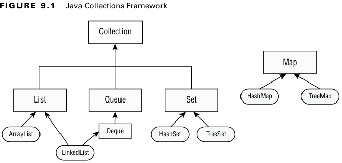

### _Chapter 09: Collections and Generics_

---
### `Common Collection APIs`
_Java Collections Framework_ içerisinde 4 ana arayüz vardır.
1. **List**
2. **Set**
3. **Queue**
4. **Map**



**Adding Data**
```java
public boolean add(E element);

Collection<String> list = new ArrayList<>();
System.out.println(list.add("Sparrow")); // true
System.out.println(list.add("Sparrow")); // true


// A set does not allow duplicates
Collection<String> set = new HashSet<>();
System.out.println(set.add("Sparrow")); // true
System.out.println(set.add("Sparrow")); // false
```

**Removing Data**
```java
public boolean remove(Object object);

Collection<String> birds = new ArrayList<>();
birds.add("hawk"); // [hawk]
birds.add("hawk"); // [hawk, hawk]
System.out.println(birds.remove("cardinal")); // false
System.out.println(birds.remove("hawk"));     // true
System.out.println(birds);                    // [hawk]
```

**Counting Elements**
```java
public boolean isEmpty();
public int size();

Collection<String> birds = new ArrayList<>();
System.out.println(birds.isEmpty()); // true
System.out.println(birds.size());    // 0

birds.add("hawk"); // [hawk]
birds.add("hawk"); // [hawk, hawk]

System.out.println(birds.isEmpty()); // false
System.out.println(birds.size());    // 2
```

**Clearing the Collection**
```java
public void clear();

Collection<String> birds = new ArrayList<>();
birds.add("hawk"); // [hawk]
birds.add("hawk"); // [hawk, hawk]

System.out.println(birds.isEmpty()); // false
System.out.println(birds.size());    // 2

birds.clear();

System.out.println(birds.isEmpty()); // true
System.out.println(birds.size());    // 0
```

**Check Contents**
```java
public boolean contains(Object object);

Collection<String> birds = new ArrayList<>();
birds.add("hawk"); // [hawk]

System.out.println(birds.contains("hawk"));  // true
System.out.println(birds.contains("robin")); // false
```

**Removing with Conditions**
```java
public boolean removeIf(Predicate<? super E> filter);

Collection<String> list = new ArrayList<>();
list.add("Magician");
list.add("Assistant");
System.out.println(list); // [Magician, Assistant]

list.removeIf(s -> s.startsWith("A"));

System.out.println(list); // [Magician]


Collection<String> set = new HashSet<>();
set.add("Wand");
set.add("");

set.removeIf(String::isEmpty);

System.out.println(set); // [Wand]
```

**Iterating**
```java
public void forEach(Consumer<? super T> action);

Collection<String> cats = List.of("Annie", "Ripley");
cats.forEach(s -> System.out.println(s));
cats.forEach(System.out::println);
```

**Determining Equality**

_ArrayList_ sıralamaya dikkat eder, _HashSet_ sıralamaya dikkat etmez.
```java
boolean equals(Object object);

var list1 = List.of(1, 2);
var list2 = List.of(2, 1);
var set1 = Set.of(1, 2);
var set2 = Set.of(2, 1);

System.out.println(list1.equals(list2)); // false
System.out.println(set1.equals(set2));   // true
System.out.println(list1.equals(list1)); // true
System.out.println(list1.equals(set1));  // false
```