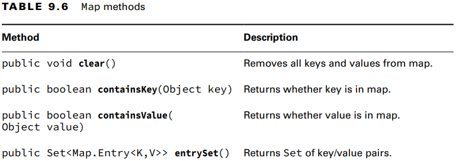
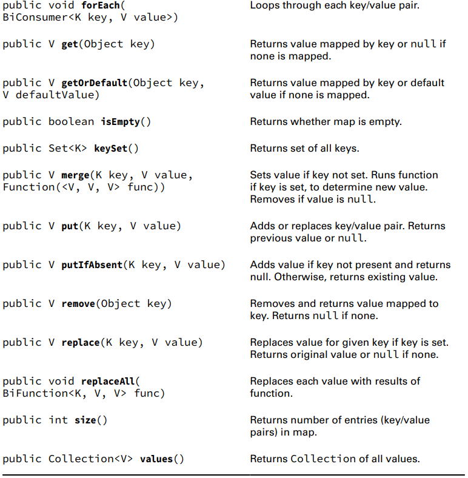
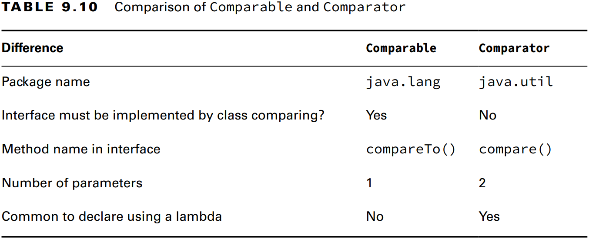
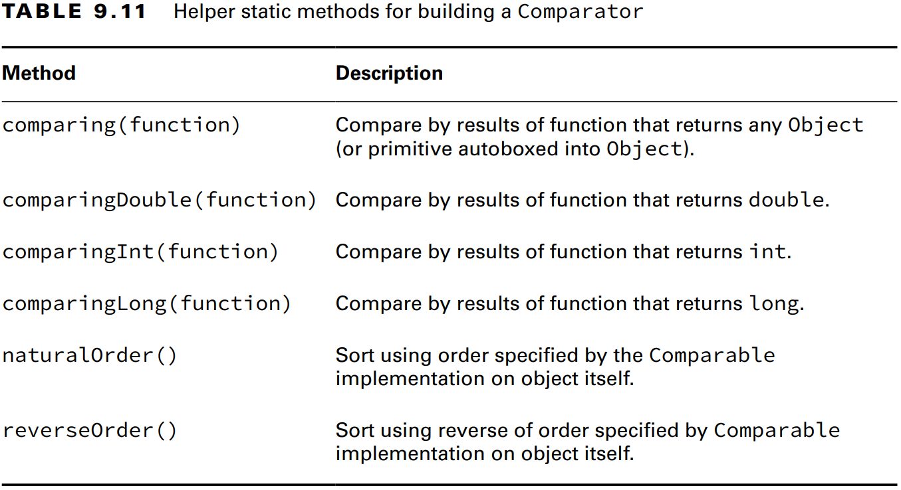
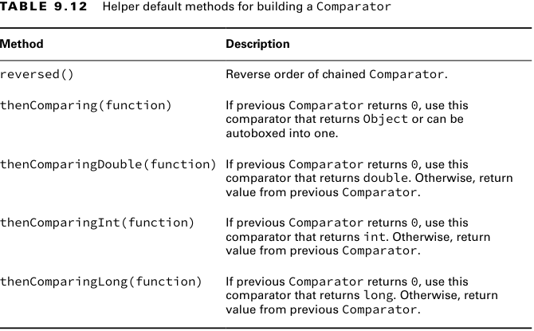
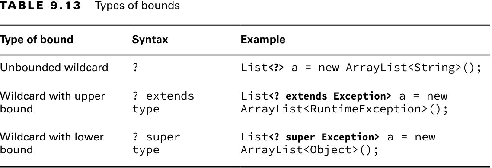

### _Chapter 09: Collections and Generics_

---
### `Common Collection APIs`
_Java Collections Framework_ içerisinde 4 ana arayüz vardır.
1. **List**
2. **Set**
3. **Queue**
4. **Map**

_**Figure 9.1** Java Collections Framework_


**Adding Data**
```java
public boolean add(E element);

Collection<String> list = new ArrayList<>();
System.out.println(list.add("Sparrow")); // true
System.out.println(list.add("Sparrow")); // true


// A set does not allow duplicates
Collection<String> set = new HashSet<>();
System.out.println(set.add("Sparrow")); // true
System.out.println(set.add("Sparrow")); // false
```

**Removing Data**
```java
public boolean remove(Object object);

Collection<String> birds = new ArrayList<>();
birds.add("hawk"); // [hawk]
birds.add("hawk"); // [hawk, hawk]
System.out.println(birds.remove("cardinal")); // false
System.out.println(birds.remove("hawk"));     // true
System.out.println(birds);                    // [hawk]
```

**Counting Elements**
```java
public boolean isEmpty();
public int size();

Collection<String> birds = new ArrayList<>();
System.out.println(birds.isEmpty()); // true
System.out.println(birds.size());    // 0

birds.add("hawk"); // [hawk]
birds.add("hawk"); // [hawk, hawk]

System.out.println(birds.isEmpty()); // false
System.out.println(birds.size());    // 2
```

**Clearing the Collection**
```java
public void clear();

Collection<String> birds = new ArrayList<>();
birds.add("hawk"); // [hawk]
birds.add("hawk"); // [hawk, hawk]

System.out.println(birds.isEmpty()); // false
System.out.println(birds.size());    // 2

birds.clear();

System.out.println(birds.isEmpty()); // true
System.out.println(birds.size());    // 0
```

**Check Contents**
```java
public boolean contains(Object object);

Collection<String> birds = new ArrayList<>();
birds.add("hawk"); // [hawk]

System.out.println(birds.contains("hawk"));  // true
System.out.println(birds.contains("robin")); // false
```

**Removing with Conditions**
```java
public boolean removeIf(Predicate<? super E> filter);

Collection<String> list = new ArrayList<>();
list.add("Magician");
list.add("Assistant");
System.out.println(list); // [Magician, Assistant]

list.removeIf(s -> s.startsWith("A"));

System.out.println(list); // [Magician]


Collection<String> set = new HashSet<>();
set.add("Wand");
set.add("");

set.removeIf(String::isEmpty);

System.out.println(set); // [Wand]
```

**Iterating**
```java
public void forEach(Consumer<? super T> action);

Collection<String> cats = List.of("Annie", "Ripley");
cats.forEach(s -> System.out.println(s));
cats.forEach(System.out::println);
```

**Determining Equality**

_ArrayList_ sıralamaya dikkat eder, _HashSet_ sıralamaya dikkat etmez.
```java
boolean equals(Object object);

var list1 = List.of(1, 2);
var list2 = List.of(2, 1);
var set1 = Set.of(1, 2);
var set2 = Set.of(2, 1);

System.out.println(list1.equals(list2)); // false
System.out.println(set1.equals(set2));   // true
System.out.println(list1.equals(list1)); // true
System.out.println(list1.equals(set1));  // false
```

---
### `List Interface`

_**Table 9.1** Factory methods to create a List_


_Arrays.asList(varargs)_; mevcut array'in kopyası veya varargs ile liste oluşturur. Array üzerinde veya oluşturulan dizi
üzerinde yapılan elemen güncelleme işlemleri iki tarafta da gözlemlenebilir. Yeni bir elemen eklenemez veya silinemez. 
<br/> 
_List.of(varargs)_ ve _List.copyOf(varargs)_ ise _immutable_ bir liste oluşturur. Oluşturulan liste hiçbir şekilde 
değştirilemez. 

```java
Integer[] array = {1, 2, 3};

List<Integer> asList = Arrays.asList(array); // [1, 2, 3]
List<Integer> of = List.of(array);           // [1, 2, 3]
List<Integer> copy = List.copyOf(asList);    // [1, 2, 3]

array[0] = 100;

System.out.println(asList); // [100, 2, 3]
System.out.println(of);     // [1, 2, 3]
System.out.println(copy);   // [1, 2, 3]


asList.set(0, 55);

System.out.println(asList);                 // [55, 2, 3]
System.out.println(Arrays.toString(array)); // [55, 2, 3]

copy.add(66); // UnsupportedOperationException
```
**List with a Constructor**

```java
import java.util.LinkedList;
import java.util.ArrayList;

var linked1 = new LinkedList<String>();
var linked2 = new LinkedList<String>(linked1);

var list0 = new ArrayList<>();       // ArrayList<Object>
var list1 = new ArrayList<String>();
var list2 = new ArrayList<>(list1);  // <String> yazmaya gerek yok çünkü Java aldığı parametreden tip çıkarımını yapıyor.
var list3 = new ArrayList<>(10);     // ArrayList<Object>
```

> Using **var** with ArrayList
>```java
>var list = new ArrayList<>(); // ArrayList<Object> 
>list.add("a");
>for (String s: list) { } // DOES NOT COMPILE
>```

_**Table 9.2** List methods_


```java
List<String> list = new ArrayList<>();
list.add("SD");                  // [SD]
list.add(0, "NY");               // [NY,SD]
list.set(1, "FL");               // [NY,FL]
System.out.println(list.get(0)); // NY
list.remove("NY");               // [FL]
list.remove(0);                  // []
list.set(0, "?");                // IndexOutOfBoundsException

var numbers = Arrays.asList(1, 2, 3);
numbers.replaceAll(x -> x * 2);
System.out.println(numbers); // [2, 4, 6]
```

>**Overloaded _remove()_ Methods**
>```java
>var list = new LinkedList<Integer>();
>list.add(3);
>list.add(2);
>list.add(1);
>
>list.remove(2);                  // primitive olduğu için 2. index'i yani 1'i siler. [3, 2]
>list.remove(Integer.valueOf(2)); // Wrapper olduğu için objeyi siler yani 2'i siler. [3]
>System.out.println(list);        // [3]
>```

**List to an Array**

Liste, arraya dönüştürülebilir. Dönüşüm işlemi tamamen bağımsız bir array oluşturur. Dönüşüm yapıldıktan sonra liste 
üzerinde yapılan işlemler arrayi, array üzerinde yapılan işlemler ise listeyi etkilemez.
```java
List<String> list = new ArrayList<>();
list.add("hawk");
list.add("robin");

Object[] objectArray = list.toArray();
String[] stringArray = list.toArray(new String[0]);

objectArray[0] = "zzz";
System.out.println(list);                         // [hawk, robin]
System.out.println(Arrays.toString(objectArray)); // [zzz, robin]
list.clear();

System.out.println(objectArray.length); // 2
System.out.println(stringArray.length); // 2
```

---
### `Set Interface`
```java
Set<Character> letters = Set.of('z', 'o'); // Immutable
Set<Character> copy = Set.copyOf(letters); // Immutable

System.out.println(letters); // [o, z]
System.out.println(copy);    // [o, z]

Set<Integer> set = new HashSet<>();
System.out.println(set.add(66)); // true
System.out.println(set.add(10)); // true
System.out.println(set.add(66)); // false
System.out.println(set.add(8));  // true
set.forEach(i -> System.out.print(i + ",")); // 66,8,10,


Set<Integer> set = new TreeSet<>();
System.out.println(set.add(66)); // true
System.out.println(set.add(10)); // true
System.out.println(set.add(66)); // false
System.out.println(set.add(8));  // true
set.forEach(i -> System.out.print(i + ",")); // 8,10,66,
```

---
### `Queue and Dequeu Interfaces`
**Queue and Deque Methods** 
- **Queue Methods**

_Queue_ arayüzünde 6 adet method bulunur. Bold olarak yazılmış olanlar bir şeyler yanlış gittiğinde hata fırlatır. 
_add()_, _remove()_ and _element()_. (ARE)

_**Table 9.3** Queue methods_


```java
Queue<Integer> queue = new LinkedList<>();
// add
queue.add(10);     // [10]
queue.offer(4); // [10, 4]

// read
System.out.println(queue.element()); // 10
System.out.println(queue.peek());    // 10

// remove
System.out.println(queue.remove());  // 10
System.out.println(queue.poll());    // 10
```

- **Deque Methods**

Tüm _Queue_ methodlarını kalıtır ve ek yeni methodlara sahiptir. Bold olarak yazılmış olanlar bir şeyler yanlış 
gittiğinde hata fırlatır. _getX()_, _addX()_ and _removeX()_. (GAR)

_**Table 9.4** Deque methods_


```java
Deque<Integer> deque = new LinkedList<>();
// add
deque.addFirst(1);   // [1]
deque.addLast(2);    // [1, 2]
deque.offerFirst(3); // [3, 1, 2]
deque.offerLast(4);  // [3, 1, 2, 4]

// read
System.out.println(deque.getFirst());  // 3
System.out.println(deque.getLast());   // 4
System.out.println(deque.peekFirst()); // 3
System.out.println(deque.peekLast());  // 4

// remove
System.out.println(deque.removeFirst()); // 3
System.out.println(deque.removeLast());  // 4
System.out.println(deque.pollFirst());   // 1
System.out.println(deque.pollLast());    // 2
```


_**Table 9.5** Using Deque as stack_


```java
Deque<Integer> deque = new ArrayDeque<>();
deque.push(1); // [1]
deque.push(2); // [2, 1]
deque.push(3); // [3, 2, 1]

System.out.println(deque.peek()); // 3

System.out.println(deque.pop());  // 3
System.out.println(deque.pop());  // 2
System.out.println(deque.pop());  // 1

System.out.println(deque.peek()); // null
```

---
### `Map Interface`
```java
Map<String, String> map = Map.of("key1", "value1", "key2", " value2");
map.put("key1", "new-value"); // UnsupportedOperationException
System.out.println(map);

Map<String, String> map = Map.ofEntries(
        Map.entry("key1", "value1"),
        Map.entry("key2", "value2")
);
map.put("key1", "new-value"); // UnsupportedOperationException
System.out.println(map);
```
_Map_ arayüzünün iki tane faktori methodu vardır. Bunlar _Map.of(key, value)_ ve _Map.ofEntries(Map.entry(key, value))_
iki method da geriye _immutable_ map döndürür.

_**Table 9.6** Map methods_




```java
Map<String, String> map = new HashMap<>();
map.put("koala", "bamboo");
map.put("lion", "meat");
map.put("giraffe", "leaf");

System.out.println(map.get("koala"));          // bamboo

Set<String> keys = map.keySet();
System.out.println(keys);                      // [koala, giraffe, lion]

System.out.println(map.containsKey("lion"));   // true
System.out.println(map.containsValue("lion")); // false

System.out.println(map.size());                // 3

map.clear();
System.out.println(map.size());                // 0
System.out.println(map.isEmpty());             // true
```

- **Iterating on Map**
```java
Map<Integer, Character> map = new HashMap<>();
map.put(1, 'a');
map.put(2, 'b');
map.put(3, 'c');

map.forEach((k, v) -> System.out.print(v)); // abc

Collection<Character> values = map.values();
values.forEach(System.out::print); // abc

Set<Map.Entry<Integer, Character>> entries = map.entrySet();
entries.forEach(e -> System.out.println(e.getKey() + ", " + e.getValue()));
```

- **Getting Values**
```java
Map<Character, String> map = new HashMap<>();
map.put('x', "spot");

System.out.println(map.get('x')); // spot
System.out.println(map.getOrDefault('x', "default")); // spot

System.out.println(map.get('y')); // null
System.out.println(map.getOrDefault('y', "default")); // default
```

- **Putting if Absent**

Eğer map üzerinde tanımlanmış key **null** ise veya hiç tanımlanmamış ise yeni değer atar, yoksa işlem yapmaz.
```java
Map<String, String> favorites = new HashMap<>();
favorites.put("Jenny", "Bus Tour");
favorites.put("Tom", null);

System.out.println(favorites.putIfAbsent("Jenny", "Tram")); // Bus Tour
System.out.println(favorites.putIfAbsent("Sam", "Tram"));   // null
System.out.println(favorites.putIfAbsent("Tom", "Tram"));   // null

System.out.println(favorites); // {Tom=Tram, Jenny=Bus Tour, Sam=Tram}
```

- **Merging Data**
1. Eğer talep edilen key **null** değere sahipse, <u>mapping function çağırılmaz</u>. Mapping function üzerinde bulunan value
   değeri key'in value'su doğrudan map'e olarak eklenir.
   ```java
   BiFunction<String, String, String> mapper = (v1, v2) -> v1.length() > v2.length() ? v1 : v2;

   Map<String, String> favorites = new HashMap<>();
   favorites.put("Sam", null);

   favorites.merge("Sam", "Skyride", mapper); // Skyride
   System.out.println(favorites);             // {Sam=Skyride}
   ```
2. Eğer talep edilen key map'te hiç yoksa <u>mapping function hiç çağırılmaz</u>. Mapping function üzerinde bulunan value
   değeri key'in value'su doğrudan map'e olarak eklenir.
   ```java
   BiFunction<String, String, String> mapper = (v1, v2) -> v1.length() > v2.length() ? v1 : v2;

   Map<String, String> favorites = new HashMap<>();
   favorites.put("Sam", "Tram");

   favorites.merge("Tom", "Skyride", mapper); // Skyride
   System.out.println(favorites);             // {Tom=Skyride, Sam=Tram}
   ```
   
3. Eğer talep edilen key **non-null** bir değere sahipse ve mapping function **null** değer dönüyorsa key map'tan <u>silinir</u>.
   ```java
   BiFunction<String, String, String> mapper = (v1, v2) -> null;

   Map<String, String> favorites = new HashMap<>();
   favorites.put("Sam", "Tram");

   favorites.merge("Sam", "Skyride", mapper); // null
   System.out.println(favorites);             // {}
   ```
4. Eğer talep edilen key **non-null** bir değere sahipse ve mapping function **non-null** bir değer dönüyorsa 
   mapping function sonucu key'in value'su olarak eklenir.
   ```java
   BiFunction<String, String, String> mapper = (v1, v2) -> v1.length() > v2.length() ? v1 : v2;

   Map<String, String> favorites = new HashMap<>();
   favorites.put("Sam", "Tram");

   favorites.merge("Sam", "Skyride", mapper); // Skyride
   System.out.println(favorites);             // {Sam=Skyride}
   ```


```java
BiFunction<String, String, String> mapper = (v1, v2) -> v1.length() > v2.length() ? v1 : v2;

Map<String, String> favorites = new HashMap<>();
favorites.put("Jenny", "Bus Tour");
favorites.put("Tom", "Tram");
favorites.put("Sam", null);

String jenny = favorites.merge("Jenny", "Skyride", mapper);
String tom = favorites.merge("Tom", "Skyride", mapper);
String sam = favorites.merge("Sam", "Skyride", mapper);

System.out.println(favorites); // {Tom=Skyride, Jenny=Bus Tour, Sam=Skyride}
System.out.println(jenny);     // Bus Tour
System.out.println(tom);       // Skyride
System.out.println(sam);       // Skyride


BiFunction<String, String, String> mapper = (v1, v2) -> null;
Map<String, String> favorites = new HashMap<>();
favorites.put("Jenny", "Bus Tour");
favorites.put("Tom", "Bus Tour");

System.out.println(favorites.merge("Jenny", "Skyride", mapper)); // null
System.out.println(favorites.merge("Sam", "Skyride", mapper));   // Skyride

System.out.println(favorites); // {Tom=Bus Tour, Sam=Skyride}
```

---
### `Sorting Data`

**Using Comparable**
```java
package java.lang;
        
public interface Comparable<T> {
 int compareTo(T o);
}
```

- İki obje aynıysa **0** döner.
- Mevcut obje alınan objeden küçükse **negatif** bir sayı döner.
- Mevcut obje alınan objeden büyükse **pozitif** bir sayı döner.

```java
class Duck implements Comparable<Duck> {
    private final String name;

    public Duck(String name) {
        this.name = name;
    }

    @Override
    public String toString() {
        return name;
    }

    @Override
    public int compareTo(Duck duck) {
        return name.compareTo(duck.name);
    }

    public static void main(String[] args) {
        var ducks = new ArrayList<Duck>();
        ducks.add(new Duck("Quack"));
        ducks.add(new Duck("Puddles"));

        Collections.sort(ducks); // sort by name

        System.out.println(ducks); // [Puddles, Quack]
    }
}
```

**Using Comparator**

Comparator _java.util_ paketindedir.
```java
class Duck implements Comparable<Duck> {
    private final String name;
    private final int weight;


    public Duck(String name, int weight) {
        this.name = name;
        this.weight = weight;
    }

    @Override
    public String toString() {
        return "%s(%d)".formatted(name, weight);
    }

    @Override
    public int compareTo(Duck duck) {
        return name.compareTo(duck.name);
    }

    public static void main(String[] args) {
        var ducks = new ArrayList<Duck>();
        ducks.add(new Duck("Quack", 7));
        ducks.add(new Duck("Puddles", 10));

        Collections.sort(ducks);   // sort by name
        System.out.println(ducks); // [Puddles(10), Quack(7)]

        Comparator<Duck> byWeight = new Comparator<>() {
            @Override
            public int compare(Duck d1, Duck d2) {
                return d1.weight - d2.weight;
            }
        };

        Collections.sort(ducks, byWeight); // sort by weight
        System.out.println(ducks);         // [Quack(7), Puddles(10)]


       Comparator<Duck> byWeight = Comparator.comparingInt(d -> d.weight);
       ducks.sort(byWeight);      // sort by weight
       System.out.println(ducks); // [Quack(7), Puddles(10)]
    }
}
```

**Comparable vs Comparator**

_**Table 9.6** Comparison of Comparable and Comparator_



_**Table 9.11** Helper static methods for building a Comparator_



_**Table 9.12** Helper default methods for building a Comparator_


```java
class Team implements Comparable<Team> {
    private final String name;
    private final int point;
    private final int average;

    public Team(String name, int point, int average) {
        this.name = name;
        this.point = point;
        this.average = average;
    }

    @Override
    public String toString() {
        return "%s (p %d, a %d)".formatted(name, point, average);
    }

    public String getName() {
        return name;
    }

    public int getPoint() {
        return point;
    }

    public int getAverage() {
        return average;
    }

    @Override
    public int compareTo(Team team) {
        return team.name.compareTo(team.getName());
    }

    public static void main(String[] args) {
        var pl = new ArrayList<Team>();

        pl.add(new Team("Arsenal", 95, 42));
        pl.add(new Team("Liverpool", 93, 35));
        pl.add(new Team("Manchester City", 95, 43));
        pl.add(new Team("Tottenham", 92, 21));

        Comparator<Team> sort = Comparator.comparing(Team::getPoint)
                .thenComparing(Team::getAverage)
                .reversed();

        pl.sort(sort);
        System.out.println(pl); // [Manchester City (p 95, a 43), Arsenal (p 95, a 42), Liverpool (p 93, a 35), Tottenham (p 92, a 21)]
    }
}

public static void main(String[] args) {
   var pl = new ArrayList<Team>();

   pl.add(new Team("Arsenal", 95, 42));
   pl.add(new Team("Liverpool", 93, 35));
   pl.add(new Team("Manchester City", 95, 43));
   pl.add(new Team("Tottenham", 92, 21));

   Comparator<Team> sort = Comparator.comparingInt(Team::getPoint)
           .thenComparingInt(Team::getAverage)
           .reversed();

   pl.sort(sort);
   System.out.println(pl); // [Manchester City (p 95, a 43), Arsenal (p 95, a 42), Liverpool (p 93, a 35), Tottenham (p 92, a 21)]
}

public static void main(String[] args) {
   var pl = new ArrayList<Team>();

   pl.add(new Team("Arsenal", 95, 42));
   pl.add(new Team("Liverpool", 93, 35));
   pl.add(new Team("Manchester City", 95, 43));
   pl.add(new Team("Tottenham", 92, 21));

   pl.sort(Comparator.naturalOrder());
   System.out.println(pl); // [Arsenal (p 95, a 42), Liverpool (p 93, a 35), Manchester City (p 95, a 43), Tottenham (p 92, a 21)]
}
```


---
### `Generics`

**Overloading a Generic Method**

1. Bir sınıfta aşağıda ki iki methoddan sadece birine izin verilir. Çünkü _type erasure_ her iki methodu da 
_**protected void chew(List input) {}**_ olarak değiştirir.
```java
class LongTailAnimal {
    protected void chew(List<Object> input) {}
    protected void chew(List<Double> input) {} // DOES NOT COMPILE
}
```

2. Yukarda ki ile aynı nedenle aşağıdaki kodda derlenmez.
```java
class LongTailAnimal {
    protected void chew(List<Object> input) {}
}

class Anteater extends LongTailAnimal {
    protected void chew(List<Double> input) {} // DOES NOT COMPILE
}
```
3. Aşağıdaki kod derlenir. Çünkü ilk method parent methodu _override_ eder. İkinci method ise _overloaded_ methoddur.
```java
class LongTailAnimal {
   protected void chew(List<Object> input) {}
}

class Anteater extends LongTailAnimal {
   @Override
   protected void chew(List<Object> input) {}
   protected void chew(ArrayList<Double> input) {}
}
```

**Returning Generic Types**

Java'da method _overriding_ işleminde return type mutlaka kovaryant tipte olmalıdır. Generic tiplerde _type erasure_'dan 
ötürü kovaryant olma durumu yoktur.

```java
class Mammal {
    public List<CharSequence> play() {
        return List.of("Java");
    }

    public CharSequence sleep() {
        return "Java";
    }
}

class Monkey extends Mammal {
    public ArrayList<CharSequence> play() {
        return new ArrayList<>();
    }
}

class Goat extends Mammal {
    public List<String> play() { // DOES NOT COMPILE
        return new ArrayList<>();
    }

    public String sleep() {
        return "Java 21";
    }
}
```

**Bounding Generic Types**

_**Table 9.13** Types of bounds_



**Un-Bounded** ve **Upper-Bounded Wildcards**

- Değişken tipinde generik ifade **? extends** veya **?** olduğunda listeye yeni bir eleman ekleyemeyiz.
- Diğer bir ifadeyle **Un-Bounded** ve **Upper-Bounded** generikler _immutable_'dır.
- Generik ifade **? super String** gibi bir ifade ise sadece _String_ veya daha alt tipte değer eklenebilir. 
  Fakat parametre olarak String veya daha geniş bir tipte parametre geçilebilir. 

```java
// Un-Bounded
public static void main(String[] args) {
    List<String> keywords = new ArrayList<>();
    keywords.add("java");
    printList1(keywords); // DOES NOT COMPILE
    printList2(keywords);
}

public static void printList1(List<Object> list) {
    for (Object x: list)
        System.out.println(x);
}

public static void printList2(List<?> list) {
    for (Object x: list)
        System.out.println(x);
}
```

```java
static void addSound(List<?> list) {
    list.add("Java"); // DOES NOT COMPILE
}
```

```java
// Upper-Bounded
public static void main(String[] args) {
    List<? extends Bird> birds = new ArrayList<Bird>();
    birds.add(new Sparrow()); // DOES NOT COMPILE
    birds.add(new Bird());    // DOES NOT COMPILE
}
```

```java
interface Flyer {
    void fly();
}

class HangGlider implements Flyer {
    @Override
    public void fly() {
    }
}

class Goose implements Flyer {
    @Override
    public void fly() {
    }
}

public class Test {
    public static void main(String[] args) {
        groupOfFlyers(new ArrayList<HangGlider>());
        groupOfFlyers(new ArrayList<Goose>());
        
        anyFlyer(new ArrayList<HangGlider>()); // DOES NOT COMPILE
        anyFlyer(new ArrayList<Goose>());              // DOES NOT COMPILE
    }

    private static void anyFlyer(List<Flyer> flyers) {
    }

    private static void groupOfFlyers(List<? extends Flyer> flyers) {
    }
}
```

```java
// Lower-Bounded
class A {
}

class B extends A {
}

class C extends B {
}

public class Test {
   public static void main(String[] args) {
      addSound(new ArrayList<A>());
      addSound(new ArrayList<B>());
      addSound(new ArrayList<C>()); // DOES NOT COMPILE
   }

   public static void addSound(List<? super B> list) {
      list.add(new A()); // DOES NOT COMPILE
      list.add(new B());
      list.add(new C());
   }
}
```

---
#### `Review Quesions`

**Q02**: **List<?>** değişken tipi **List<Object>** olarak değerlendirilir.
```java
List<?> q = List.of("mouse", "parrot"); // List<Object> q = List.of("mouse", "parrot");
```

**Q15**: Queue arayüzünün içinde sadece custom parametre alan bir remove methodu bulunmuyor. Sadece _Collection_ 
içerisinde bulunan **remove(Object o)** ve kendi içinde bulunan **remove()** methodlarına sahip.
```java
List<?> q = List.of("mouse", "parrot"); // List<Object> q = List.of("mouse", "parrot");
```

**Q18**: _< T>_ sadece method return tipinden önce gelebilir.
```java
public static <T> T identity(T t) { // OK
    return t;
}

public <T> static T identity(T t) { // DOES NOT COMPILE
   return t;
}
```