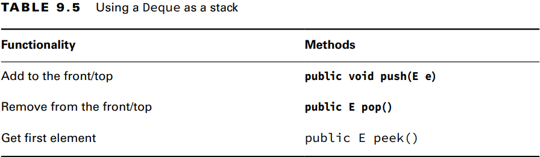

### _Chapter 09: Collections and Generics_

---
### `Common Collection APIs`
_Java Collections Framework_ içerisinde 4 ana arayüz vardır.
1. **List**
2. **Set**
3. **Queue**
4. **Map**


**Adding Data**
```java
public boolean add(E element);

Collection<String> list = new ArrayList<>();
System.out.println(list.add("Sparrow")); // true
System.out.println(list.add("Sparrow")); // true


// A set does not allow duplicates
Collection<String> set = new HashSet<>();
System.out.println(set.add("Sparrow")); // true
System.out.println(set.add("Sparrow")); // false
```

**Removing Data**
```java
public boolean remove(Object object);

Collection<String> birds = new ArrayList<>();
birds.add("hawk"); // [hawk]
birds.add("hawk"); // [hawk, hawk]
System.out.println(birds.remove("cardinal")); // false
System.out.println(birds.remove("hawk"));     // true
System.out.println(birds);                    // [hawk]
```

**Counting Elements**
```java
public boolean isEmpty();
public int size();

Collection<String> birds = new ArrayList<>();
System.out.println(birds.isEmpty()); // true
System.out.println(birds.size());    // 0

birds.add("hawk"); // [hawk]
birds.add("hawk"); // [hawk, hawk]

System.out.println(birds.isEmpty()); // false
System.out.println(birds.size());    // 2
```

**Clearing the Collection**
```java
public void clear();

Collection<String> birds = new ArrayList<>();
birds.add("hawk"); // [hawk]
birds.add("hawk"); // [hawk, hawk]

System.out.println(birds.isEmpty()); // false
System.out.println(birds.size());    // 2

birds.clear();

System.out.println(birds.isEmpty()); // true
System.out.println(birds.size());    // 0
```

**Check Contents**
```java
public boolean contains(Object object);

Collection<String> birds = new ArrayList<>();
birds.add("hawk"); // [hawk]

System.out.println(birds.contains("hawk"));  // true
System.out.println(birds.contains("robin")); // false
```

**Removing with Conditions**
```java
public boolean removeIf(Predicate<? super E> filter);

Collection<String> list = new ArrayList<>();
list.add("Magician");
list.add("Assistant");
System.out.println(list); // [Magician, Assistant]

list.removeIf(s -> s.startsWith("A"));

System.out.println(list); // [Magician]


Collection<String> set = new HashSet<>();
set.add("Wand");
set.add("");

set.removeIf(String::isEmpty);

System.out.println(set); // [Wand]
```

**Iterating**
```java
public void forEach(Consumer<? super T> action);

Collection<String> cats = List.of("Annie", "Ripley");
cats.forEach(s -> System.out.println(s));
cats.forEach(System.out::println);
```

**Determining Equality**

_ArrayList_ sıralamaya dikkat eder, _HashSet_ sıralamaya dikkat etmez.
```java
boolean equals(Object object);

var list1 = List.of(1, 2);
var list2 = List.of(2, 1);
var set1 = Set.of(1, 2);
var set2 = Set.of(2, 1);

System.out.println(list1.equals(list2)); // false
System.out.println(set1.equals(set2));   // true
System.out.println(list1.equals(list1)); // true
System.out.println(list1.equals(set1));  // false
```

---
### `List Interface`
**List with a Factory**


_Arrays.asList(varargs)_; mevcut array'in kopyası veya varargs ile liste oluşturur. Array üzerinde veya oluşturulan dizi
üzerinde yapılan elemen güncelleme işlemleri iki tarafta da gözlemlenebilir. Yeni bir elemen eklenemez veya silinemez. 
<br/> 
_List.of(varargs)_ ve _List.copyOf(varargs)_ ise _immutable_ bir liste oluşturur. Oluşturulan liste hiçbir şekilde 
değştirilemez. 

```java
Integer[] array = {1, 2, 3};

List<Integer> asList = Arrays.asList(array); // [1, 2, 3]
List<Integer> of = List.of(array);           // [1, 2, 3]
List<Integer> copy = List.copyOf(asList);    // [1, 2, 3]

array[0] = 100;

System.out.println(asList); // [100, 2, 3]
System.out.println(of);     // [1, 2, 3]
System.out.println(copy);   // [1, 2, 3]


asList.set(0, 55);

System.out.println(asList);                 // [55, 2, 3]
System.out.println(Arrays.toString(array)); // [55, 2, 3]

copy.add(66); // UnsupportedOperationException
```
**List with a Constructor**

```java
import java.util.LinkedList;
import java.util.ArrayList;

var linked1 = new LinkedList<String>();
var linked2 = new LinkedList<String>(linked1);

var list0 = new ArrayList<>();       // ArrayList<Object>
var list1 = new ArrayList<String>();
var list2 = new ArrayList<>(list1);  // <String> yazmaya gerek yok çünkü Java aldığı parametreden tip çıkarımını yapıyor.
var list3 = new ArrayList<>(10);     // ArrayList<Object>
```

> Using **var** with ArrayList
>```java
>var list = new ArrayList<>(); // ArrayList<Object> 
>list.add("a");
>for (String s: list) { } // DOES NOT COMPILE
>```

**List Methods**

```java
List<String> list = new ArrayList<>();
list.add("SD");                  // [SD]
list.add(0, "NY");               // [NY,SD]
list.set(1, "FL");               // [NY,FL]
System.out.println(list.get(0)); // NY
list.remove("NY");               // [FL]
list.remove(0);                  // []
list.set(0, "?");                // IndexOutOfBoundsException

var numbers = Arrays.asList(1, 2, 3);
numbers.replaceAll(x -> x * 2);
System.out.println(numbers); // [2, 4, 6]
```

>**Overloaded _remove()_ Methods**
>```java
>var list = new LinkedList<Integer>();
>list.add(3);
>list.add(2);
>list.add(1);
>
>list.remove(2);                  // primitive olduğu için 2. index'i yani 1'i siler. [3, 2]
>list.remove(Integer.valueOf(2)); // Wrapper olduğu için objeyi siler yani 2'i siler. [3]
>System.out.println(list);        // [3]
>```

**List to an Array**

Liste, arraya dönüştürülebilir. Dönüşüm işlemi tamamen bağımsız bir array oluşturur. Dönüşüm yapıldıktan sonra liste 
üzerinde yapılan işlemler arrayi, array üzerinde yapılan işlemler ise listeyi etkilemez.
```java
List<String> list = new ArrayList<>();
list.add("hawk");
list.add("robin");

Object[] objectArray = list.toArray();
String[] stringArray = list.toArray(new String[0]);

objectArray[0] = "zzz";
System.out.println(list);                         // [hawk, robin]
System.out.println(Arrays.toString(objectArray)); // [zzz, robin]
list.clear();

System.out.println(objectArray.length); // 2
System.out.println(stringArray.length); // 2
```

---
### `Set Interface`
```java
Set<Character> letters = Set.of('z', 'o'); // Immutable
Set<Character> copy = Set.copyOf(letters); // Immutable

System.out.println(letters); // [o, z]
System.out.println(copy);    // [o, z]

Set<Integer> set = new HashSet<>();
System.out.println(set.add(66)); // true
System.out.println(set.add(10)); // true
System.out.println(set.add(66)); // false
System.out.println(set.add(8));  // true
set.forEach(i -> System.out.print(i + ",")); // 66,8,10,


Set<Integer> set = new TreeSet<>();
System.out.println(set.add(66)); // true
System.out.println(set.add(10)); // true
System.out.println(set.add(66)); // false
System.out.println(set.add(8));  // true
set.forEach(i -> System.out.print(i + ",")); // 8,10,66,
```

---
### `Queue and Dequeu Interfaces`
**Queue and Deque Methods** 
- **Queue Methods**

_Queue_ arayüzünde 6 adet method bulunur. Bold olarak yazılmış olanlar bir şeyler yanlış gittiğinde hata fırlatır. 
_add()_, _remove()_ and _element()_. (ARE)

```java
Queue<Integer> queue = new LinkedList<>();
// add
queue.add(10);     // [10]
queue.offer(4); // [10, 4]

// read
System.out.println(queue.element()); // 10
System.out.println(queue.peek());    // 10

// remove
System.out.println(queue.remove());  // 10
System.out.println(queue.poll());    // 10
```

- **Deque Methods**

Tüm _Queue_ methodlarını kalıtır ve ek yeni methodlara sahiptir. Bold olarak yazılmış olanlar bir şeyler yanlış 
gittiğinde hata fırlatır. _getX()_, _addX()_ and _removeX()_. (GAR)

```java
Deque<Integer> deque = new LinkedList<>();
// add
deque.addFirst(1);   // [1]
deque.addLast(2);    // [1, 2]
deque.offerFirst(3); // [3, 1, 2]
deque.offerLast(4);  // [3, 1, 2, 4]

// read
System.out.println(deque.getFirst());  // 3
System.out.println(deque.getLast());   // 4
System.out.println(deque.peekFirst()); // 3
System.out.println(deque.peekLast());  // 4

// remove
System.out.println(deque.removeFirst()); // 3
System.out.println(deque.removeLast());  // 4
System.out.println(deque.pollFirst());   // 1
System.out.println(deque.pollLast());    // 2
```

- **Using Deque as Stack**

```java
Deque<Integer> deque = new ArrayDeque<>();
deque.push(1); // [1]
deque.push(2); // [2, 1]
deque.push(3); // [3, 2, 1]

System.out.println(deque.peek()); // 3

System.out.println(deque.pop());  // 3
System.out.println(deque.pop());  // 2
System.out.println(deque.pop());  // 1

System.out.println(deque.peek()); // null
```