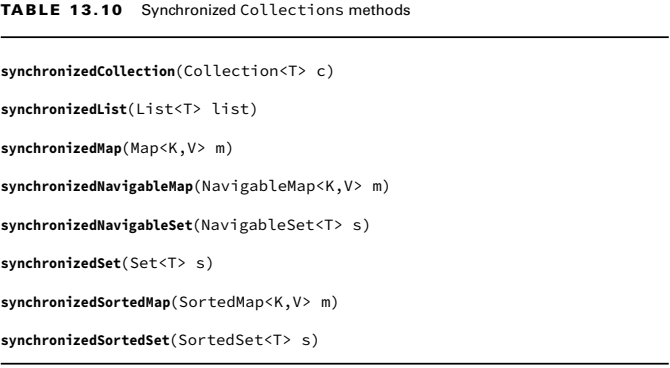

### _Chapter 13: Concurrency_

---
### `Threads`

- Bir thread, işletim sistemi tarafından yürütülen en küçük yürütme birimidir.
- Bir process, aynı paylaşılan ortamda yürütülen bir grup ilişkili thread'den oluşur.
- Bir thread, aynı anda yanlızca bir görevi tamamlayabilir.
- Bir thread için ayrılan süre tamamlandığında fakat thread'in yapmış olduğu işlem tamamlanmazsa _context switch_ oluşur.
- _Context switch_, bir threadin mevcut durumunu saklama ve daha sonra yürütmeye devam edebilmek için geri yükleme işlemidir. 
  Bu maliyetli bir işlemdir.
- Eğer bir thread diğer thread'lerden daha yüksek bir _thread priority_'e sahipse mevcut çalışan threadi _interrupt_ 
  edebilir veya başka bir thread'in yerini alabilir. Java'da thread priority integer değerler ile ifade edilir.

**Creating a Thread**

Java'da thread oluşturabilmek için iki yol vardır:
1. Bir _Runnable_ nesne veya lambda expression Thread constructor'a verilir.
2. Thread'i **extends** eden bir sınıf oluşturulur ve _run_ methodu _override_ edilir.


```java
@FunctionalInterface 
public interface Runnable {
    void run();
}
```

- Thread çalışma sırası garanti değildir. Thread'ler genellikle rastgele sırada çalışırlar.

Aşağıda ki kodlar thread oluşturur ve çalıştırır. Sonuçları çalışana kadar belli değildir.
```java
new Thread(() -> System.out.print("Hello")).start();
System.out.print("World");
```

```java
Runnable runnable = () -> System.out.print("Hello");
new Thread(runnable).start();
System.out.print("World");
```


```java
class MyThread extends Thread {
    @Override
    public void run() {
        System.out.println("Name: " + Thread.currentThread().getName());
    }

    public static void main(String[] args) {
        new MyThread().start();
        new MyThread().start();
        new MyThread().start();
    }
}
```

> Thread'i başlatmak için _start()_ methodu kullanılır. _run()_ methodunu çağırmak thread'i başlatmaz.

> Bir Thread üzerinde _start()_ methodusadece bir kez çalıştırılabilir. İkinci kez çağrılmayı denedeğimizde 
> _IllegalThreadStateException_ hatasını alırız.
> ```java
> Thread thread = new Thread();
> thread.start();
> thread.start(); // IllegalThreadStateException
> ```

**Daemon Thread**

Daemon threadler arka planda çalışan düşük öncelikli threadlerdir.

JVM, main thread tamamlansa bile _user-defined_ threadlerin tamamlanmasını bekler. Uygulamayı sonlandırmaz. 
Fakat _daemon_ threadler için aynı durum geçerli değildir. Eğer main thread tamamlanırsa JVM daemon threadlerin 
tamamlanmasını beklemeden uygulamayı sonlandırır. 

Örneğin _GarbageCollector_ bir daemon threaddir.

```java
/*
 * Below code prints: 
 *  Main method finished!
 *  Thread finished!
 */
public static void pause() {
    try {
        Thread.sleep(1000);
    } catch (InterruptedException ignored) {
    }
    System.out.println("Thread finished!");
}

public static void main(String[] args) {
    var job = new Thread(Test::pause);
    // job.setDaemon(true);
    job.start();
    System.out.println("Main method finished!");
}
```

```java
/*
 * Below code prints: 
 *  Main method finished!
 */
public static void pause() {
    try {
        Thread.sleep(1000);
    } catch (InterruptedException ignored) {
    }
    System.out.println("Thread finished!");
}

public static void main(String[] args) {
    var job = new Thread(Test::pause);
    job.setDaemon(true);
    job.start();
    System.out.println("Main method finished!");
}
```

> setDaemon() methodu start() methodundan önce çalıştırılmalıdır. Aksi halde uygulama _IllegalThreadStateException_ fırlatır.
> ```java
> Thread thread = new Thread();
> thread.start();
> thread.setDaemon(true); // IllegalThreadStateException
> ```

**Thread Life Cycle**


1. Threadlerin 6 durumu vardır. _getState()_ methodu ile threadin durmunu öğrenebiliriz. 
2. Thread başlangıçta **NEW** durumda.
3. _start()_ methodu çağrıldığında **RUNNABLE** duruma geçer. Bu durum threadin gerçekten çalıştığı anlamına gelmez. 
   Thread çalışıyor veya çalışmıyor olabilir. **RUNNABLE** thread çalışmaya hazır demektir.
4. Thread çalışmayı tamamladığında veya hata ile sonlandığında **TERMINATED** duruma geçer.

**Polling with Sleep**

Bazen bir threadin çalışabilmesi için başka bir threadin görevini tamamlamış olması gerekir. Polling belli aralıklarla
verileri kontrol etme işlemidir.

While loop ile işlemin sonucunu kontrol etmek CPU kaynaklarını gereksi yere tükettiği için _bad practice_'dir.

```java
public static int counter = 0;
public static void main(String[] args) {
    new Thread(() -> {
        for (int i = 0; i < 100_000_000; i++) {
            counter++;
        }
    }).start();
    while (counter < 100_000_000) {
        System.out.println(counter + " Not reached yet.");
    }
    System.out.println("Reached: " + counter);
}
```

Bunun yerine _Thread.sleep()_ ile mevcut threadi durdurup diğer threadin işini tamamlamasını bekleyebiliriz.
```java
public static int counter = 0;
public static void main(String[] args) throws InterruptedException {
    new Thread(() -> {
        for (int i = 0; i < 100_000_000; i++) {
            counter++;
        }
    }).start();
    while (counter < 100_000_000) {
        System.out.println(counter + " Not reached yet.");
        Thread.sleep(1000);
    }
    System.out.println("Reached: " + counter);
}
```

**Interrupting a Thread**

Önceki çözüm CPU'un **while** döngüsünde sonsuza kadar beklemesini engellese de programa gereksiz bir sleep ekledi. 
Programın çalışması 2.1 saniye sürerse sleep yine de 1 saniye bekleyeceği için arada 0.9 saniyelik bir süre boşuna geçer.

Bunu engellemek için sonucunu beklediğimiz thread işini bitirdiğinde main threadi _interrupt_ ederek gereksiz beklemesinin
önüne geçer. 

Thread üzerinde _interrupt()_ methodunu çağırmak _TIMED_WAITING_ veya _WAITING_ durumda olan threadin tekrar _RUNNABLE_ 
duruma geçmesini sağlar. Yani _sleep()_ ile uyutulan thread için _interrupt()_ çalıştırılırsa sleep sona erer ve thread 
tekrar çalışır ve _InterruptedException_ fırlatır.

Uyumayan thread üzerinde _interrupt()_ methodunu çağırmanın hiç bir etkisi olmayacaktır. Sadece flag olarak **true** yapacaktır.

```java
public static long counter = 0;
public static void main(String[] args) {
    Thread mainThread = Thread.currentThread();
    long to = 5_000_000_000L;
    new Thread(() -> {
        for (long i = 0; i < to; i++) {
            counter++;
        }
        mainThread.interrupt();
    }).start();
    while (counter < to) {
        System.out.println(counter + " Not reached yet.");
        try {
            Thread.sleep(1000);
        } catch (InterruptedException e) {
            System.out.println("Interrupted!");
        }
    }
    System.out.println("Reached: " + counter);
}
```

---
### `Concurrency API`

Java'da Concurrency API olarak adlandırılan _java.util.concurrent_ paketi bulunur. Bu paket içerisinde threadleri
oluşturmak ve yönetmek için _ExecutorService_ arayüzü bulunur.

Doğrudan threadleri kullanmak zordur. Bir tane thread için bile olsa _Concurrency API_ gibi hazır API'leri kullanmak daha iyidir.

**Single-Thread Executor**

Aşağıda ki örnekte sadece iki adet thread oluşturulur. Çıktısı kod çalışana kadar tahmin edilemez.

```java
/*
 * Below code prints:
     Begin
     Printing zoo inventory
     Printing record: 0
     Printing record: 1
     End
     Printing record: 2
     Printing zoo inventory
 */
public static void main(String[] args) {
    Runnable printInventory = () -> System.out.println("Printing zoo inventory");
    Runnable printRecords = () -> {
        for (int i = 0; i < 3; i++) {
            System.out.println("Printing record: " + i);
        }
    };
    ExecutorService service = Executors.newSingleThreadExecutor();
    try {
        System.out.println("Begin");
        service.execute(printInventory);
        service.execute(printRecords);
        service.execute(printInventory);
        System.out.println("End");
    } finally {
        service.shutdown();
    }
}
```

**Shutting Down a Thread Executor**

Thread executor ile işini bitirdiğinde mutlaka _shutdown()_ methodu çalıştırılmalıdır. Thread executor _non-daemon_ thread 
oluşturur ve _shutdown()_ çalıştırılmazsa uygulama sonlandırılmaz.

Shutdown işlemi başlatıldığında thread executor <u>hemen sonlanmaz</u>. _isShutdown()_ **true**, _isTerminated()_ **false**  
durumuna geçer. Bu aşamada;
- Yeni bir task kabul etmez ve _RejectedExecutionException_ hatasını fırlatır.
- Mevcut çalışan taskların çalışması devam eder.
- Mevcut çalışan tasklar tamamlandığında _isShutdown()_ ve _isTerminated()_ **true** olur ve thread executor sonlanır.

**Figure 13.3** ExecutorService life cycle


> _shutdown()_ methodu, thread executor'a önceden gönderilmiş taskları sonlandırmaz.

> _shutdownNow()_ methodu, thread executor'u hemen sonlandırmayı dener. Fakat sonlandırmayı garanti etmez.

**Submitting Tasks**

ExecutorService'e birden çok şekilde task gönderebiliriz. İlki _execute()_ methodu. Bu methodun dönüş tipi **void**'tir
yani değer dönmez.  

Eğer değer dönmesini istediğimiz bir task göndermek istersek _submit()_ methodunu kullanabiliriz. 
Bu method bize _Future<?>_ nesnesi döner.

**Table 13.1** ExecutorService methods


```java
/*
 * Below code prints:
     I am Runnable at execute()
     I am Runnable at submit()
     I am Callable at submit()
 */
ExecutorService service = Executors.newSingleThreadExecutor();
try {
    service.execute(() -> System.out.println("I am Runnable at execute()"));
    service.submit(() -> System.out.println("I am Runnable at submit()"));
    Future<String> msg = service.submit(() ->  "I am Callable at submit()");
    System.out.println(msg.get());
} finally {
    service.shutdown();
}
```

```java
/*
 * Below code prints:
     100
     200
     300
     400
 */
ExecutorService service = Executors.newFixedThreadPool(4);
Callable<Integer> task1 = () -> 100;
Callable<Integer> task2 = () -> 200;
Callable<Integer> task3 = () -> 300;
Callable<Integer> task4 = () -> 400;
try {
    List<Future<Integer>> results = service.invokeAll(List.of(task1, task2, task3, task4));
    for (Future<Integer> result : results) {
        System.out.println(result.get());
    }
} finally {
    service.shutdown();
}
```

```java
/*
 * Below code prints one of 100,200,300,400 randomly        
 */
ExecutorService service = Executors.newFixedThreadPool(4);
Callable<Integer> task1 = () -> 100;
Callable<Integer> task2 = () -> 200;
Callable<Integer> task3 = () -> 300;
Callable<Integer> task4 = () -> 400;
try {
    Integer result = service.invokeAny(List.of(task1, task2, task3, task4));
    System.out.println(result);
} finally {
    service.shutdown();
}
```

**Waiting for Results**

**Table 13.2** Future methods


- _isDone()_: Görev tamamlanmışsa, hata fırlatılmışsa veya iptal edilmişse **true** döner.
- _isCancelled()_: Eğer görev normal şekilde tamamlanmadan önce iptal edilirse **true** döner.
- _cancel(boolean mayInterruptIfRunning)_: Görevi iptal etmeye çalışır. Başarılı olursa **true** döner. Başaramaz veya 
  görev zaten tamamlanmışsa **false** döner.
- _get()_: Görevin sonucunu getirir. Henüz mevcut değilse sonsuza kadar bekler.
- _get(long timeout, TimeUnit unit)_: Belirli süre içerisinde görevin sonucunu bekler. Zaman aşımına ulaşıldığında sonuç
  hazır değilse, _checked TimeoutException_ fırlatır.

Aşağıdaki kod en fazla 10 saniyeye kadar sonucu almayı bekler. Eğer 10 saniye içinde görev tamamlanmazsa _TimeoutException_
fırlatır.

Aşağıda ki _result.get()_ methodunun sonucu her zaman **null**'dır çünkü _Runnable.run()_ methodunun dönüş tipi **void**'dir.

```java
private static int counter = 0;
public static void main(String[] args) {
    ExecutorService service = Executors.newSingleThreadExecutor();
    Future<?> result = service.submit(() -> {
        for (int i = 0; i < 100_000_000; i++) {
            counter++;
        }
    });
    try {
        result.get(10, TimeUnit.SECONDS);
    } catch (Exception e) {
        System.out.println("Not reached in time");
    } finally {
        service.shutdown();
    }
}
```

&#20; **Introducing Callable**

```java
@FunctionalInterface
public interface Callable<V> {
    V call() throws Exception;
}

@FunctionalInterface
public interface Runnable {
    void run();
}
```

_Runnable_ ve _Callable_ arayüzleri benzerdir. _Callable_ arayüzü _call()_ methoduna sahiptir. Bu method dönüş tipine 
sahiptir ve _Exception_ fırlatır.

Geriye değer döndüğü için _Callable, Runnable_ yerine tercih edilir. Executer

ExecutorService üzerinde _submit()_ methodunun _Runnable_ ve _Callable_ parametre alan iki overloaded versiyonu bulunur.

```java
ExecutorService service = Executors.newSingleThreadExecutor();
Future<Integer> result = service.submit(() -> 30 + 11);
try {
    System.out.println(result.get()); // 41
} finally {
    service.shutdown();
}
```

&#20; **Waiting for All Tasks to Finish**

Çoğu durumda thread executer'a verilen görevlerin bitmesini bekleriz. Daha öncede gördüğümüz gibi bunun ilk yolu _get()_
methodu ile kontrol etmektir. 

Eğer tüm taskların sonuçlarına ihtiyacımız yoksa bu verbose koda neden olur. Bunun daha basit bir çözümü vardır. _awaitTermination()_.

Önce _shutdown()_ methodunu kullanırız, daha sonra _awaitTermination()_'da belirtilen süre kadar görevlerin tamamlanmasını bekleriz.

```java
ExecutorService service = Executors.newSingleThreadExecutor();
try {
    // Add tasks to thread executor
} finally {
    service.shutdown();
}
service.awaitTermination(1, TimeUnit.MINUTES);
if (service.isTerminated()) {
    System.out.println("Finished");
} else {
    System.out.println("At least one task is still running");
}
```

**Scheduling Tasks**

**Table 13.4** ScheduledExecutorService methods


- _schedule()_: 
  1. Runnable veya Callable alabilir. 
  2. Görev _delay_ süresinden sonra başlar.
  3. Sadece bir kez çalışır.

- _scheduleAtFixedRate()_: 
  1. Sadece Runnable çalıştırır.
  2. İlk görev _initialDelay_ süresinden sonra başlar.
  3. Daha sonra her görev, bir önceki görevin tamamlanmasını <u>beklemeden</u>, başlamasından itibaren belirlenen 
     _period_ süresi sonunda tekrar çalışır.

- _scheduleWithFixedDelay()_:
    1. Sadece Runnable çalıştırır.
    2. İlk görev _initialDelay_ süresinden sonra başlar.
    3. Daha sonra her görev, bir önceki görevin tamamlanmasını <u>bekler</u>. Görevin tamamlanma zamanından itibaren 
       _period_ süresi sonunda tekrar çalışır.


- _schedule()_ with Runnable
```java
ScheduledExecutorService service = Executors.newSingleThreadScheduledExecutor();
try {
    service.schedule(() -> System.out.println("Monkey"), 1, TimeUnit.SECONDS);
} finally {
    service.shutdown();
}
```

- _schedule()_ with Callable
```java
ScheduledExecutorService service = Executors.newSingleThreadScheduledExecutor();
try {
    ScheduledFuture<String> future = service.schedule(() -> "Monkey", 1, TimeUnit.SECONDS);
    System.out.println(future.get());
} finally {
    service.shutdown();
}
```

- _scheduleAtFixedRate()_
```java
ScheduledExecutorService service = Executors.newSingleThreadScheduledExecutor();
service.scheduleAtFixedRate(() -> System.out.println("Monkey"),
        3,
        1,
        TimeUnit.SECONDS);
```

- _scheduleWithFixedDelay()_
```java
ScheduledExecutorService service = Executors.newSingleThreadScheduledExecutor();
service.scheduleWithFixedDelay(() -> System.out.println("Monkey"),
        3,
        1,
TimeUnit.SECONDS);
```

**Increasing Concurrency with Pools**

Bir _thread pool_, önceden oluşturulmuş ve yeniden kullanılan thread parçacıklarından oluşturulmuş bir gruptur. 

**Table 13.5** Executors factory methods


- _newCachedThreadPool()_: Gerektiğinde yeni threadler oluşturabilen ancak daha önce oluşturulmuş threadler kullanabilir  
  olduklarında yeniden kullanan _thread pool_'dur. Daha çok kısa süreli görevler. Thread sayısını kendisi ayarlar.
- _newFixedThreadPool()_: Belirli sayıda thread oluşturan _thread pool_'dur.
- _newScheduledThreadPool()_: Periyodik şekilde çalışsacak _thread pool_ oluşturur.

---
### `Thread-Safe Code`

```java
public class SheepManager {
    private int sheepCount = 0;

    private void incrementAndGet() {
        System.out.print((++sheepCount) + " ");
    }

    public static void main(String[] args) {
        ExecutorService service = Executors.newFixedThreadPool(10);
        try {
            SheepManager manager = new SheepManager();
            for (int i = 0; i < 10; i++) {
                service.submit(manager::incrementAndGet);
            }
        } finally {
            service.shutdown();
        }
    }
}
```

Yukardaki kodun verebileceği olası sonuçlar:
1 2 3 4 5 6 7 8 9 10<br/>
1 9 8 7 3 6 6 2 4 5<br/>
1 8 7 3 2 6 5 4 2 9<br/>

Yukarda ki kodda sorun, iki farklı threadin aynı değeri okuyup önce birinin çalışıp değeri artırması ve yazması 
ve diğer threadin eski değer üzerinden tekrar o değeri artırıp üstüne yazması. Bu duruma _race condition_ denir.

**Figure 13.4** Lack of thread synchronization


**Volatile**

- **volatile** anathar kelimesi, bellekteki verilere erişimin tutarlı olduğunu garanti etmek için kullanılır. 
- Birden fazla thread aynı veriye erişim sağladığında, verilerin tutarlı olmasını sağlar.

- **volatile** değişkenler CPU cache yerine ana memorye yazılır. _non-volatile_ için bu kesin değildir.

- Ama yine **volatile** anahtar kelimesi thread-safe değildir.

```java
private volatile int sheepCount = 0;
private void incrementAndReport() {
    System.out.print((++sheepCount) + " "); // 5 7 1 1 8 9 6 3 2 4 
}
```

Yukarıda ki kod thread-safe değildir. Çünkü _++sheepCount_ işlemi atomic değildir. _++sheepCount_ işlemi 
_sheepCount = sheepCount + 1_ işlemine eşittir. Yani değeri okur, değiştirir ve yazar. Yani 3 adımdan oluşur. **volatile**
ise bu 3 adımın tutarlı olmasını sağlar.

**Atomic Classes**

Atomic action, bölünemez, süreç ortasında durmaz. Tamamen gerçekleşir ya da hiç çalışmaz. _Interleaved_ değildir.

**Table 13.6** Atomic classes


**Table 13.7** Common atomic methods


```java
/*
 * Below code prints:
      2 3 1 4 5 6 7 8 9 10
      1 4 3 2 5 6 7 8 9 10
      1 4 3 5 6 2 7 8 10 9
 */
private final AtomicInteger sheepCount = new AtomicInteger(0);
private void incrementAndReport() {
    System.out.print((sheepCount.incrementAndGet()) + " ");
}
```

- Önceki örneklerden farklı olarak 1-10 arasında ki tüm sayılar bastırılır.
- Hiçbir değer kaybı yaşanmaz. Aynı sayıyı iki kere yazmaz.
- Ama sırası hala garanti değildir. Her çalışmada farklı bir sonuç verir.

**Synchronized Blocks**

- Atomic sınıflar tek bir değişkeni korumak için yeterli olsada. Bir dizi komut yürütmemiz veya method çağırmamız gerektiğinde
yeterli olmayacaktır.
- Bunun için bir _monitor_ diğer bir adıyla _lock_ kullanılabilir. Monitor _mutual exclusion_ destekler.
- _Mutual exclusion_, belirli bir zamanda belirli bir kod parçasını tek bir threadin çalıştırdığı bir özelliktir.
- Java, da her objenin tek bir kilidi vardır. Bu kilide, _intrinsic lock_ veya _monitor lock_ denir.
- Kilidi bir thread ele geçirdiğinde başka bir thread bu kilidi ele geçiremez. Kilide sahip olan thread işini bitirdiğinde 
kildi bırakır. Bu sayede diğer threadler de kilide erişip çalışmaya devam edebilir.
- **synchronized** anahtar kelimesi sadece _methodlar_ veya _bloklarda_ kullanılabilir. Değişkenler veya sınıflarda kullanılamaz.

Aşağıda ki kod, threadlerin oluşturulmasını synchronized ediyor, çalışmasını değil. Bu yüzden beklediğimiz gibi çalışmaz.
```java
public class SheepManager {
    private int sheepCount = 0;

    private void incrementAndReport() {
        System.out.print((++sheepCount) + " ");
    }

    public static void main(String[] args) throws Exception {
        SheepManager manager = new SheepManager();
        ExecutorService service = Executors.newFixedThreadPool(10);
        for (int i = 0; i < 10; i++) {
            synchronized (manager) { // Bu kod threadlerin oluşturulmasını synchronized ediyor, çalışmasını değil.
                service.submit(manager::incrementAndReport); // 8 1 4 2 3 9 5 10 6 7 
            }
        }
        service.shutdown();
    }
}
```

Doğru kod parçası aşağıda ki gibidir. Threadlerin çalıştırdığı method **synchronized** bloğa sahip.
```java
public class SheepManager {
    private int sheepCount = 0;

    private void incrementAndReport() {
        synchronized (this) {
            System.out.print((++sheepCount) + " ");
        }
    }

    public static void main(String[] args) throws Exception {
        SheepManager manager = new SheepManager();
        ExecutorService service = Executors.newFixedThreadPool(10);
        for (int i = 0; i < 10; i++) {
            service.submit(manager::incrementAndReport); // 1 2 3 4 5 6 7 8 9 10
        }
        service.shutdown();
    }
}
```

**Synchronized Methods**

Aşağıda ki methodlar block ve method synchronized olarak birebir eşittir.

```java
// Instance methods
void sing0() {
    synchronized (this) {
        System.out.println("La la la!");
    }
}
synchronized void sing1() {
    System.out.println("La la la!");
}

// Static methods
static void dance0() {
    synchronized (SheepManager.class) {
        System.out.println("La la la!");
    }
}
synchronized static void dance1() {
    System.out.println("La la la!");
}
```

**Lock Framework**

- **synchronized** bloklar limitli özelliklere sahiptirler. Örneğin bir kilidin mevcut olup olmadığını kontrol etmek ve eğer
mevcut değilse başka bir görevi gerçekleştirmek istersek ne olur?

- Bununla birlikte kilit hiç bir zaman kullanılamıyorsa ve üzerinde **synchronized** yaparsak sonsuza kadar bekleyebiliriz.

- Concurrency API içerisinde **synchronized** anahtar kelimesine benzeyen ama çok daha fazla özellik içeren _Lock_ 
arayüzü vardır. Herhangi bir nesne üzerinde senkronizasyon yapmak yerine, _Lock_ arayüzünü uygulayan bir nesneyi kilitleyebiliriz.

```java
// Implementation #1 with a synchronized block
Object object = new Object();
synchronized(object) {
    // Protected code    
}


// Implementation #2 with a lock
Lock lock = new ReentrantLock();
try {
    lock.lock();
    // Protected code    
} finally {
    lock.unlock();
}
```

- Eğer bir thread _lock()_ methodunu çağırıp kilidi elde ederse diğer tüm threadler bu threadin _unlock()_ methodunu 
çağırmasını bekleyecektir.
- ReentrantLock sınıfında **boolean** _fairness_ parametresi alan bir _constructor_ bulunur. Eğer parametre **true** ise
kilit, threadlerin talep ettiği sıraya göre verilecektir. Varsayılanda bu **false**'dur.
- _lock()_ methodunu çağırmadan _unlock()_ methodunu çağırırsak _IllegalMonitorStateException_ fırlatır.
```java
Lock lock = new ReentrantLock();
lock.unlock(); // IllegalMonitorStateException 
```

&#20; **Attempting to Acquire a Lock**

Bir thread sonsuza kadar kilidi elde etmek için bekleyebilir. Bunun için _tryLock()_ methodu kullanılabilir.

**Table 13.8** Lock methods


```java
private static void printHello(Lock lock) {
    try {
        lock.lock();
        System.out.println("Hello");
    } finally {
        lock.unlock();
    }
}

public static void main(String[] args) {
    Lock lock = new ReentrantLock();
    new Thread(() -> printHello(lock)).start();
    if (lock.tryLock()) {
        try {
            System.out.println("Lock obtained.");
        } finally {
            lock.unlock();
        }
    } else {
        System.out.println("Unable to acquire lock.");
    }
}
```

Yukarıdaki kod kesin olarak _Hello_ yazdırır. Çünkü o blok _lock()_ ile çağrılmış. Ama ikinci blokta _Lock obtained_ veya
_Unable to acquire lock_ yazabilir. Çünkü o blok _tryLock()_ ile çağrılmış.

&#20; **Acquiring the Same Lock Twice**

Lock üzerinde çağrılan _lock()_ sayısı kadar _unlock()_ çağrılmalıdır. Diğer durumda ilk giren thread kilidi hiç bir zaman
bırakmayacağı için diğer threadler kilidi alamazlar.

```java
/*
 * Below code prints:
      Lock obtained, entering the protected code.
      Lock cannot obtained!
      Lock cannot obtained!
      Lock cannot obtained!
 */
private static final Lock lock = new ReentrantLock(true);

private static void performTask() {
    if (lock.tryLock()) {
        try {
            lock.lock();
            System.out.println("Lock obtained, entering the protected code.");
        } finally {
            lock.unlock();
            // lock.unlock();
        }
    } else {
        System.out.println("Lock cannot obtained!");
    }
}

public static void main(String[] args) {
    new Thread(Test::performTask).start();
    new Thread(Test::performTask).start();
    new Thread(Test::performTask).start();
    new Thread(Test::performTask).start();
}
```

**CyclicBarrier**

- Birden fazla threadin belirli görevleri grup olarak yapması için kullanılır.
- Örneğin hayvanat bahçesinde aslan kafeslerini temizlemek 3 adımdan oluşur:
  1. Kafesten aslanları çıkar.
  2. Kafesleri temizle.
  3. Aslanları tekrar kafese koy.
- Bir thread temizliği bitirdikten sonra diğer tüm threadlerin temizliği bitirmesini bekleyecek. (Tüm adımlar için geçerlidir.)
- Tüm bu işler tek bir thread ile yapılabilir ama bu yavaş olur. Bu yüzden multi-thread kullanabiliriz.

```java
/*
 * Below code prints:
      pool-1-thread-3 is removing lions
      pool-1-thread-2 is removing lions
      pool-1-thread-4 is removing lions
      pool-1-thread-1 is removing lions
      *** Step Passed ***
      pool-1-thread-4 is cleaning the pen
      pool-1-thread-3 is cleaning the pen
      pool-1-thread-2 is cleaning the pen
      pool-1-thread-1 is cleaning the pen
      *** Step Passed ***
      pool-1-thread-1 is adding lions
      pool-1-thread-3 is adding lions
      pool-1-thread-4 is adding lions
      pool-1-thread-2 is adding lions
 */
public class LionPenManager {
    private void removeLions() {
        System.out.println(Thread.currentThread().getName() + " is removing lions");
    }

    private void cleanPen() {
        System.out.println(Thread.currentThread().getName() + " is cleaning the pen");
    }

    private void addLions() {
        System.out.println(Thread.currentThread().getName() + " is adding lions");
    }

    private void performTask(CyclicBarrier cb) {
        try {
            removeLions();
            cb.await(); // Waits all tasks to finish

            cleanPen();
            cb.await(); // Waits all tasks to finish
            // cb.await(1, TimeUnit.SECONDS);

            addLions();
        } catch (Exception e) {
            throw new RuntimeException(e);
        }
    }

    public static void main(String[] args) {
        LionPenManager manager = new LionPenManager();
        ExecutorService service = Executors.newFixedThreadPool(4);

        // CyclicBarrier cb = new CyclicBarrier(4);
        CyclicBarrier cb = new CyclicBarrier(4, () -> System.out.println("*** Step Passed ***"));

        try {
            for (int i = 0; i < 4; i++) {
                service.submit(() -> manager.performTask(cb));
            }
        } finally {
            service.shutdown();
        }
    }
}
```

---
### `Concurrent Collections`

**Memory Consistency Error**

Non-concurrent veri yapılarında aynı anda okuma-yazma yaptığımızda _ConcurrentModificationException_ fırlatır.

```java
var foodData = new HashMap<String, Integer>();
foodData.put("penguin", 1);
foodData.put("flamingo", 2);
for (String key : foodData.keySet()) {
    foodData.remove(key); // ConcurrentModificationException on second iteration
}
```

```java
var foodData = new ConcurrentHashMap<String, Integer>();
foodData.put("penguin", 1);
foodData.put("flamingo", 2);
for (String key : foodData.keySet()) {
    foodData.remove(key);
}
```

**Working with Concurrent Classes**

**synchronized** block veya method dışında bir collection'ı değiştiren birden fazla thread varsa 
_concurrent collections_'ları kullanmamız gerekir. _Concurrent collection_ olmadığı durumda collection'a erişen birden
fazla thread olursa exception veya bozuk data ortaya çıkabilir.

Eğer collection ve içerdiği objeler _immutable_ özelliğe sahipse _concurrent collection_'a gerek kalmaz. Immutable objeler
değişmezler, doğal olarak corrupt veri olmaz.

**Table 13.9** Concurrent collection classes


Yukarda ki listede bir çok veri yapısı _non-concurrent_ tiplerinin muadilidir. 

CopyOnWrite sınıfları biraz farklıdır. Bu sınıflarda güncelle yapıldığında mevcut verinin kopyası alınarak o veriler
üzerinde değişiklikler yapılarak mevcut referansa atanır. Yani her güncellemede yeni bir veri yapısı oluşturulur.

```java
List<Integer> list = new ArrayList<>(List.of(4, 3, 42));
for (var n : list) {
    System.out.print(n + " ");
    list.add(n + 1); // ConcurrentModificationException on second iteration
}
System.out.println();
System.out.println(list);
```

```java
List<Integer> list = new CopyOnWriteArrayList<>(List.of(4, 3, 42));
for (var n : list) {
    System.out.print(n + " "); // 4 3 42
    list.add(n + 1);
}
System.out.println();
System.out.println(list);      // [4, 3, 42, 5, 4, 43]
```

**Table 13.10** Synchronized Collections methods



- Eğer elimizde bir collection varsa ve bunu **synchronized** etmek istiyorsak tabloda ki methodları kullanabiliriz.
Concurrent collection'lar Synchronized collection'lardan daha performanslı çalışır.
- Synchronized collection'lar normal collection'lar gibi read-write işlemi sırasında _ConcurrentModificationException_ fırlatırlar.
- Synchronized collection üzerinde yapılan değişiklik bağlantını _non-synchronized_ collection'a da yansır.

---
### `Identifying Threading Problems`

Üç adet _Liveness_ sorunu vardır.
1. **Deadlock**: İki veya daha fazla threadin bir birlerini sonsuza kadar beklemesi sonucu ortaya çıkar.
   ```java
   class Food {}
   class Water {}
   
   record Fox(String name) {
       public void eatAndDrink(Food food, Water water) {
           synchronized (food) {
               System.out.println(name + " got food!");
               move();
               synchronized (water) {
                   System.out.println(name + " got water!");
               }
           }
       }
       
       public void drinkAndEat(Food food, Water water) {
           synchronized (water) {
               System.out.println(name + " got water!");
               move();
               synchronized (food) {
                   System.out.println(name + " got food!");
               }
           }
       }
       
       public void move() {
           try {
               Thread.sleep(100);
           } catch (InterruptedException e) {
               throw new RuntimeException(e);
           }
       }
       
       public static void main(String[] args) {
           var foxy = new Fox("Foxy");
           var tails = new Fox("Tails");
           var food = new Food();
           var water = new Water();
           var service = Executors.newScheduledThreadPool(10);
           try {
               service.submit(() -> foxy.eatAndDrink(food, water));
               service.submit(() -> tails.drinkAndEat(food, water));
           } finally {
               service.shutdown();
           }
       }
   }
   ```
2. **Starvation**: Bir threadin kilide erişiminin sürekli reddedilmesi durumunda ortaya çıkar. Thread aktiftir ama işini yapamaz.
3. **Livelock**: Threadlerin deadlock'a girdiklerini anlayarak kilitleri bırakmasıdır. Fakat her iki threadde sürekli kilit
   değiştirmesine karşın her zaman ellerinde bir kilit olduğu için işlerini tamamlayamıyorlar. Özelleşmiş bir starvation durumudur.