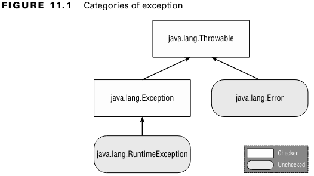
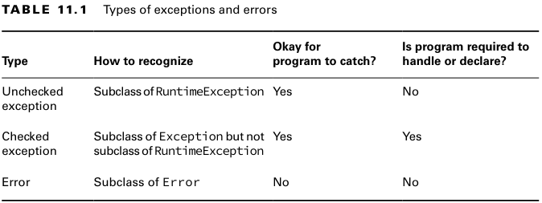
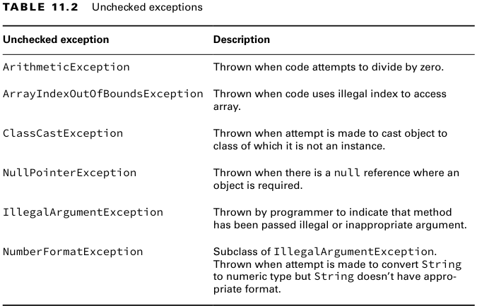
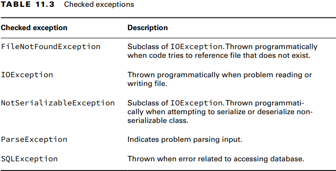
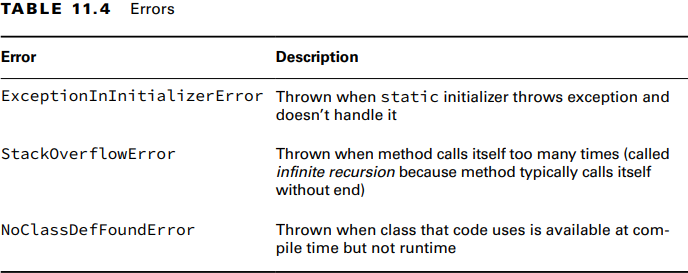
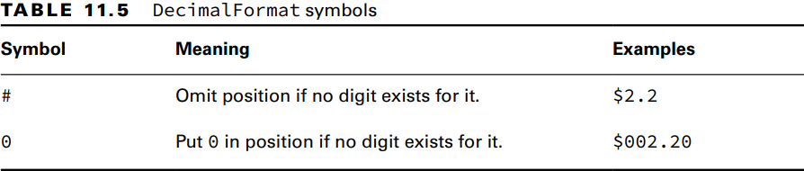

### _Chapter 11: Exceptions and Localization_

---
### `Exceptions`

**Figure 11.1** Categories of exception



Checked exception'lar handle or declare kuralına uymalıdır.
```java
// Declares
void fall(int distance) throws IOException {
    if (distance > 10) {
        throw new IOException();
    }
}

// Handles
void fall(int distance) {
    try {
        if (distance > 10) {
            throw new IOException();
        }
    } catch (Exception e) {
        e.printStackTrace();
    }
}
```

- _Error_ program artık kurtarılamaycak kadar kötü bir hata durumu olduğunda fırlatılırlar.
- **catch** bloğu içerisinde _Throwable_ ve _Error_ yakalanabilir fakat bunun yapılması tavsiye edilmez.

**Table 11.1** Types of exceptions and errors



Aşağıda ki gibi bir kod geçerlidir.
```java
var e = new RuntimeException();
throw e;
```

```java
throw RuntimeException(); // DOES NOT COMPILE
```

```java
try {
    throw new RuntimeException();
    // Unreachable
    throw new ArrayIndexOutOfBoundsException(); // DOES NOT COMPILE
} catch (Exception e) {}
```
<br/>

**Calling Methods That Throw Exceptions**

**try-catch** ile sarılan method deklerasyonunda hata fırlatılmadığı durumda.
1. Eğer catch ile yakalanan hata Exception veya RuntimeException ise kod derlenir.
2. Eğer checked exception tipinde ve Exception sınıfının alt tipinde ise derlenmez.
```java
public void good() {
    try {
        eatCarrot();
    } catch (Exception e) {
        System.out.println("Problematic");
    }
}

private void eatCarrot() {}
```

```java
public void good() {
    try {
        eatCarrot();
    } catch (Exception e) {
        System.out.println("Problematic");
    }
}

private void eatCarrot() {}
```

```java
public void bad() {
    try {
        eatCarrot();
    } catch (IOException e) { // DOES NOT COMPILE
        System.out.println("Problematic");
    }
}

private void eatCarrot() {}
```
<br/>

**Overriding Methods with Exceptions**

- Override edilen method yeni bir checked exception tanımlayamaz. _(Bkz. hop1())_
- Override edilen method daha geniş tipte bir checked exception tanımlayamaz. _(Bkz. hop2())_
- Override edilen method gövdesi eğer hata fırlatmıyorsa parent sınıfta bulunan exception'ı method deklerasyonuna eklemek
  zorunda değildir. _(Bkz. hop3())_
```java
class CanNotHopException extends Exception {}

class Hopper {
    public void hop1() {}
    public void hop2() throws CanNotHopException {}
    public void hop3() throws CanNotHopException {}
}

class Bunny extends Hopper {
    @Override
    public void hop1() throws CanNotHopException {} // DOES NOT COMPILE

    @Override
    public void hop2() throws Exception {} // DOES NOT COMPILE

    @Override
    public void hop3() {}
}
```

<br/>

**Recognizing Exception Classes**

**TABLE 11.2** Unchecked exceptions



**TABLE 11.3** Checked exceptions



**TABLE 11.4** Errors

- Error'lar unchecked'dir.
- JVM tarafından fırlatılırlar.
- Handle or declare kuralına uymak zorunda değildirler.



---
### `Handling Exception`

**Multi-Catch Block**
```java
try {
    System.out.println(Integer.parseInt(args[1]));
} catch (ArrayIndexOutOfBoundsException e) {
    System.out.println("Missing or invalid input.");
} catch (NumberFormatException e) {
    System.out.println("Missing or invalid input.");
}

try {
    System.out.println(Integer.parseInt(args[1]));
} catch (ArrayIndexOutOfBoundsException | NumberFormatException e) {
    System.out.println("Missing or invalid input.");
}
```

```java
catch(Exception1 e | Exception2 e | Exception3 e)    // DOES NOT COMPILE
catch(Exception1 e1 | Exception2 e2 | Exception3 e3) // DOES NOT COMPILE
catch(Exception1 | Exception2 | Exception3 e)
```

Multi-catch içerisinde hierarşik olarak birbirinden bağımsız exception sınıflarını kullanmamız gerekiyor.

```java
try {
    throw new IOException();
} catch (FileNotFoundException | IOException e) {} // DOES NOT COMPILE
```

```java
try {
    throw new IOException();
} catch (Exception | IOException e) {} // DOES NOT COMPILE
```

**Finally Block**

- Exception olsun veya olmasın **finally** block çalışır.
- Finally ile birlikte, unchecked exceptionlar için **catch** block kullanmak opsiyoneldir.
- Finally block en sonda olması gerekiyor.
- Finally block her zaman çalışır fakat her zaman tamamlanacağının garantisi yoktur. Eğer finally block içerisinde hata 
  olursa kod yine hata üretir.
```java
/*
  Below code prints:
   Inside catch block
   Inside finally block      
 */
public static void main(String[] args) {
    try {
        fall();
        System.out.println("Inside try block");
    } catch (UnsupportedOperationException e) {
        System.out.println("Inside catch block");
    } finally {
        System.out.println("Inside finally block");
    }
}

private static void fall() {
    throw new UnsupportedOperationException();
}
```

```java
/*
  Below code prints:
   Inside finally block
   Exception in thread "main" java.lang.UnsupportedOperationException     
 */
public static void main(String[] args) {
    try {
        fall();
        System.out.println("Inside try block");
    } finally {
        System.out.println("Inside finally block");
    }
}

private static void fall() {
    throw new UnsupportedOperationException();
}
```

```java
/*
  Below code prints:
   Inside try block
   Inside finally block
   3       
 */
public static void main(String[] args) {
    System.out.println(goHome());
}

private static int goHome() {
    try {
        System.out.println("Inside try block");
        return 1;
    } catch (Exception e) {
        System.out.println("Inside catch block");
        return 2;
    } finally {
        System.out.println("Inside finally block");
        return 3;
    }
}
```

```java
/*
  Below code prints:
   Inside try block
   Inside finally block
   1       
 */
public static void main(String[] args) {
    System.out.println(goHome());
}

private static int goHome() {
    try {
        System.out.println("Inside try block");
        return 1;
    } catch (Exception e) {
        System.out.println("Inside catch block");
        return 2;
    } finally {
        System.out.println("Inside finally block");
    }
}
```

```java
/*
  Below code prints:
   Inside try block
   Exception in thread "main" java.lang.NullPointerException      
 */
String text = null;
try {
    System.out.println("Inside try block");
} catch (Exception e) {
    System.out.println("Inside catch block");
} finally {
    System.out.println(text.toUpperCase()); // Causes to exception
    System.out.println("Inside finally block");
}
```

Eğer try içerisinde _System.exit(0)_ çalıştırılırsa Java uygulaması aniden durur ve **finally** block hiç çalışmaz.
```java
try {
    System.exit(0);
}  finally {
    System.out.println("Never going to here"); // Will not print
}
```

---
### `Automating Resource Management`

Veri tabanı veya dosya işlemleri gibi harici kaynaklara resource denir. Bunlar üzerinde işlem yapabilmek için uygulama
üzerinde _connection_ açılması gerekir. Eğer bu bağlantılar kapatılmazsa _memory leak_'lere neden olur.

```java
FileInputStream fis = null;
try {
    fis = new FileInputStream("myFile.txt");
} catch (IOException e) {
    e.printStackTrace();
} finally {
    if (fis != null) {
        try {
            fis.close();
        } catch (IOException e) {
            e.printStackTrace();
        }
    }
}
```

**Try with Resources**

Yukarıda ki kodda manuel bir şekilde resouce kapatıldı. Ama Java'da resouce kapatma işlemi otomatik olarak da yapılabilir.

```java
try(FileInputStream fis = new FileInputStream("myFile.txt")) {
    // Read the file
} catch (IOException e) {
    e.printStackTrace();
}
```

- Bir sınıfın try with resouce ile kullanılabilmesi için _Closable_ doğal olarak onun parenti olan _AutoClosable_ 
  arayüzünü implement etmesi gerekir.
- _Closable_ ve _AutoClosable_ farkı, close() methodunun fırlattığı exception tipi ve bulundukları paketlerdir.
  ```java
  package java.lang;
  
  public interface AutoCloseable {
    void close() throws Exception;
  }
  ```
  ```java
  package java.io;
  
  public interface Closeable extends AutoCloseable {
    public void close() throws IOException;
  }
  ```
- close() methodu eğer checked exception fırlatıyorsa exception **catch** block içerisinde mutlaka yakalanmalıdır.
- Derleyici arka planda bizim yerimize **finally** bloğu ekleyecektir. 
```java
class HugeResource implements AutoCloseable {
    private final String fileName;

    HugeResource(String fileName) {
        this.fileName = fileName;
    }

    @Override
    public void close() throws Exception {
        System.out.println("Resource closed.");
    }

    public static void main(String[] args) {
        try (var resource = new HugeResource("myFile.txt")) {
            // Read the file
        } catch (Exception e) {
            e.printStackTrace();
        }
    }
}
```

- Derleyicinin eklediği **finally** blok bizim tanımladığımız **catch** ve **finally** bloktan önce çalışır.
```java
/*
  Below code prints:
   Try block
   res-1 closed.
   Catch block
   Finally block
 */
try (var in = new HugeResource("res-1")) {
    System.out.println("Try block");
    throw new Exception();
} catch (Exception e) {
    System.out.println("Catch block");
} finally {
    System.out.println("Finally block");
}
```

- Try with resource'da birden fazla resource aynı anda birden çok resouce tanımlanabilir.
  Resouce'lar kapatılırken tanımlandığı sıranın tersinde kapatılır.

```java
/*
  Below code prints:
   res-2 closed.
   res-1 closed.      
 */
class HugeResource implements AutoCloseable {
    private final String resourceName;

    HugeResource(String resourceName) {
        this.resourceName = resourceName;
    }

    @Override
    public void close() {
        System.out.println(resourceName + " closed.");
    }

    public static void main(String[] args) {
        // Önce out, sonra in kapatılır.
        try (var in = new HugeResource("res-1");
             var out = new HugeResource("res-2")) {
            // Read the file
        }
    }
}
```

- Birden fazla resource tanımlanırken, değişken tipi olarak _var_ ve sınıf ismi birlikte kullanılabilir.
```java
try (var in = new HugeResource("res-1");
     HugeResource out = new HugeResource("res-2")) {
    // Read the file
}
```
- Resource'lar genelde _try-with-resource_ statement'ta tanımlanır. Try bloğundan önce de bu tanımlama yapılabilir. 
  Bunun için ilgili resource değişkeninin **final** veya _effectively final_ olması gerekir.
```java
var in = new HugeResource("res-1");
final var out = new HugeResource("res-2");
try (in; out) {
    System.out.println("Try block");
}
```

```java
var in = new HugeResource("res-1");
final var out = new HugeResource("res-2");
try (in; out) { // DOES NOT COMPILE
    System.out.println("Try block");
}
in = new HugeResource("res-3");
```

**Suppressed Exceptions**

Try-with-resource da birden fazla exception fırlatılıyorsa, fırlatılan ilk primary, diğerleri suppressed exceptions'dır.
```java
/*
  Below code prints:
   Primary: Cannot put turkeys in
   Suppressed: Cage door does not close      
 */
class TurkeyCage implements AutoCloseable {
    @Override
    public void close() throws IllegalStateException {
        throw new IllegalStateException("Cage door does not close");
    }

    public static void main(String[] args) {
        try (TurkeyCage cage = new TurkeyCage()) {
            // Primary exception
            throw new UnsupportedOperationException("Cannot put turkeys in");
        } catch (RuntimeException e) {
            System.out.println("Primary: " + e.getMessage()); // Cannot put turkeys in
            for (Throwable throwable : e.getSuppressed()) {
                System.out.println("Suppressed: " + throwable.getMessage()); // Cage door does not close
            }
        }
    }
}
```

```java
/*
  Below code prints:
   Caught: cage-3 Cage door does not close
   Suppressed: cage-2 Cage door does not close
   Suppressed: cage-1 Cage door does not close      
 */
class TurkeyCage implements AutoCloseable {
  private final String name;

  public TurkeyCage(String name) {
    this.name = name;
  }

  @Override
  public void close() throws IllegalStateException {
    throw new IllegalStateException(name + " Cage door does not close");
  }

  public static void main(String[] args) {
    try (var cage1 = new TurkeyCage("cage-1");
         var cage2 = new TurkeyCage("cage-2");
         var cage3 = new TurkeyCage("cage-3")) {
      // Do something
    } catch (RuntimeException e) {
      System.out.println("Caught: " + e.getMessage()); // cage-3 Cage door does not close
      for (Throwable throwable : e.getSuppressed()) {
        System.out.println("Suppressed: " + throwable.getMessage()); // cage-2 Cage door does not close ...
      }
    }
  }
}
```

- Eğer **finally** blokta exception fılatılırsa diğer bütün exception'ları ezer ve program sonlanır.
```java
/*
  Below code prints:
   Exception in thread "main" java.lang.UnsupportedOperationException: Unsupported operation.      
 */
class TurkeyCage implements AutoCloseable {
    @Override
    public void close() throws IllegalStateException {
        throw new IllegalStateException("Cage door does not close");
    }

    public static void main(String[] args) {
        try (TurkeyCage cage = new TurkeyCage()) {
            throw new RuntimeException("Cannot put turkeys in");
        } catch (IllegalStateException e) {
            System.out.println("Primary: " + e.getMessage()); // Cannot put turkeys in
            for (Throwable throwable : e.getSuppressed()) {
                System.out.println("Suppressed: " + throwable.getMessage()); // Cage door does not close
            }
        } finally {
            throw new UnsupportedOperationException("Unsupported operation.");
        }
    }
}
```

---
### `Formatting Values`

**Formatting Numbers**

**Table 11.5** DecimalFormat symbols



- NumberFormat sınıfında iki tane sayısal format methodu vardır.
  ```java
  public final String format(double number)
  public final String format(long number)
  ```
- Sınav için iki sadece iki tane format karakteri bilmemiz yeterli. (_#_ ve _0_)
- _#_, eğer rakam yoksa hiçbir şey eklemez.
- _0_, rakam olmasa bile 0 ekler.

```java
double number = 1234.567;

NumberFormat format1 = new DecimalFormat("###,###,###.0");
System.out.println(format1.format(number)); // 1,234.6

NumberFormat format2 = new DecimalFormat("##,##,##.0");
System.out.println(format2.format(number)); // 12,34.6

NumberFormat format3 = new DecimalFormat("000,000.00000");
System.out.println(format3.format(number)); // 001,234.56700

NumberFormat format4 = new DecimalFormat("Your balance $#,###,###.##");
System.out.println(format4.format(number)); // Your balance $1,234.57
```

**Formatting Dates and Times**