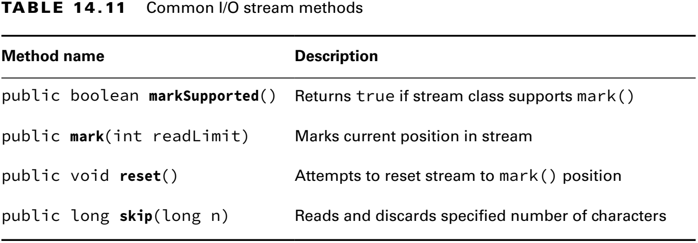
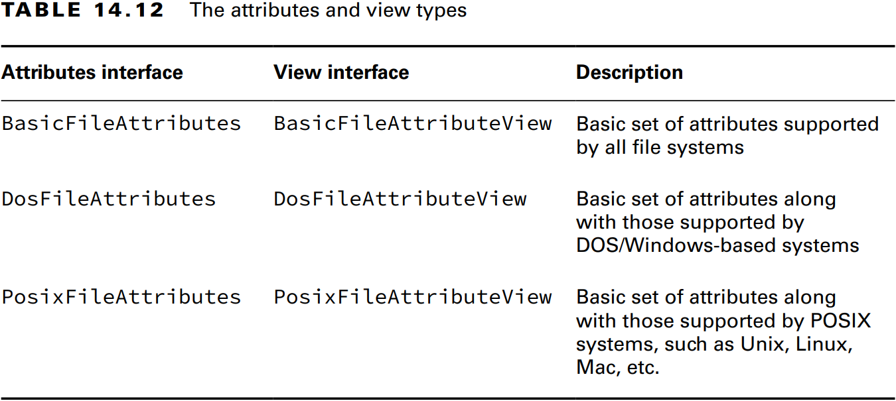
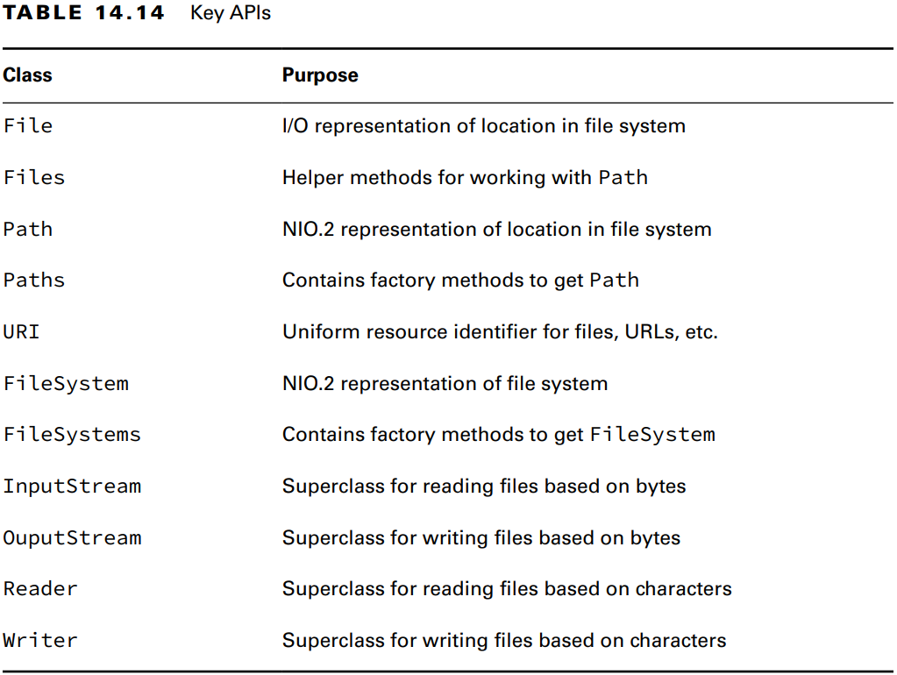
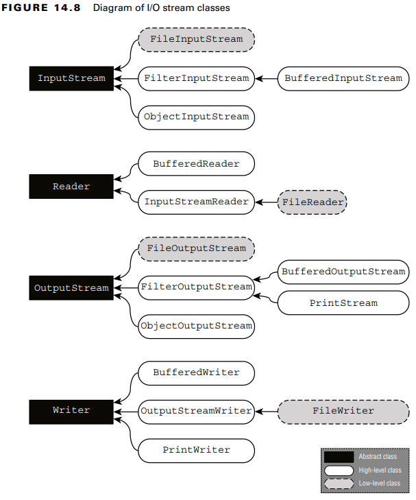

### _Chapter 14: I/O_

---
### `Referencing Files and Directories`

**Figure 14.1** Directory and file hierarchy 


Root dizin dosya sisteminin en başıdır. Windows için _C:\\_ Linux için _/_ dır.

Bir dosya için _absolute path_, _root_ dizinden itibaren dosyaya veya dizine giden tüm yoldur. **C:\app\animals\Bear.java**

_Relative path_ ise geçerli çalışma dizininden dosyaya veya dizine giden tüm yoldur. Eğer kullanıcını mevcut dizini _C:\app_ ise
_relative path_ **animals\Bear.java**'dır.

- Dizin / ile başlıyorsa _absolute path_'dir. Örn:_/bird/parrot.png_. (Linux)
- Dizin _C:_ ile başlıyorsa _absolute path_'dir. Örn:_C:/bird/parrot.png_. (Windows)
- Diğer durumlarda _relative path_'dir. Örn: _bird/parrot.png_.

**Table 14.1** File-system symbols


Mevcut dizinimiz _fish/shark/hammerhead_ ise _..swim.txt_ dizini _/fish/shar/swim.txt_'e karşılık gelmektedir.

_/fish/clownfish/../shark/./swim.txt_ dizini _/fish/shark/swim.txt_'e karşılık gelir.

**Figure 14.2** Relative paths using path symbols 


_Symbolic link_, bir dosya sistemi içerisinde başka bir dosya veya dizine referans veya işaretçi olarak hizmet veren özel bir dosyadır.
Varsayalım ki _zoo/user/favorite_'ten _fish/shark_'a bir sembolik linkimiz olsun. Artık iki dizin aynı dosyayı göstrecektir. 
Örneğin aşağıdaki dizin bilgileri aynı yolu gösterecektir:

_**zoo/user/favorite**/swim.txt_<br/>
_**fish/shark**/swim.txt_

Sembolik link kullanıcılar görünmezdir. Bu işlemi işletim sistemi halleder. Java'da _I/O_ sembolik linki desteklemez 
fakat _NIO.2_ destekler.

### Creating File or Path

File sistemde yer alan bir dosya yada klasörü temsil edecek bir oluşturmamız gereklidir. Bunun için _java.io.File_ sınıfını
veya _java.nio.file.Path_ sınıfını kullanabiliriz. _File_ veya _Path_ sınıfı dosya içeriğini okuyamaz veya dosyaya veri 
yazamaz.

_java.io.File_ bir sınıftır. _java.nio.file.Path_ ise bir **interface**'dir.

**Creating a File**
```java
File file1 = new File("C:\\tiger\\data\\stripes.txt");
File file2 = new File("C:\\tiger", "data\\stripes.txt");
File parent = new File("C:\\tiger");
File file3 = new File(parent, "data\\stripes.txt");

System.out.println(file1.exists()); // true
System.out.println(file2.exists()); // true
System.out.println(file3.exists()); // true
```

**Creating a Path**
```java
// Path.of()
Path path1 = Path.of("C:\\tiger\\data\\stripes.txt");
Path path2 = Path.of("C:", "tiger", "data", "stripes.txt");
// Paths.of()
Path path3 = Paths.get("C:\\tiger\\data\\stripes.txt");
Path path4 = Path.of("C:", "tiger", "data", "stripes.txt");

System.out.println(**Files.exists(path1)); // true
System.out.println(Files.exists(path2)); // true
System.out.println(Files.exists(path3)); // true
System.out.println(Files.exists(path4)); // true
```

**Path from the _FileSystems_ Class**
```java
Path path1 = FileSystems.getDefault().getPath("C:\\tiger\\data\\stripes.txt");
Path path2 = FileSystems.getDefault().getPath("C:", "tiger", "data", "stripes.txt");

System.out.println(Files.exists(path1)); // true
System.out.println(Files.exists(path2)); // true
```

**Switching Between File and Path**

```java
File file = new File("rabbit");
Path nowPath = file.toPath();
File backToFile = nowPath.toFile();
```

---
### `Operationg on File and Path`

### Using Shared Functionality

**Table 14.3** Common _File_ and _Path_ operations


**Table 14.4** Common _File_ and _Files_ operations


**File Methods**
```java
public static void io(String pathname) {
    var file = new File(pathname);
    if (file.exists()) {
        System.out.println("Absolute Path: " + file.isAbsolute());
        System.out.println("Is Directory: " + file.isDirectory());
        System.out.println("Parent Path: " + file.getParent());
        if (file.isFile()) {
            System.out.println("Size: " + file.length());
            System.out.println("Last Modified: " + file.lastModified());
        } else {
            for (File subFile : file.listFiles()) {
                System.out.println("    " + subFile.getName());
            }
        }
    }
}
```

- _io(**"C:\\data\\zoo.txt"**)_:

_Output:_
<pre>
Absolute Path: C:\data\zoo.txt
Is Directory: false
Parent Path: C:\data
Size: 18
Last Modified: 1722401720205
</pre>

- _io(**"C:\\data"**)_:

_Output:_
<pre>
Absolute Path: C:\data
Is Directory: true
Parent Path: C:\
    employees.txt
    zoo-backup.txt
    zoo.txt
</pre>

**Files Method**
```java
public static void io(String pathname) throws IOException {
    var path = Path.of(pathname);
    if (Files.exists(path)) {
        System.out.println("Absolute Path: " + path.toAbsolutePath());
        System.out.println("Is Directory: " + Files.isDirectory(path));
        System.out.println("Parent Path: " + path.getParent());
        if (Files.isRegularFile(path)) {
            System.out.println("Size: " + Files.size(path));
            System.out.println("Last Modified: " + Files.getLastModifiedTime(path));
        } else {
            try (Stream<Path> stream = Files.list(path)) {
                stream.forEach(p -> System.out.println("    " + p.getName(0)));
            }
        }
    }
}
```

- _io(**"C:\\data\\zoo.txt"**)_:

_Output:_
<pre>
Absolute Path: C:\data\zoo.txt
Is Directory: false
Parent Path: C:\data
Size: 18
Last Modified: 2024-07-31T04:55:20.2054116Z
</pre>

- _io(**"C:\\data"**)_:

_Output:_
<pre>
Absolute Path: C:\data
Is Directory: true
Parent Path: C:\
data
data
data
</pre>

### Providing NIO.2 Optional Parameter

**Table 14.5** Common NIO.2 method arguments


### Interacting with NIO.2 Paths

**Table 14.6** Path APIs


_Path_ objeleri _immutable_'dır.

```java
Path path = Path.of("whale");
path.resolve("krill");
System.out.println(path); // whale
```

**Viewing the Path**

_Path_ arayüzünde path ile ilgili bilgi almak için 3 adet method bulunur (_toString()_, _getNameCount()_ and _getName(int index)_).

```java
Path path = Paths.get("/land/hippo/harry.happy");
System.out.println("The Path Name: " + path);
for (int i = 0; i < path.getNameCount(); i++) {
    System.out.println("    Element(" + i + "): " + path.getName(i));
}
```

_Output:_
<pre>
The Path Name: \land\hippo\harry.happy
    Element(0): land
    Element(1): hippo
    Element(2): harry.happy
</pre>

Son iki method _root directory_'i içermez.
```java
Path path = Paths.get("/");
System.out.println(path.getNameCount()); // 0
System.out.println(path.getName(0));     // IllegalArgumentException
```

**Creating Part of the Path**

_Path_ arayüzünde _subpath()_ isiminde, pathin parçalarını seçmek için bir method bulunur. İki parametre alır: _inclusive_
beginIndex ve _exclusive_ endIndex. Bu method _String.substring()_ methoduna benzer.

```java
Path path = Paths.get("/mammal/omnivore/raccon.image");
System.out.println("Path: " + path);

for (int i = 0; i < path.getNameCount(); i++) {
    System.out.println("    Element(" + i + "): " + path.getName(i));
}

System.out.println();
System.out.println("subpath(0,3): " + path.subpath(0, 3));
System.out.println("subpath(1,2): " + path.subpath(1, 2));
System.out.println("subpath(1,3): " + path.subpath(1, 3));

path.subpath(0, 4); // IllegalArgumentException
path.subpath(1, 1); // IllegalArgumentException
```

_Output:_
<pre>
Path: \mammal\omnivore\raccon.image
    Element(0): mammal
    Element(1): omnivore
    Element(2): raccon.image

subpath(0,3): mammal\omnivore\raccon.image
subpath(1,2): omnivore
subpath(1,3): omnivore\raccon.image
Exception in thread "main" java.lang.IllegalArgumentException
</pre>

**Accessing Path Elements**

```java
Path path = Paths.get("/mammal/omnivore/raccon.image");

System.out.println("Absolute Path: " + path.toAbsolutePath());
System.out.println("File Name: " + path.getFileName());
System.out.println("    Root: " + path.getRoot());

Path currentPath = path;
while ((currentPath = currentPath.getParent()) != null) {
    System.out.println("    Current Path: " + currentPath);
}
```

_Output:_
<pre>
Absolute Path: C:\mammal\omnivore\raccon.image
File Name: raccon.image
    Root: \
    Current Path: \mammal\omnivore
    Current Path: \mammal
    Current Path: \
</pre>

**Resolving Paths**

_Path_'leri concat etmek için _resolve()_ methodu kullanılır. _String.concat()_'a benzer. İki tane overloaded versiyonu vardırç
Birisi String alır diğeri Path. Eğer parametre olarak verilen değer _absolute path_ olursa doğrudan o değer geriye döner.

```java
Path path1 = Path.of("/cats/../panther");
Path path2 = Path.of("food");
System.out.println(path1.resolve(path2)); 

Path path3 = Path.of("/turkey/food");
System.out.println(path3.resolve("/tiger/cage"));
```
_Output:_
<pre>
\cats\..\panther\food
\tiger\cage
</pre>

- **Relativizing a Path**

1. Bir dosyadan diğer dosyaya nasıl gidebileceğimizi belirler. 
2. Bu işlemin gerçekleşebilmesi için iki parametreninde aynı anda _absolute_ veya _relative_ olması gerekiyor. 
3. Farklı disklerde olursa (_C:\\_ ve _D:\\_) o zaman yine hata fırlatır.

```java
var path1 = Path.of("fish.txt");
var path2 = Path.of("friendly/birds.txt");

System.out.println(path1.relativize(path2));
System.out.println(path1.relativize(path1));
System.out.println(path2.relativize(path1));
```

_Output:_
<pre>
..\friendly\birds.txt

..\..\fish.txt
</pre>

```java
var path1 = Path.of("E:\\habitat");
var path2 = Path.of("E:\\sanctuary\\raven\\poe.txt");

System.out.println(path1.relativize(path2)); // ..\sanctuary\raven\poe.txt
System.out.println(path2.relativize(path1)); // ..\..\..\habitat
```

_Output:_
<pre>
..\sanctuary\raven\poe.txt
..\..\..\habitat
</pre>

**Normalizing a Path**

_Path_ içerisinde ki gereksiz dizinleri temizler.

```java
var p1 = Path.of("./armadillo/../shells.txt");
System.out.println(p1.normalize()); // shells.txt

var p2 = Path.of("/cats/../panther/food");
System.out.println(p2.normalize()); // \panther\food

var p3 = Path.of("/../../fish.txt");
System.out.println(p3.normalize()); // \fish.txt
```

_Output:_
<pre>
shells.txt
\panther\food
\fish.txt
</pre>

İki dizin aynı olasa bile ilk dizinde gereksiz karakterler olduğu için _equals()_ **false** döner. Fakat _normalize()_ 
işleminden sonra ise cevap **true** olur.
```java
var p1 = Paths.get("/pony/../weather.txt");
var p2 = Paths.get("/weather.txt");
var p3 = Paths.get("/weather.txt");

System.out.println(p1.equals(p2)); // false
System.out.println(p1.normalize().equals(p2.normalize())); // true
System.out.println(p2.equals(p3)); // true
```

_Output:_
<pre>
false
true
true
</pre>

**Retrieving the Real File System Path**

Buraya kadar kullanılan methodlarda dosya veya dizinin gerçekte olup olmaması önemli değildi. _Path_ nesneleri üzerinde 
teorik işlemler yaptık. **_toRealPath()_** methodu, eğer dosya gerçekte yoksa hata fırlatır.

### Creating, Moving, and Deleting Files and Directories

**Making Directories**
```java
public static Path createDirectory(Path dir, FileAttribute<?>... attrs) throws IOException
    
public static Path createDirectories(Path dir, FileAttribute<?>... attrs) throws IOException
```

_createDirectory()_: Tek bir dizin oluşturacaktır. Eğer dizin mevcut ise veya dizine giden üst dizinler mevcut değil ise 
hata fırlatacaktır.

_createDirectories()_: İlgili dizin ile mevcut olmayan üst dizinleri de oluşturacaktır. Tüm dizinler zaten mevcut ise 
_createDirectories()_ hiç bir şey yapmaz.

```java
Files.createDirectory(Path.of("C:\\bison\\field"));
Files.createDirectories(Path.of("C:\\bison\\field\\pasture\\green"));
```

**Making Files**

```java
Files.createFile(Path.of("my-file-1"));
Files.createFile(Paths.get("my-file-2"));
Files.createDirectory(Path.of("my-folder"));
Files.createFile(Path.of("my-folder", "my-file-3"));
```

**Copying Files**

```java
public static Path copy(Path source, Path target, CopyOption... options) throws IOException
```

Aşagıda ki kod önce dizinleri oluşturur (_files/panda_ ve _files/panda-new_). Sonra _bamboo.txt_ dosyasını. En 
sonunda da _files/panda/bamboo.txt_ dosyasını _files/panda-new_ altına kopyalar.
```java
// Create folders (panda and panda-new)
Path path = Path.of("files/panda");
Files.createDirectories(path);
Files.createDirectories(Path.of("files/panda-new"));

// Create file
Path bamboo = path.resolve("bamboo.txt");
// Files.createFile(Path.of("files/panda", "bamboo.txt"));
Files.createFile(bamboo);

// Move files
Files.copy(bamboo, Path.of("files/panda-new/bamboo.txt"));
```

Dizinler kopyalandığında _shallow copy_ yapılır. Yani dizinin altında bulunan alt dizi ve dosyalar kopyalanmaz. Aşağıda ki
kodda _turtle_ dizininin altında _turtle1.txt_ ve _turtle2.txt_ dosyaları mevcut. Kod çalıştığında sadece _turtleCopy_  
dizinini oluşturur altında ki dosya ve dizinleri kopyalamaz. Bunun için recursive kopyalama işlemine ihtiyaç vardır.

Kod iki kez arka arkaya çalışırsa _files\turtleCopy_ dizini için _FileAlreadyExistsException_ hatası fırlatır.

```java
Files.copy(Path.of("files/turtle"), Path.of("files/turtleCopy"));
```

**Copying and Replacing Files**

Varsayılan olarak _copy()_ methodunda ki hedef dosya zaten varsa _FileAlreadyExistsException_ hatası fırlatır. Bu davranışı 
**StandardCopyOption.REPLACE_EXISTING** ile değiştirebiliriz. Aşağıda ki kod _movie.txt_ dosyası var olsa bile dosyanın
üzerine yazar.

```java
Files.copy(Path.of("book.txt"), Path.of("movie.txt"), StandardCopyOption.REPLACE_EXISTING);
```

Yukarıda ki kod _movie.txt_ dosyası var olsa bile dosyanın _book.txt_ dosyasının içeriğini _movie.txt_ dosyasının içine 
kopyalar.

**Copying Files with I/O Streams**

```java
public static long copy(InputStream in, Path target, CopyOption... options) throws IOException

public static long copy(Path source, OutputStream out) throws IOException
```

Aşağıda ki kod _Files.copy()_ ile tamamen aynı işlemi yapar. Kaynak dosyayı hedef dosyaya kopyalar. Eğer hedef dosya zaten
mevcut ise o zaman hata fırlatır. Bunu engellemek için aynı şekilde **StandardCopyOption.REPLACE_EXISTING** varargs olarak
methoda geçebiliriz.

```java
try (var is = new FileInputStream("book.txt")) {
    Files.copy(is, Path.of("movie.txt"), StandardCopyOption.REPLACE_EXISTING);
}
```

Aşağıda ki kod çalıştığında _book.txt_ dosyasını içini _System.out_'a yani konsola kopyalar ve konsola yazdırır.
```java
Files.copy(Path.of("book.txt"), System.out);
```
_Output:_
<pre>
Anna Karenina
</pre>

**Copying Files into a Directory**

_Files.copy_ methodu hem dosyalar hemde dizinler için kullanılabilir.

```java
Path file = Path.of("food.txt");
Path directory = Path.of("enclosure");
Files.copy(file, directory);
```

Yukarıda ki kod çalıştığında _enclosure/food.txt_ dosyasını oluşturmaz. Çalıştığında oluşabilecek üç durum vardır:
1. _food.txt_ yoksa _NoSuchFileException_ fırlatır.
2. _enclosure_ dizini/dosyası varsa _FileAlreadyExistsException_ fırlatır.
3. _enclosure_ dosyasını sonunda uzantı olmadan oluşturur ve _food.txt_ dosyasının içeriğini doğrudan bu dosyaya kopyalar.

_food.txt_ dosyasını başka bir dizine kopyalamak için aşağıda ki yöntem kullanılır. Fakat bunun için _enclosure_ dizinin 
var olması gerekir.
```java
Path file = Path.of("food.txt");
Path directory = Path.of("enclosure/food.txt");
Files.copy(file, directory);
```

Dosyaları ve dizinleri taşımak veya yeniden adlandırmak için _Files.move()_ methodu kullanılabilir.

Aşağıda ki kod dizini ve dosyayı yeniden isimlendirir.
```java
Files.move(Path.of("C:\\user"), Path.of("C:\\user-new"));
Files.move(Path.of("zoo.txt"), Path.of("zoo-new.txt"));
```

Aşağıda ki kod satırı dosyayı taşır. Burada dikkat edilmesi gereken durum, _user/addresses.txt_ dosyası veya _zoo_ dizini
olmazsa kod hata fırlatır. Parent dizinleri oluşturmaz.

```java
Files.move(Path.of("user/addresses.txt"), Path.of("zoo/addresses2.txt"));
```

Aşağıda ki kod _DirectoryNotEmptyException_ fırlatır. Çünkü hedef dizin olam _zoo/reports_ dizini boş değil. Bu yüzden 
yeniden adlandıramaz.
```java
Files.move(Path.of("zoo/report.txt"), Path.of("zoo/reports"), StandardCopyOption.REPLACE_EXISTING);
```

**Performing an Atomic Move**

_Atomic move_ tek bir bölünmez işlem olarak yapılır. Eğer dosya sistemi bu işlemi desteklemiyorsa 
_AtomicMoveNotSupportedException_ hatası fırlatır. Ek olarak, eğer _StandardCopyOption.ATOMIC_MOVE_ parametresi 
_Files.copy()_ methoduna parametre olarak geçilirse yine hata fırlatır. 

```java
Files.move(Path.of("mouse.txt"), Path.of("gerbil.txt"), StandardCopyOption.ATOMIC_MOVE);
```

**Deleting a File with delete() and deleteIfExists()**

```java
public static void delete(Path path) throws IOException
public static boolean deleteIfExists(Path path) throws IOException
```

Dizin ve dosyayı silmek için iki adet method bulunur. _deleteIfExists()_ methodu geriye **boolean** bir değer döner.

Dizini silebilmek için dizinin mutlaka boş olması gerekir. Aksi takdirde _DirectoryNotEmptyException_ hatası fırlatılır.

Eğer verilan _Path_ sembolik bir link ise sembolik link silinir. Sembolik linkin işaret ettiği dosya silinmez.

_delete()_ methodu dosya yoksa _NoSuchFileException_ fırlatır. _deleteIfExists()_ dosya yoksa hiçbir şey yapmaz.

```java
Files.delete(Path.of("zoo/report.txt"));
Files.deleteIfExists(Path.of("zoo/report.txt"));
```

### Comparing Files with isSameFile() and mismatch()

_Files.isSameFile()_ iki dizinin/dosyanın eşitliğini kontrol etmek için _equals()_ methodundan daha gelişmiş bir methodur.

_isSameFile()_ methodu iki tane path parametresi alır. Eğer path'ler gerçekte mevcut değil ise hata fırlatır. Bunun tek 
bir istisnası vardır. Eğer _equals()_ methodu **true** ise o zaman _isSameFile()_ methodu kontrole devam etmez. Doğrudan 
**true** cevabını döner.

Aşağıda ki kodda _missing-file.txt_ dosyası gerçekte mevcut değil fakat _equals()_ **true** değer döndüğü için _isSameFile()_
methodu hata fırlatmaz.
```java
Path p1 = Path.of("missing-file.txt");
Path p2 = Path.of("missing-file.txt");

System.out.println(p1.equals(p2)); // true
System.out.println(Files.isSameFile(p1, p2)); // true
```

```java
Path p1 = Path.of("zoo/report.txt");
Path p2 = Path.of("zoo/../zoo/report.txt");

System.out.println(p1.equals(p2)); // false
System.out.println(Files.isSameFile(p1, p2)); // true
```
_Output:_
<pre>
false
true
</pre>

_Files.mismatch()_ methodu dosya içeriğini kontrol eder ve geriye **long** döner. Eğer iki dosyanın _içeriği_ tamamen 
aynıysa _-1_ aksi takdirde farklılığın bulunduğu ilk index numarasını yazar.

```java
Path p1 = Path.of("animals/lion.txt");
Path p2 = Path.of("animals/wolf.txt");

System.out.println(Files.mismatch(p1, p2)); // false
```

---
### `Introducing I/O Streams`

### Learning I/O Stream Nomenclature

**Byte Streams vs. Character Streams**

_java.io_ API io streamleri okumak ve yazmak için iki grup io stream sınıfı tanımlar. _Byte Streams_ ve _Character Streams_.

- Byte I/O Streamler verileri _binary_ data olarak okur ve yazar. Sınıf isimleri _InputStream_ veya _OutputStream_ ile biter.
- Character I/O Streamler verileri text olarak okur ve yazar. Sınıf isimleri _Reader_ veya _Writer_ ile biter.

**Table 14.7** The java.io abstract stream base classes


**Table 14.8** The java.io concrete I/O stream classes


---
### `Reading and Writing Files`

### Using I/O Streams

I/O stream sınıflarında _read()_ ve _write()_ methodları bulunur. _InputStream_ ve _Reader_ sınıflarında _read()_ methodu,
_OutputStream_ ve _Writer_ sınıflarında ise _write()_ methodu bulunur.

Aşağıda ki kodda methodlar dosyaya okuma yazma işlemi yaparlar. Her iki örnekte de **-1** streamin sonunu belirtir.

```java
public static void main(String[] args) throws IOException {
    copy(new FileInputStream("source.txt"), new FileOutputStream("target.txt"));
    copy(new FileReader("source.txt"), new FileWriter("target.txt"));
}

private static void copy(InputStream in, OutputStream out) throws IOException {
    int b;
    while ((b = in.read()) != -1) {
        System.out.print((char) b + " ");
        out.write(b);
    }
    out.close();
}

private static void copy(Reader in, Writer out) throws IOException {
    int b;
    while ((b = in.read()) != -1) {
        System.out.print((char) b + " ");
        out.write(b);
    }
    out.close();
}
```

_Output:_
<pre>
M y   s o u r c e . M y   s o u r c e . 
</pre>

Her seferinde tek tek okuyup yazmank verimsiz bir yol. Çoklu byte okuma/yazma için overloaded methodlar var.

```java
private static void copy(InputStream in, OutputStream out) throws IOException {
    int batchSize = 1024;
    var buffer = new byte[batchSize];
    int lengthRead;
    while ((lengthRead = in.read(buffer, 0, batchSize)) > 0) {
        System.out.print(lengthRead);
        out.write(buffer, 0, lengthRead);
        out.flush();
    }
    out.close();
}

// Satır satır okuyup yazar.
private static void copy(File src, File dest) throws IOException {
    try (var reader = new BufferedReader(new FileReader(src));
         var writer = new BufferedWriter(new FileWriter(dest))) {
        String line;
        while ((line = reader.readLine()) != null) {
            writer.write(line);
            writer.newLine();
        }
    }
}
```

`var writer = new BufferedWriter(new FileWriter(dest));` şeklinde bir writer oluşturursak her seferinde dosya içeriğini 
silip yeniden oluşturur. Her zaman sonuna eklemesini sağlamak için _append_ parametresini **true** olarak vermemiz gerekir.
`var writer = new BufferedWriter(new FileWriter(dest, true));`

Aşağıda ki kodda _BufferedWriter_ yerine _PrintWriter_ kullanınca _writer.newLine()_ methodunu çağırmamız gerekmiyor.  
_writer.println()_ methodu bunu otomatik yapıyor. 

```java
private static void copy(File src, File dest) throws IOException {
    try (var reader = new BufferedReader(new FileReader(src));
         var writer = new PrintWriter(new FileWriter(dest, true))) {
        String line;
        while ((line = reader.readLine()) != null) {
            System.out.println(line);
            writer.println(line);
        }
    }
}
```

> _PrintWriter_ ve _PrintStream_ sınıflarına karşılık gelen reader sınıfı yoktur.

**Enhancing with _Files_**

NIO.2 dosya okuma/yazma için daha kolay methodlar sunuyor. 

```java
public static void main(String[] args) throws IOException {
    Path in = Path.of("source.txt");
    readWriteAsString(in, Path.of("target1.txt"));
    readWriteAsBytes(in, Path.of("target2.txt"));
    readWriteAsLines(in, Path.of("target3.txt"));
}

private static void readWriteAsString(Path in, Path out) throws IOException {
    String string = Files.readString(in);
    Files.writeString(out, string, StandardOpenOption.CREATE, StandardOpenOption.APPEND);
}

private static void readWriteAsBytes(Path in, Path out) throws IOException {
    byte[] bytes = Files.readAllBytes(in);
    Files.write(out, bytes);
}

private static void readWriteAsLines(Path in, Path out) throws IOException {
    List<String> lines = Files.readAllLines(in);
    Files.write(out, lines);
}
```

_readString()_, _readAllBytes()_ ve _readAllLines()_ methodları tüm dosyayı tek bir seferde okur ve hafızaya alır. Eğer 
dosya içeriği çok uzun olursa o zaman _OutOfMemoryError_ hatası fırlatır. Java'nın bu sorun için bir çözümü var.

Aşağıda ki kod lazily olarak çalışır. Yani belirli bir zamanda dosyanın küçük bir kısmı hafızada tutulur.

```java
private static void readLazily(Path in) throws IOException {
    try (Stream<String> stream = Files.lines(in)) {
        stream.forEach(System.out::println);
    }
}
```

_Output:_
<pre>
INFO:Server starting
DEBUG:Processes available = 10
WARN:No database could be detected
DEBUG:Processes available reset to 0
WARN:Performing manual recovery
INFO:Server successfully started
</pre>

Daha iyi sonuclar için diğer stream methodlarından yararlanabiliriz.

```java
private static void readLazily(Path in) throws IOException {
    try (Stream<String> stream = Files.lines(in)) {
        stream.filter(s -> s.startsWith("WARN:"))
                .map(s -> s.substring(5))
                .forEach(System.out::println);
    }
}
```

_Output:_
<pre>
No database could be detected
Performing manual recovery
</pre>

> **Files.readAllLines() vs. Files.lines()**
> 
> Sınav için _readAllLines()_ ve _lines()_ methodlarının farkını bilmemiz gerekiyor.
> 
> ```java
> Files.readAllLines(Paths.get("birds.txt")).forEach(System.out::println);
> Files.lines(Paths.get("birds.txt")).forEach(System.out::println);
> ```
> - _readAllLines()_, dosya içeriğini tek seferde okur, hafızaya kaydeder ve dosyaya yazar. 
> 
> - _lines()_, her satırı lazily olarak işler ve yazar. Tüm dosyayı hafızada tutması gerekmez.
> 
> - _readAllLines()_, methodu geriye _List<String>_ döner. _lines()_ methodu geriye _Stream<String>_ döner.

**Combining with newBufferedReader() and newBufferedWriter()**

```java
private static void readWrite(File in, File out) throws IOException {
    try (BufferedReader reader = new BufferedReader(new FileReader(in));
         BufferedWriter writer = new BufferedWriter(new FileWriter(out))) {
        String line;
        while ((line = reader.readLine()) != null) {
            writer.write(line);
            writer.newLine();
        }
    }
}

private static void newBuffered(Path in, Path out) throws IOException {
    try (BufferedReader reader = Files.newBufferedReader(in);
         BufferedWriter writer = Files.newBufferedWriter(out)) {
        String line;
        while ((line = reader.readLine()) != null) {
            writer.write(line);
            writer.newLine();
        }
    }
}
```

---
### `Serializing Data`

Nesneleri I/O streame ve I/O streami nesnelere çevirmek için _serialization_ mekanizmasını kullanabiliriz. 
_Serialization_, in memory olan bir nesneyi byte streame dönüştürme işlemidir. _Deserialization_ ise byte streamden nesne 
oluşturma işlemidir.

**Figure 14.6** Serialization process


### Applying the Serializable Interface

Bir nesneyi I/O API kullanarak serileştirmek için _java.io.Serializable_ arayüzünü uygulaması gerekir.

```java
class Gorilla implements Serializable {
    private static final long serialVersionUID = 1L;
    private String name;
    private int age;
    private Boolean friendly;
    private transient String favoriteFood;
}
```

**transient** anahtar kelimesine ait alanlar serileştirilmez. Şifre gibi gizli bilgiler **transient** olarak işaretlenebilir.
Bir değişken **transient** olarak işaretlendiğinde deserialization işlemi sonrasında değişkenin varsayılan değeri verilir. 

_Serializable_ arayüzününü uygulayan sınıfların _serialVersionUID_ değişkenini tamınlaması iyi bir yaklaşımdır. Sınıf her
değiştiğinde (Yeni bir alan ekleme/silme vb.) _serialVersionUID_ bir artırılır. Deserialization işlemi sırasında versiyon 
uyumsuzlukları JVM'de _InvalidClassException_ hatasına neden olur.

> **static** değişkenler serileştirilmez. Bu yüzden **transient** olarak işaretlenmesinin bir anlamı olmayacaktır. 
> 
> Sadece ismi _serialVersionUID_ olan **static** değişken serileştirilir.

### Ensuring That a Class Is Serializable

Eğer serileştirilmek istenen nesne _Serializable_ arayüzünü uygulamıyorsa, serileştirme sırasında _NotSerializableException_ fırlatır.

Bir sınıfı serializable yapabilmek için: 
1. Sınıf _Serializable_ arayüzünü uygulamalı.
2. Sınıfın tüm instance değişkenleri _serializable_, **transient** veya serileştirme işlemi sırasında **null** değere sahip olmalıdır.

```java
public class Fur {}

public class Cat implements Serializable { 
    private Tail tail = new Tail();
}

public class Tail implements Serializable {
    private Fur fur = new Fur();
}
```

_Fur_ sınıfı _Serializable_ olarak işaretlenmediği için _Cat_ sınıfı serileştirilemez. Serileştirme sırasına _fur_ değişkeni 
**null** değere sahip olursa hata fırlatmaz. Aksi takdirde fırlatır.

### Storing Data with ObjectOutputStream and ObjectInputStream

_ObjectInputStream_ sınıfı nesneyi deserialize etmek için, _ObjectOutputStream_ ise nesneyi serialize etmek için kullanılır.
İki sınıfta high-level streamdir. İki sınıfında bir çok methodu var fakat sınav için sadece _readObject()_ ve _writeObject()_
methodlarına ihtiyaç var.

```java
// ObjectInputStream
public Object readObject() throws IOException, ClassNotFoundException

// ObjectOutputStream
public void writeObject(Object obj) throws IOException
```

```java
class Cat implements Serializable {
    private String name;
    private int age;
    private String color = "white";
    
    public Cat() {
        System.out.println("No-args constructor");
    }
    
    public Cat(String name, int age, String color) {
        System.out.println("All-args constructor");
        this.name = name;
        this.age = age;
        this.color = color;
    }
    
    public String getName() {
        System.out.println("getName");
        return name;
    }
    
    public void setName(String name) {
        System.out.println("setName");
        this.name = name;
    }
    
    @Override
    public String  toString() {
        return "Cat{" +
                "name='" + name + '\'' +
                ", age=" + age +
                ", color='" + color + '\'' +
                '}';
    }
}

public static void main(String[] args) throws IOException, ClassNotFoundException {
    var objectOutputStream = new ObjectOutputStream(new FileOutputStream("cat.serial"));
    Cat cat = new Cat("tekir", 2, "black");
    objectOutputStream.writeObject(cat);
    objectOutputStream.close();
    
    var objectInputStream = new ObjectInputStream(new FileInputStream("cat.serial"));
    Cat deserilaizedCat = (Cat) objectInputStream.readObject();
    objectInputStream.close();
    
    System.out.println(deserilaizedCat);
}
```

_Output:_
<pre>
All-args constructor
Cat{name='tekir', age=2, color='black'}
</pre>

Deserialize işlemi sırasında hiç bir constructor veya set methodu çalışmaz. Ayrıca değişkenlerinde başlangıç değerleri göz 
ardı edilir.

### Understanding the Deserialization Creation Process

Bir nesneyi deserialize yaptığımızda ilgili sınıfta bulunan constructorler ve _instance initializer block_'lar çalışmayacaktır.
Deserialize işlemi yaptığımızda Java sınıf hiyerarşisinde bulunan ilk _non-serialized_ sınıfın _no-args_ constructorunu 
çağırır.

```java
class Animal {
    private int id;
    private String type;

    public Animal() {
        System.out.println("Animal no-args constructor");
    }

    public Animal(int id, String type) {
        System.out.println("Animal all-args constructor");
        this.id = id;
        this.type = type;
    }

    @Override
    public String toString() {
        return "Animal{" +
                "id=" + id +
                ", type='" + type + '\'' +
                '}';
    }
}

class Cat extends Animal implements Serializable {
    private String name;
    private int age;
    private String color = "white";

    public Cat() {
        System.out.println("Cat no-args constructor");
    }

    public Cat(String name, int age, String color, int id, String type) {
        super(id, type);
        System.out.println("Cat all-args constructor");
        this.name = name;
        this.age = age;
        this.color = color;
    }

    public String getName() {
        System.out.println("getName");
        return name;
    }

    public void setName(String name) {
        System.out.println("setName");
        this.name = name;
    }

    @Override
    public String toString() {
        return "Cat{" +
                "name='" + name + '\'' +
                ", age=" + age +
                ", color='" + color + '\'' +
                ", " + super.toString() +
                '}';
    }
}
```
_Output:_
<pre>
Animal all-args constructor
Cat all-args constructor

// Starting deserialize.
Animal no-args constructor
Cat{name='Tekir', age=2, color='white', Animal{id=0, type='null'}}
</pre>

_Animal_ sınıfının no-args constructoru çalıştırılır. _id_ ve _type_ alanları varsayılan değerlerini alıyor.

---
### `Interacting with Users`

### Reading Input as an I/O Stream

```java
var reader = new BufferedReader(new InputStreamReader(System.in));
System.out.print("Your name: ");
String userInput = reader.readLine();
System.out.println("You entered: " + userInput);
```

_Output:_
<pre>
Your name: Muhammed
You entered: Muhammed
</pre>

### Closing System Streams

_System.out_, _System.err_ ve _System.in_ yapılarını kullanırız fakat bunları asla oluşturmayız veya kapatmayız.

Bu yapılar **static** ve tüm uygulama içerisinde geçerlidir. _JVM_ bunları bizim yerimize kendisi oluşturur. Bu streamler 
_try-with-resources_ veya _close()_ methodu ile kapatılabilir. Fakat bunu asla yapmamalıyız. Çünkü bu streamler bir kez 
kapatılırsa tüm uygulama genelinde kapatılmış olur. Bu durumda uygulamanın geriye kalan kısmında örneğin _System.out.println()_
methodunu kullanamayız.

```java
try (var out = System.out) {
    out.println("Inside try");
}
System.out.println("After try"); // Will not print
```

```java
System.out.close();
System.out.println("After try"); // Will not print
```

_PrintStream_ sınıfının aksine çoğu _InputStream_ uygulamaları kapanmış I/O streamler üzerinde işlem yaparsa hata fırlatır.

```java
var reader = new BufferedReader(new InputStreamReader(new FileInputStream("cat.txt")));
reader.close();
reader.readLine(); // throws IOException: Stream closed
```

---
### `Working with Advanced APIs`

### Manipulating Input Streams

**TABLE 14.11** Common I/O stream methods




**Skipping Data**

Kod çalıştığında _TRS_ sonucunu bastırır. _skip()_ methodu kaç karakter atlamışsa onu döner. _skip(1000)_ çağrıldığında 
1000 karakterden az varsa örneğin 20 dönebilir.

```java
try (var is = new BufferedInputStream(new FileInputStream("tiger.txt"))) {
    System.out.print((char) is.read()); // T
    is.skip(2); // Skips I and G
    is.read();  // Reads E but doesn't output it
    System.out.print((char) is.read()); // R
    System.out.print((char) is.read()); // S
}
```
_Output:_
<pre>
TRS
</pre>

### Discovering File Attributes

**Checking for Symbolic Links**

```java
Path newLink = Paths.get("symbolic.txt");
Path target = Path.of("target.txt");

Files.createFile(target);
Files.createSymbolicLink(newLink, target);

System.out.println(Files.isDirectory(Path.of("extras")));
System.out.println(Files.isSymbolicLink(Path.of("symbolic.txt")));
System.out.println(Files.isRegularFile(Path.of("zoo.txt")));

Files.deleteIfExists(newLink);
Files.deleteIfExists(target);
```

_Output:_
<pre>
true
true
true
</pre>

**Checking File Accessibility**

_Files.isHidden()_, IOException fırlatır. Diğerleri hata fırlatmaz.

```java
System.out.print(Files.isHidden(Paths.get("/walrus.txt")));
System.out.print(Files.isReadable(Paths.get("/seal/baby.png")));
System.out.print(Files.isWritable(Paths.get("dolphin.txt")));
System.out.print(Files.isExecutable(Paths.get("whale.png")));
```

**Improving Attribute Access**

Dosya özelliklerini okumak için her seferinde dosyayı gidip okumak verimsiz bir yaklaşımdır. Java'da bunun için daha iyi 
bir çözüm var. 

**TABLE 14.12** The attributes and view types



- _BasicFileAttributes_: Tüm işletim sistemleri tarafından desteklenen temel dosya özellikleridir.
- _DosFileAttributes_: DOS/Windows tarafıdan desteklenen dosya özellikleridir.
- _PosixFileAttributes_: Unix/Linux/Mac tarafından desteklenen dosya özellikleridir.

```java
Path path = Path.of("zoo.txt");

BasicFileAttributes attributes = Files.readAttributes(path, BasicFileAttributes.class);
System.out.println("Is a directory: " + attributes.isDirectory());
System.out.println("Is a regular file: " + attributes.isRegularFile());
System.out.println("Is a symbolic link: " + attributes.isSymbolicLink());
System.out.println("Size (in bytes): " + attributes.size());
System.out.println("Last modified: " + attributes.lastModifiedTime());
System.out.println("Last modified: " + attributes.creationTime());

DosFileAttributes dosAttributes = Files.readAttributes(path, DosFileAttributes.class);
System.out.println("\nIs hidden: " + dosAttributes.isHidden());
System.out.println("Is read only: " + dosAttributes.isReadOnly());
System.out.println("Is archive: " + dosAttributes.isArchive());
System.out.println("Is system: " + dosAttributes.isSystem());
```

### Traversing a Directory Tree

Aşağıdaki kod, bir dosya içerisinde ki tüm alt dosya ve dizinleri dolaşır. _Files.walk(src, 5)_ kullanınımı ile kaç alt 
dizine ineceğini belirtiriz.

Varsayılan olarak circular path'leri engellemek için sembolik linkleri takip etmez. Sembolik linkleri aktif hale getirmek 
için _Files.walk(src, **FileVisitOption.FOLLOW_LINKS**)_.
```java
public static void main(String[] args) throws IOException {
    System.out.println(new Test().getPathSize(Path.of("src")));
}

private long getSize(Path path) {
    try {
        return Files.size(path);
    } catch (IOException e) {
        throw new RuntimeException(e);
    }
}

private long getPathSize(Path src) throws IOException {
    try(var s = Files.walk(src)) {
        return s.parallel()
                .filter( p -> !Files.isDirectory(p))
                .peek(p -> System.out.println(p))
                .mapToLong(this::getSize)
                .sum();
    }
}
```

_Output:_
<pre>
src\main\java\com\mtopgul\beyondClasses\sealing\subclassModifier\nonsealedSubclass\MyWolf.java
src\main\java\com\mtopgul\io\readingAndWritingFiles\usingIoStream\BufferedReaderWriterExample02.java
src\main\java\com\mtopgul\concurrency\concurrencyApi\callable\CallableExample02.java
src\main\resources\images\2.2-unary-operators.png
...
</pre>

### Searching a Directory

_Files.find()_ methodu, _Files.walk()_ methoduna benzer ve doğrudan belirli dosyaları aramak için kullanılır.

Aşağıda ki kod, bir dizin ağacını arar ve en az 1.000 bayt boyutundaki tüm .java dosyalarını 10 derinlik sınırını 
kullanarak yazdırır. Bu işlem _Files.walk()_ ile de yapılabilir fakat daha fazla işlem gerekecektir.

```java
Path path = Path.of("src");
long minSize = 1000;

try (var s = Files.find(
        path,
        10,
        (p, f) -> f.isRegularFile()
                && p.toString().endsWith(".java")
                && f.size() > minSize)) {
    s.forEach(System.out::println);
}
```

_Output:_
<pre>
src\main\java\com\mtopgul\beyondClasses\enums\Season.java
src\main\java\com\mtopgul\beyondClasses\enums\Season2.java
src\main\java\com\mtopgul\beyondClasses\implementingInterfaces\IsColdBlooded.java
src\main\java\com\mtopgul\beyondClasses\polymorphism\casting\Casting.java
...
</pre>

**Table 14.14** Key APIs



**Figure 14.8** Diagram of I/O stream classes



### Review Questions

- _new File("/home").delete();_ işlemi boolean döner. Hata fırlatmaz.