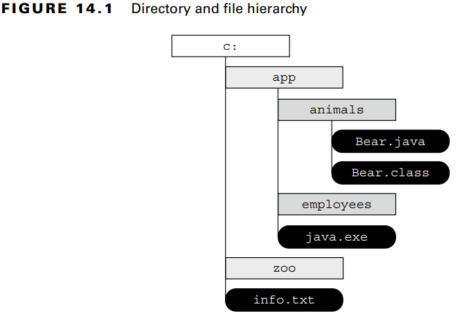

### _Chapter 14: I/O_

---
### `Referencing Files and Directories`

**Figure 14.1** Directory and file hierarchy 



Root dizin dosya sisteminin en başıdır. Windows için _C:\\_ Linux için _/_ dır.

Bir dosya için _absolute path_, _root_ dizinden itibaren dosyaya veya dizine giden tüm yoldur. **C:\app\animals\Bear.java**

_Relative path_ ise geçerli çalışma dizininden dosyaya veya dizine giden tüm yoldur. Eğer kullanıcını mevcut dizini _C:\app_ ise
_relative path_ **animals\Bear.java**'dır.

- Dizin / ile başlıyorsa _absolute path_'dir. Örn:_/bird/parrot.png_. (Linux)
- Dizin _C:_ ile başlıyorsa _absolute path_'dir. Örn:_C:/bird/parrot.png_. (Windows)
- Diğer durumlarda _relative path_'dir. Örn: _bird/parrot.png_.

**Table 14.1** File-system symbols


Mevcut dizinimiz _fish/shark/hammerhead_ ise _..swim.txt_ dizini _/fish/shar/swim.txt_'e karşılık gelmektedir.

_/fish/clownfish/../shark/./swim.txt_ dizini _/fish/shark/swim.txt_'e karşılık gelir.

**Figure 14.2** Relative paths using path symbols 


_Symbolic link_, bir dosya sistemi içerisinde başka bir dosya veya dizine referans veya işaretçi olarak hizmet veren özel bir dosyadır.
Varsayalım ki _zoo/user/favorite_'ten _fish/shark_'a bir sembolik linkimiz olsun. Artık iki dizin aynı dosyayı göstrecektir. 
Örneğin aşağıdaki dizin bilgileri aynı yolu gösterecektir:

_**zoo/user/favorite**/swim.txt_<br/>
_**fish/shark**/swim.txt_

Sembolik link kullanıcılar görünmezdir. Bu işlemi işletim sistemi halleder. Java'da _I/O_ sembolik linki desteklemez 
fakat _NIO.2_ destekler.

**Creating File or Path**

File sistemde yer alan bir dosya yada klasörü temsil edecek bir oluşturmamız gereklidir. Bunun için _java.io.File_ sınıfını
veya _java.nio.file.Path_ sınıfını kullanabiliriz. _File_ veya _Path_ sınıfı dosya içeriğini okuyamaz veya dosyaya veri 
yazamaz.

_java.io.File_ bir sınıftır. _java.nio.file.Path_ ise bir **interface**'dir.

- **Creating a File**
```java
File file1 = new File("C:\\tiger\\data\\stripes.txt");
File file2 = new File("C:\\tiger", "data\\stripes.txt");
File parent = new File("C:\\tiger");
File file3 = new File(parent, "data\\stripes.txt");

System.out.println(file1.exists()); // true
System.out.println(file2.exists()); // true
System.out.println(file3.exists()); // true
```

- **Creating a Path**
```java
// Path.of()
Path path1 = Path.of("C:\\tiger\\data\\stripes.txt");
Path path2 = Path.of("C:", "tiger", "data", "stripes.txt");
// Paths.of()
Path path3 = Paths.get("C:\\tiger\\data\\stripes.txt");
Path path4 = Path.of("C:", "tiger", "data", "stripes.txt");

System.out.println(**Files.exists(path1)); // true
System.out.println(Files.exists(path2)); // true
System.out.println(Files.exists(path3)); // true
System.out.println(Files.exists(path4)); // true
```

**Path from the _FileSystems_ Class**
```java
Path path1 = FileSystems.getDefault().getPath("C:\\tiger\\data\\stripes.txt");
Path path2 = FileSystems.getDefault().getPath("C:", "tiger", "data", "stripes.txt");

System.out.println(Files.exists(path1)); // true
System.out.println(Files.exists(path2)); // true
```

- **Switching Between File and Path**

```java
File file = new File("rabbit");
Path nowPath = file.toPath();
File backToFile = nowPath.toFile();
```

---
### `Operationg on File and Path`

**Using Shared Functionality**

**Table 14.3** Common _File_ and _Path_ operations


**Table 14.4** Common _File_ and _Files_ operations


- **File Methods**
```java
public static void io(String pathname) {
    var file = new File(pathname);
    if (file.exists()) {
        System.out.println("Absolute Path: " + file.isAbsolute());
        System.out.println("Is Directory: " + file.isDirectory());
        System.out.println("Parent Path: " + file.getParent());
        if (file.isFile()) {
            System.out.println("Size: " + file.length());
            System.out.println("Last Modified: " + file.lastModified());
        } else {
            for (File subFile : file.listFiles()) {
                System.out.println("    " + subFile.getName());
            }
        }
    }
}
```

- _io(**"C:\\data\\zoo.txt"**)_:

_Output:_
<pre>
Absolute Path: C:\data\zoo.txt
Is Directory: false
Parent Path: C:\data
Size: 18
Last Modified: 1722401720205
</pre>

- _io(**"C:\\data"**)_:

_Output:_
<pre>
Absolute Path: C:\data
Is Directory: true
Parent Path: C:\
    employees.txt
    zoo-backup.txt
    zoo.txt
</pre>

- **Files Method**
```java
public static void io(String pathname) throws IOException {
    var path = Path.of(pathname);
    if (Files.exists(path)) {
        System.out.println("Absolute Path: " + path.toAbsolutePath());
        System.out.println("Is Directory: " + Files.isDirectory(path));
        System.out.println("Parent Path: " + path.getParent());
        if (Files.isRegularFile(path)) {
            System.out.println("Size: " + Files.size(path));
            System.out.println("Last Modified: " + Files.getLastModifiedTime(path));
        } else {
            try (Stream<Path> stream = Files.list(path)) {
                stream.forEach(p -> System.out.println("    " + p.getName(0)));
            }
        }
    }
}
```

- _io(**"C:\\data\\zoo.txt"**)_:

_Output:_
<pre>
Absolute Path: C:\data\zoo.txt
Is Directory: false
Parent Path: C:\data
Size: 18
Last Modified: 2024-07-31T04:55:20.2054116Z
</pre>

- _io(**"C:\\data"**)_:

_Output:_
<pre>
Absolute Path: C:\data
Is Directory: true
Parent Path: C:\
data
data
data
</pre>

**Providing NIO.2 Optional Parameter**

**Table 14.5** Common NIO.2 method arguments


**Interacting with NIO.2 Paths**

_Path_ objeleri _immutable_'dır.

```java
Path path = Path.of("whale");
path.resolve("krill");
System.out.println(path); // whale
```

- **Viewing the Path**

_Path_ arayüzünde path ile ilgili bilgi almak için 3 adet method bulunur (_toString()_, _getNameCount()_ and _getName(int index)_).

```java
Path path = Paths.get("/land/hippo/harry.happy");
System.out.println("The Path Name: " + path);
for (int i = 0; i < path.getNameCount(); i++) {
    System.out.println("    Element(" + i + "): " + path.getName(i));
}
```

_Output:_
<pre>
The Path Name: \land\hippo\harry.happy
    Element(0): land
    Element(1): hippo
    Element(2): harry.happy
</pre>

Son iki method _root directory_'i içermez.
```java
Path path = Paths.get("/");
System.out.println(path.getNameCount()); // 0
System.out.println(path.getName(0));     // IllegalArgumentException
```

- **Creating Part of the Path**

_Path_ arayüzünde _subpath()_ isiminde, pathin parçalarını seçmek için bir method bulunur. İki parametre alır: _inclusive_
beginIndex ve _exclusive_ endIndex. Bu method _String.substring()_ methoduna benzer.

```java
Path path = Paths.get("/mammal/omnivore/raccon.image");
System.out.println("Path: " + path);

for (int i = 0; i < path.getNameCount(); i++) {
    System.out.println("    Element(" + i + "): " + path.getName(i));
}

System.out.println();
System.out.println("subpath(0,3): " + path.subpath(0, 3));
System.out.println("subpath(1,2): " + path.subpath(1, 2));
System.out.println("subpath(1,3): " + path.subpath(1, 3));

path.subpath(0, 4); // IllegalArgumentException
path.subpath(1, 1); // IllegalArgumentException
```

_Output:_
<pre>
Path: \mammal\omnivore\raccon.image
    Element(0): mammal
    Element(1): omnivore
    Element(2): raccon.image

subpath(0,3): mammal\omnivore\raccon.image
subpath(1,2): omnivore
subpath(1,3): omnivore\raccon.image
Exception in thread "main" java.lang.IllegalArgumentException
</pre>

- **Accessing Path Elements**

```java
Path path = Paths.get("/mammal/omnivore/raccon.image");

System.out.println("Absolute Path: " + path.toAbsolutePath());
System.out.println("File Name: " + path.getFileName());
System.out.println("    Root: " + path.getRoot());

Path currentPath = path;
while ((currentPath = currentPath.getParent()) != null) {
    System.out.println("    Current Path: " + currentPath);
}
```

_Output:_
<pre>
Absolute Path: C:\mammal\omnivore\raccon.image
File Name: raccon.image
    Root: \
    Current Path: \mammal\omnivore
    Current Path: \mammal
    Current Path: \
</pre>

- **Resolving Paths**

_Path_'leri concat etmek için _resolve()_ methodu kullanılır. _String.concat()_'a benzer. İki tane overloaded versiyonu vardırç
Birisi String alır diğeri Path. Eğer parametre olarak verilen değer _absolute path_ olursa doğrudan o değer geriye döner.

```java
Path path1 = Path.of("/cats/../panther");
Path path2 = Path.of("food");
System.out.println(path1.resolve(path2)); 

Path path3 = Path.of("/turkey/food");
System.out.println(path3.resolve("/tiger/cage"));
```
_Output:_
<pre>
\cats\..\panther\food
\tiger\cage
</pre>

- **Relativizing a Path**

Bir dosyadan diğer dosyaya nasıl gidebileceğimizi belirler.

```java
var path1 = Path.of("fish.txt");
var path2 = Path.of("friendly/birds.txt");

System.out.println(path1.relativize(path2));
System.out.println(path1.relativize(path1));
System.out.println(path2.relativize(path1));
```

_Output:_
<pre>
..\friendly\birds.txt

..\..\fish.txt
</pre>