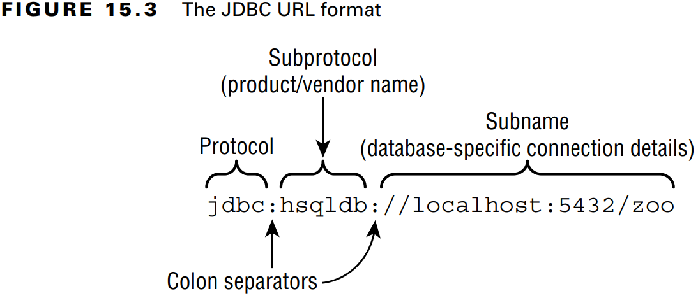

### _JDBC_

---
### `Connecting to a Database`

JDBC içerisinde beş temel arayüz vardır.
1. **Driver**: Vertabanına bağlantı kurar.
2. **Connection**: Veritabanına komut gönderir.
3. **PreparedStatement**: SQL sorgusunu yürütür.
4. **CallableStatement**: Veriabanında bulunan _stored procedure_'leri yürütür.
5. **ResultSet**: Sorgu sonucunu okur.

### Building a JDBC URL

**Figure 15.3** The JDBC URL format



_jdbc:hsqldb:file:zoo_

Bağlantı URL'i üç parçdan oluşur:
1. Protocol ismi olarak _jdbc_ ile başlar.
2. Subprotocol ismi olarak _hsqldb_ gelir.
3. Son olarak subname gelir. Bu örnekte dosya sistemini kullanıldığını ve sonrasında veritabanı isminin (_zoo_) geldiği
   görülür.

Diğer örnekler:

_jdbc:postgresql:**//localhost/zoo**_
_jdbc:oracle:thin:**@123.123.123.123:1521:zoo**_
_jdbc:mysql:**//localhost:3306**_
_jdbc:mysql:**//localhost:3306/zoo?profileSQL=true**_

### Getting a Database Connection

_Connection_ oluşturabilmek için iki yol vardır: **DriverManager** ve **DataSource**. Ama _DriverManager_'i gerçek hayatta
yazdığımız kodlarda kullanmamalıyız. _DataSource_ _DriverManager_'dan çok daha yeteneklidir. Örneğin _connection pool_ 
oluşturabilir veya veritabanı bağlantı bilgilerini uygulama dışında saklayabilir.

```java
public static void main(String[] args) throws SQLException {
    try (Connection connection = DriverManager.getConnection("jdbc:hsqldb:file:zoo")) {
        System.out.println(connection);
    }
}
```

_Output:_
<pre>
org.hsqldb.jdbc.JDBCConnection@4524411f
</pre>

```java
public static void main(String[] args) throws SQLException {
    try (Connection connection = DriverManager.getConnection("jdbc:postgresql://localhost:5432/zoo_db", "postgres", "postgres")) {
        System.out.println(connection);
    }
}
```
_Output:_
<pre>
org.postgresql.jdbc.PgConnection@52feb982
</pre>