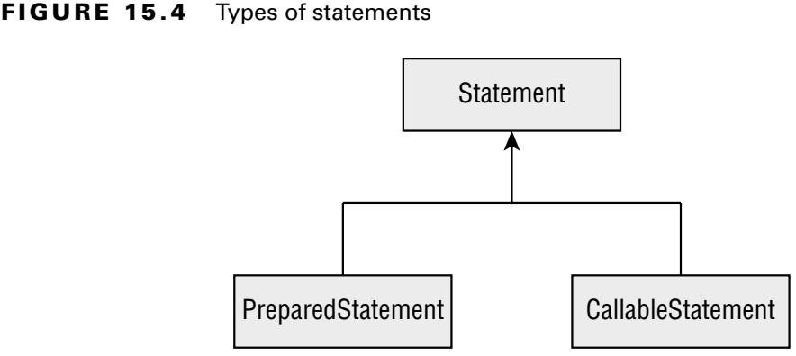
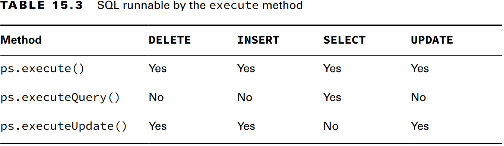
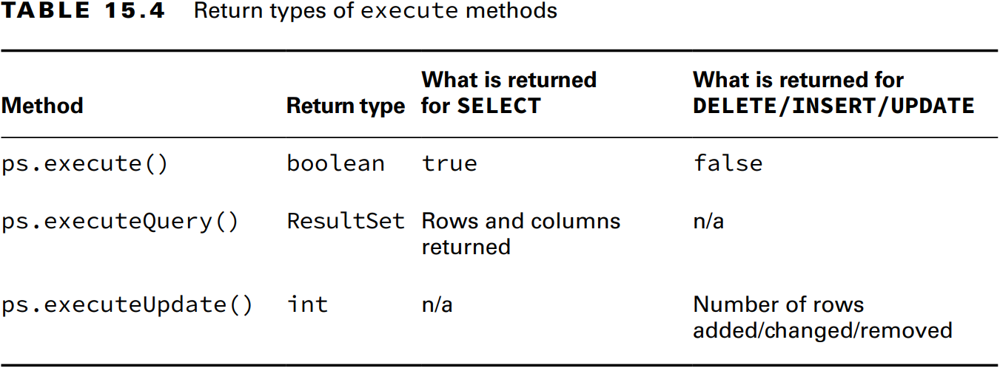
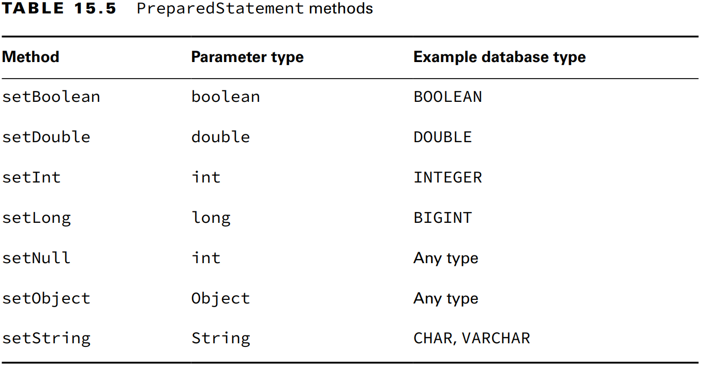
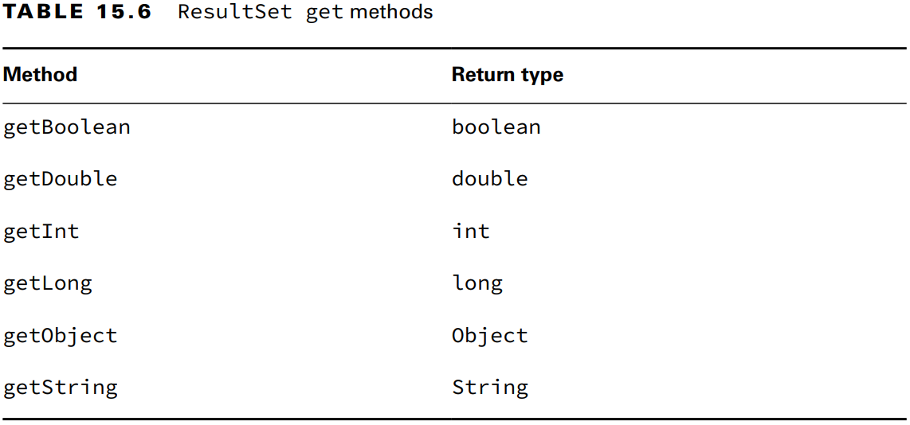
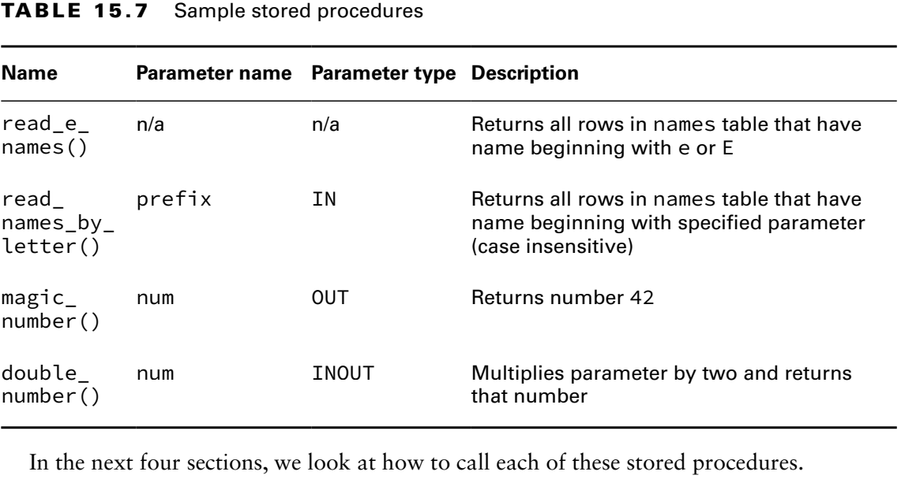
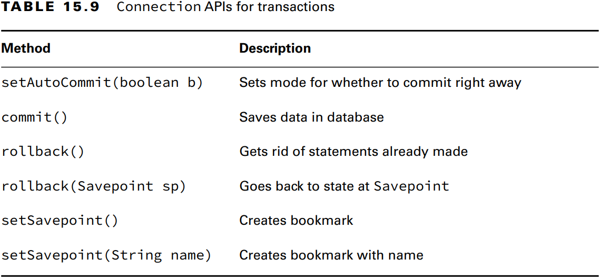

### _JDBC_

---
### `Connecting to a Database`

JDBC içerisinde beş temel arayüz vardır.
1. **Driver**: Vertabanına bağlantı kurar.
2. **Connection**: Veritabanına komut gönderir.
3. **PreparedStatement**: SQL sorgusunu yürütür.
4. **CallableStatement**: Veriabanında bulunan _stored procedure_'leri yürütür.
5. **ResultSet**: Sorgu sonucunu okur.

### Building a JDBC URL

**Figure 15.3** The JDBC URL format


_jdbc:hsqldb:file:zoo_

Bağlantı URL'i üç parçdan oluşur:
1. Protocol ismi olarak _jdbc_ ile başlar.
2. Subprotocol ismi olarak _hsqldb_ gelir.
3. Son olarak subname gelir. Bu örnekte dosya sistemini kullanıldığını ve sonrasında veritabanı isminin (_zoo_) geldiği
   görülür.

Diğer örnekler:

_jdbc:postgresql:**//localhost/zoo**_</br>
_jdbc:oracle:thin:**@123.123.123.123:1521:zoo**_</br>
_jdbc:mysql:**//localhost:3306**_</br>
_jdbc:mysql:**//localhost:3306/zoo?profileSQL=true**_</br>

### Getting a Database Connection

_Connection_ oluşturabilmek için iki yol vardır: **DriverManager** ve **DataSource**. Ama _DriverManager_'i gerçek hayatta
yazdığımız kodlarda kullanmamalıyız. _DataSource_ _DriverManager_'dan çok daha yeteneklidir. Örneğin _connection pool_ 
oluşturabilir veya veritabanı bağlantı bilgilerini uygulama dışında saklayabilir.

```java
public static void main(String[] args) throws SQLException {
    try (Connection connection = DriverManager.getConnection("jdbc:hsqldb:file:zoo")) {
        System.out.println(connection);
    }
}
```

_Output:_
<pre>
org.hsqldb.jdbc.JDBCConnection@4524411f
</pre>

```java
public static void main(String[] args) throws SQLException {
    try (Connection connection = DriverManager.getConnection("jdbc:postgresql://localhost:5432/zoo_db", "postgres", "postgres")) {
        System.out.println(connection);
    }
}
```
_Output:_
<pre>
org.postgresql.jdbc.PgConnection@52feb982
</pre>

---
### `Working with a PreparedStatement`

**Figure 15.4** Types of statements



SQL'i doğrudan _Statement_ ile çalıştırmak mümkün olsa da, bunu yapmamalısınız. _PreparedStatement_ aşağıda ki nedenlerden 
dolayı çok daha üstündür:

- **Performance**: Çoğu progra benzer sorguları birden fazla kez çalıştırabilir. _PreparedStatement_'i kullandığımızda, 
  veritabanı yazılımı genellikle sorguyu iyi çalıştırmak için bir plan tasarlar ve bunu hatırlar.
- **Security**: _PreparedStatement_'i doğru kullandığımızda bizi _SQL injection_'lara karşı korur. 
- **Readability**: String concat etmek okunabilirliği azaltır.
- **Future use**: Parametre almasa bile _PreparedStatement_ kullanmak daha iyidir.

_Statement_ sınavda yer almıyor.

### Obtaining a PreparedStatement

```java
try (Connection connection = DriverManager.getConnection("jdbc:hsqldb:file:zoo");
     PreparedStatement ps = connection.prepareStatement("SELECT * FROM exhibits")) {
    System.out.println(ps);
}
```

_Output:_
<pre>
org.hsqldb.jdbc.JDBCPreparedStatement@3bf7ca37[sql=[SELECT * FROM exhibits]]
</pre>

### Executing a PreparedStatement

**Modifying Data with _executeUpdate()_**

Insert, update ve delete işlemleri için kullanılır. Geriye **int** değer döner. Bu değer çalıştırılan sql komutu sonucunda
kaç adet satırın etkilendiği bilgisini döner.

```java
var insertSql = "INSERT INTO exhibits VALUES (10, 'Deer', 3)";
var updateSql = "UPDATE exhibits SET name = '' WHERE name = 'None'";
var deleteSql = "DELETE FROM exhibits WHERE id = 10";
try (Connection connection = DriverManager.getConnection("jdbc:hsqldb:file:zoo")) {
    try (var ps = connection.prepareStatement(insertSql)) {
        int affectedRows = ps.executeUpdate();
        System.out.printf("%d rows affected after insert.\n", affectedRows);
    }
    
    try (var ps = connection.prepareStatement(updateSql)) {
        int affectedRows = ps.executeUpdate();
        System.out.printf("%d rows affected after update.\n", affectedRows);
    }
    
    try (var ps = connection.prepareStatement(deleteSql)) {
        int affectedRows = ps.executeUpdate();
        System.out.printf("%d rows affected after delete.\n", affectedRows);
    }
}
```

_Output:_
<pre>
1 rows affected after insert.
0 rows affected after update.
1 rows affected after delete.
</pre>

**Reading Data with _executeQuery()_**

```java
var selectSql = "SELECT * FROM exhibits";

try (Connection connection = DriverManager.getConnection("jdbc:hsqldb:file:zoo")) {
    try (var ps = connection.prepareStatement(selectSql)) {
        ResultSet rs = ps.executeQuery();
        while (rs.next()) {
            int id = rs.getInt(1);
            String name = rs.getString(2);
            System.out.println(id + " " + name);
        }
    }
}
```

_Output:_
<pre>
1 African Elephant
2 Zebra
</pre>

**Processing Data with _execute()_**

_executeUpdate()_ ve _executeQuery()_ methodlarının yapmış olduğu işlemleri yapabiliyor. Geriye **boolean** değer döner.
Eğer sonuç **true** ise _ResultSet_ elde edebilir, eğer **false** ise o zaman etkilenen satır sayısını alabiliriz.

```java
public static void main(String[] args) throws SQLException {
    var insertSql = "INSERT INTO exhibits VALUES (3, 'Deer', 3)";
    var selectSql = "SELECT * FROM exhibits";
    try (Connection connection = DriverManager.getConnection("jdbc:hsqldb:file:zoo")) {
        try (var ps = connection.prepareStatement(insertSql)) {
            execute(ps);
        }
        try (var ps = connection.prepareStatement(selectSql)) {
            execute(ps);
        }
    }
}

private static void execute(PreparedStatement ps) throws SQLException {
    boolean isResultSet = ps.execute();
    if (isResultSet) {
        try (ResultSet rs = ps.getResultSet()) {
            while (rs.next()) {
                int id = rs.getInt(1);
                String name = rs.getString(2);
                System.out.println(id + " " + name);
            }
        }
    } else {
        int affectedRows = ps.getUpdateCount();
        System.out.printf("%d rows affected.\n", affectedRows);
    }
}
```

_Output:_
<pre>
1 rows affected.
1 African Elephant
2 Zebra
3 Deer
</pre>

**Table 15.3** SQL runnable by the execute method



**Table 15.4** Return types of execute methods




### Working with Parameters

Değerleri paremetrik olarak geçmek için _?_ kullanabiliriz. Bu yöntem _bind variable_ olarak adlandırılır.

```java
var insertSql = "INSERT INTO names VALUES (?, ?, ?)";

try (Connection connection = DriverManager.getConnection("jdbc:hsqldb:file:zoo")) {
    try (PreparedStatement ps = connection.prepareStatement(insertSql)) {
        ps.setInt(1, 58);
        ps.setInt(2, 1);
        ps.setString(3, "Muhammed");
        int affectedRow = ps.executeUpdate();
        System.out.println(affectedRow + " rows affected.");
    }
}
```

_Output:_
<pre>
1 rows affected.
</pre>

Soru işareti sayısı kadar değer _bind_ edilmeli. Eksik veya fazla sayıda bind işlemi yapılırsa uygulama hata fırlatır. 

```java
var insertSql = "INSERT INTO names VALUES (?, ?, ?)";

try (Connection connection = DriverManager.getConnection("jdbc:hsqldb:file:zoo")) {
    try (PreparedStatement ps = connection.prepareStatement(insertSql)) {
        ps.setInt(1, 58);
        ps.setInt(2, 1);
        // Missing the set for parameter number 3
        int affectedRow = ps.executeUpdate();
        System.out.println(affectedRow + " rows affected.");
    }
}
```

_Output:_
<pre style="color: red">
java.sql.SQLException: Parameter not set
</pre>

**Table 15.5** PreparedStatement methods



Object tip ile tüm bind işlemini yapabiliriz.

```java
var insertSql = "INSERT INTO names VALUES (?, ?, ?)";

try (Connection connection = DriverManager.getConnection("jdbc:hsqldb:file:zoo")) {
    try (PreparedStatement ps = connection.prepareStatement(insertSql)) {
        ps.setObject(1, 58);
        ps.setObject(2, 1);
        ps.setObject(3, "Muhammed");
        int affectedRow = ps.executeUpdate();
        System.out.println(affectedRow + " rows affected.");
    }
}
```

_Output:_
<pre>
1 rows affected.
</pre>

### Updating Multiple Records

Tek bir _PreparedStatement_ ile birden fazla kaydı güncelleyebiliriz.

```java
var insertSql = "INSERT INTO names VALUES (?, ?, ?)";

try (Connection connection = DriverManager.getConnection("jdbc:hsqldb:file:zoo")) {
    try (PreparedStatement ps = connection.prepareStatement(insertSql)) {
        ps.setInt(1, 100);
        ps.setInt(2, 1);
        ps.setString(3, "Muhammed");
        int affectedRow = ps.executeUpdate();
        System.out.println(affectedRow + " rows affected.");
        
        ps.setInt(1, 101);
        ps.setString(3, "John");
        affectedRow = ps.executeUpdate();
        System.out.println(affectedRow + " rows affected.");
    }
}
```

_Output:_
<pre>
1 rows affected.
1 rows affected.
</pre>

Burada dikkat edilmesi gereken durum, ikinci kayıt için 3 yerine 2 adet parametre verdik. Bu durumda _PreparedStatement_ 
en son bind edilen değeri kullanır. Yani 2. paremetrenin değeri hala 1'dir.

---
### `Getting Data from a ResultSet`

### Reading a ResultSet

```java
var idToNameMap = new HashMap<>();
var selectSql = "SELECT id, name FROM exhibits";

try (Connection connection = DriverManager.getConnection("jdbc:hsqldb:file:zoo")) {
    try (PreparedStatement ps = connection.prepareStatement(selectSql)) {
        ResultSet rs = ps.executeQuery();
        while (rs.next()) {
            int id = rs.getInt("id");
            String name = rs.getString("name");
            idToNameMap.put(id, name);
        }
    }
    System.out.println(idToNameMap);
}
```

_Output:_
<pre>
{1=African Elephant, 2=Zebra}
</pre>

Bazen veritabanından tek bir kayıt alabiliriz. Bunun için _while loop_ kullanmaya gerek yoktur.

```java
var selectSql = "SELECT count(*) as counter FROM exhibits";

try (Connection connection = DriverManager.getConnection("jdbc:hsqldb:file:zoo")) {
    try (PreparedStatement ps = connection.prepareStatement(selectSql)) {
        ResultSet rs = ps.executeQuery();
        if (rs.next()) {
            System.out.println("Count: " + rs.getInt(1));
            System.out.println("Count: " + rs.getInt("counter"));
        }
    }
}
```

_Output:_
<pre>
Count: 2
Count: 2
</pre>

Olmayan bir kolan ismini veya index'i okumaya çalışırsak uygulama hata fırlatır.

```java
var selectSql = "SELECT count(*) as counter FROM exhibits";
try (Connection connection = DriverManager.getConnection("jdbc:hsqldb:file:zoo")) {
    try (PreparedStatement ps = connection.prepareStatement(selectSql)) {
        ResultSet rs = ps.executeQuery();
        if (rs.next()) {
            System.out.println("Count: " + rs.getInt(2));
            System.out.println("Count: " + rs.getInt("counter_new"));
        }
    }
}
```

_Output:_
<pre style="color: red">
java.sql.SQLException: Column not found: 2

java.sql.SQLException: Column not found: counter_new
</pre>

_resultSet.next()_ değeri kontrol edilmeden _resultSet_ okunursa o zaman uygulama hata fırlatır.

```java
var selectSql = "SELECT * FROM exhibits WHERE name='Not in table'";
try (Connection connection = DriverManager.getConnection("jdbc:hsqldb:file:zoo")) {
    try (PreparedStatement ps = connection.prepareStatement(selectSql)) {
        ResultSet rs = ps.executeQuery();
        rs.next();
        System.out.println(rs.getInt(1));
    }
}
```

_Output:_
<pre style="color: red">
java.sql.SQLException: invalid cursor state
</pre>

_resultSet.next()_ çalıştırılmadan _resultSet_ okunursa uygulama hata fırlatır.

```java
var selectSql = "SELECT * FROM exhibits WHERE name='Zebra'";
try (Connection connection = DriverManager.getConnection("jdbc:hsqldb:file:zoo")) {
    try (PreparedStatement ps = connection.prepareStatement(selectSql)) {
        ResultSet rs = ps.executeQuery();
        // rs.next();
        System.out.println(rs.getInt(1));
    }
}
```

_Output:_
<pre style="color: red">
java.sql.SQLException: invalid cursor state
</pre>

### Getting Data for a Column

**Table 15.6** ResultSet get methods



```java
var sql = "SELECT id, name FROM exhibits";

try (var ps = connection.prepareStatement(sql);
     var rs = ps.executeQuery()) {
    while (rs.next()) {
        Object idField = rs.getObject("id");
        Object nameField = rs.getObject("name");
        if (idField instanceof Integer id)
            System.out.println(id);
        if (nameField instanceof String name)
            System.out.println(name);
    }
}
```

_Output:_
<pre>
1
African Elephant
2
Zebra
</pre>

---
### `Calling a CallableStatement`

Bazı durumlarda SQL sorgularını veritabanında saklamak daha kullanışlıdır. Özellikle çok sayıda karmaşık sorgu olduğunda
kullanışlıdır. Bu sorgulara _Stored Procedure_ adı verilir.

_Stored Procedure_'ler önceden derlenen ve veritabanında saklanan SQL kodlarıdır. Network trafiğini azaltırlar. 

**Table 15.7** Sample stored procedures



### Calling a Procedure without Parameters

```java
String sql = "{call read_e_names()}";

try (CallableStatement cs = connection.prepareCall(sql)) {
    ResultSet rs = cs.executeQuery();
    while (rs.next()) {
        System.out.println(rs.getString(3));
    }
}
```

_Output:_
<pre>
Elsa
Ester
Eddie
</pre>

### Passing an IN Parameter

```java
String sql = "{call read_names_by_letter(?)}";

try (CallableStatement cs = connection.prepareCall(sql)) {
    cs.setString("prefix", "Z");
    // cs.setString(1, "Z");
    ResultSet rs = cs.executeQuery();
    while (rs.next()) {
        System.out.println(rs.getString(3));
    }
}
```

_Output:_
<pre>
Zelda
Zoe
</pre>

### Returning an OUT Parameter

```java
String sql = "{?= call magic_number(?)}";
try (CallableStatement cs = connection.prepareCall(sql)) {
    cs.registerOutParameter(1, Types.INTEGER);
    cs.execute();
    //cs.executeQuery(); // java.sql.SQLException: statement does not generate a result set
    
    System.out.println(cs.getInt("num"));
    System.out.println(cs.getInt(1));
}
```

_Output:_
<pre>
42
42
</pre>

### Working with an INOUT Parameter

```java
String sql = "{call double_number(?)}";
try (CallableStatement cs = connection.prepareCall(sql)) {
    cs.setInt(1, 8);
    cs.registerOutParameter(1, Types.INTEGER);
    cs.execute();
 
    System.out.println(cs.getInt("num"));
    System.out.println(cs.getInt(1));
}
```

_Output:_
<pre>
16
16
</pre>

### Comparing Callable Statement Parameters

**Table 15.8** Stored procedure parameter types


### Using Additional Options

_PreparedStatement_ ve _CallableStatement_, _type_ ve _concurrency_ parametrelerini destekler. Sınav için sadece geçerli 
olup olmadığını bilmek yeterli.

Üç adet _ResultSet_ integer _type_ değeri vardır.
1. **ResultSet.TYPE_FORWARD_ONLY**
2. **ResultSet.TYPE_SCROLL_INSENSITIVE**
3. **ResultSet.TYPE_SCROLL_SENSITIVE**

İki adet _ResultSet_ integer _concurrency mode_ değeri vardır.
1. **ResultSet.CONCUR_READ_ONLY**
2. **ResultSet.CONCUR_UPDATABLE**

Bu değerler integer değerlerdir, **enum** değildirler.
```java
conn.prepareCall(sql, ResultSet.TYPE_FORWARD_ONLY, ResultSet.CONCUR_READ_ONLY);

conn.prepareStatement(sql, ResultSet.TYPE_SCROLL_INSENSITIVE, ResultSet.CONCUR_UPDATABLE);
```

Sıralamada SQL birinci sırada, _type_ ikinci sırada ve _concurrency mode_ üçüncü sıradadır.

---
### `Controlling Data with Transactions`

Şuana kadar yapılan tüm değişiklikler hemen veritabanına yansıtıldı. _Commit_ bir dosyayı kaydetmeye benzer. Sınavda aksi
belirtilmediği sürece değişiklikler otomatik olarak uygulanır. _Commit_ ve _rollback_ işlemlerini manuel olarak kontrol 
edebiliriz.

Transaction bir grup işlemin ya hep ya hiç kuralına göre çalışmasıdır. Ya hepsi başarılı bir şekilde çalışır ya da hepsi 
_rollback_ edilir.

### Committing and Rolling Back

_Auto commit_ mod varsayılan olarak açıktır. İlk 2 kayıt veritanına yansıyacaktır. Fakat üçüncü kayıt hatadan dolayı
kaydedilmeyecektir.

```java
public static void main(String[] args) throws SQLException {
    Connection connection = DriverManager.getConnection("jdbc:hsqldb:file:zoo");
    String sql = "INSERT INTO exhibits VALUES (?, ?, ?)";
    try (PreparedStatement ps = connection.prepareStatement(sql)) {
        ps.setInt(1, 3);
        ps.setString(2, "Dog-1");
        ps.setDouble(3, 1.5);
        ps.execute();
        
        ps.setInt(1, 4);
        ps.setString(2, "Dog-2");
        ps.setDouble(3, 2.5);
        ps.execute();
        
        ps.setInt(1, 3); // Throws exception. ID 3 already exist!
        ps.setString(2, "Dog-3");
        ps.setDouble(3, 3.5);
        ps.execute();
    } finally {
        read(connection);
    }
}

private static void read(Connection connection) throws SQLException {
    String sql = "SELECT * FROM exhibits";
    try (PreparedStatement ps = connection.prepareStatement(sql)) {
        ResultSet rs = ps.executeQuery();
        while (rs.next()) {
            int id = rs.getInt("id");
            double numAcres = rs.getDouble("num_acres");
            String name = rs.getString("name");
            System.out.printf("Id: %d   Num Acres: %f   Name: %s\n", id, numAcres, name);
        }
    }
}
```

_Output:_
<pre>
java.sql.SQLIntegrityConstraintViolationException: integrity constraint violation

Id: 1   Num Acres: 7.500000   Name: African Elephant
Id: 2   Num Acres: 1.200000   Name: Zebra
Id: 3   Num Acres: 1.500000   Name: Dog-1
Id: 4   Num Acres: 2.500000   Name: Dog-2
</pre>

Eğer işlem üzerinde _transaction_ yaparsak hata durumunda tüm işlemler geri alınacaktır.

```java
public static void main(String[] args) throws SQLException {
    Connection connection = DriverManager.getConnection("jdbc:hsqldb:file:zoo");
    String sql = "INSERT INTO exhibits VALUES (?, ?, ?)";
    try (PreparedStatement ps = connection.prepareStatement(sql)) {
        connection.setAutoCommit(false);
        
        ps.setInt(1, 3);
        ps.setString(2, "Dog-1");
        ps.setDouble(3, 1.5);
        ps.execute();
        
        ps.setInt(1, 4);
        ps.setString(2, "Dog-2");
        ps.setDouble(3, 2.5);
        ps.execute();
        ps.setInt(1, 3); // Throws exception. ID 3 already exist!
        
        ps.setString(2, "Dog-3");
        ps.setDouble(3, 3.5);
        ps.execute();
        connection.commit();
    } catch (Exception e) {
        System.out.println("Rolling back...");
        connection.rollback();
    } finally {
        read(connection);
    }
}

private static void read(Connection connection) throws SQLException {
    String sql = "SELECT * FROM exhibits";
    try (PreparedStatement ps = connection.prepareStatement(sql)) {
        ResultSet rs = ps.executeQuery();
        while (rs.next()) {
            int id = rs.getInt("id");
            double numAcres = rs.getDouble("num_acres");
            String name = rs.getString("name");
            System.out.printf("Id: %d   Num Acres: %f   Name: %s\n", id, numAcres, name);
        }
    }
}
```

_Output:_
<pre>
Rolling back...
Id: 1   Num Acres: 7.500000   Name: African Elephant
Id: 2   Num Acres: 1.200000   Name: Zebra
</pre>

### Bookmarking with Savepoints

Varsayılan olarak _rollback_ işlemi tüm süreci geriye alıyor. _Rollback_ üzerinde daha fazla kontrole sahip olabilmek 
için _Savepoint_ noktaları kullanabiliriz. 

_Savepoint_'ler sadece _auto commit_ mod kapalı olduğunda kullanılabilir. Aksi durumda hata fırlatır.

_Savepoint_'ler oluşturulduğu sıranın tersinde _rollback_ edilmelidir. Aski durumda hata fırlatır.

Aşağıdaki örnekte _Dog-3_ kaydı geri alınır ve veritabanına kaydedilmez.

```java
public static void main(String[] args) throws SQLException {
    Connection connection = DriverManager.getConnection("jdbc:hsqldb:file:zoo");
    String sql = "INSERT INTO exhibits VALUES (?, ?, ?)";
   
    try (PreparedStatement ps = connection.prepareStatement(sql)) {
        connection.setAutoCommit(false);
        ps.setInt(1, 3);
        ps.setString(2, "Dog-1");
        ps.setDouble(3, 1.5);
        ps.execute();
        
        Savepoint sp1 = connection.setSavepoint();
        
        ps.setInt(1, 4);
        ps.setString(2, "Dog-2");
        ps.setDouble(3, 2.5);
        ps.execute();
       
        Savepoint sp2 = connection.setSavepoint("Second save point");
        
        ps.setInt(1, 5);
        ps.setString(2, "Dog-3");
        ps.setDouble(3, 3.5);
        ps.execute();
       
        connection.rollback(sp2);
        // connection.rollback(sp1);
        connection.commit();
    } finally {
        read(connection);
    }
}

private static void read(Connection connection) throws SQLException {
    String sql = "SELECT * FROM exhibits";
    try (PreparedStatement ps = connection.prepareStatement(sql)) {
        ResultSet rs = ps.executeQuery();
        while (rs.next()) {
            int id = rs.getInt("id");
            double numAcres = rs.getDouble("num_acres");
            String name = rs.getString("name");
            System.out.printf("Id: %d   Num Acres: %f   Name: %s\n", id, numAcres, name);
        }
    }
}
```

_Output:_
<pre>
Id: 1   Num Acres: 7.500000   Name: African Elephant
Id: 2   Num Acres: 1.200000   Name: Zebra
Id: 3   Num Acres: 1.500000   Name: Dog-1
Id: 4   Num Acres: 2.500000   Name: Dog-2
</pre>

**Table 15.9** Connection APIs for transactions



---
### `Closing Database Resources`

İlk önce _ResultSet_, ikinci sırada _PreparedStatement_ veya _CallableStatement_ son olarak _Connection_ kapatılır.

_Connection_ kapatıldığında _PreparedStatement_ (veya _CallableStatement_) ve _ResultSet_ kapatılır.

_PreparedStatement_ (veya _CallableStatement_) kapatıldığında _ResultSet_ kapatılır.

```java
var sql = "SELECT not_a_column FROM names";
var url = "jdbc:hsqldb:zoo";

try (var conn = DriverManager.getConnection(url);
     var ps = conn.prepareStatement(sql);
     var rs = ps.executeQuery()) {
    while (rs.next())
        System.out.println(rs.getString(1));
} catch (SQLException e) {
    System.out.println(e.getMessage());
    System.out.println(e.getSQLState());
    System.out.println(e.getErrorCode());
}
```