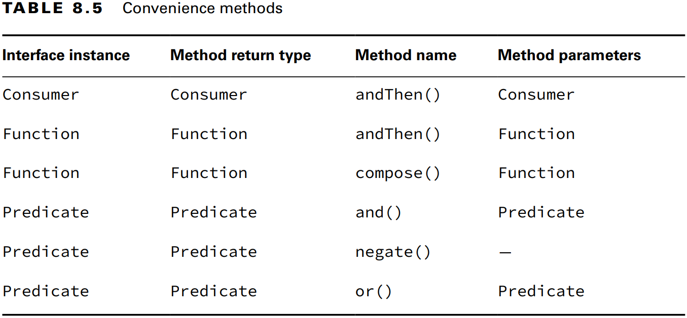

### _Chapter 08: Lambdas and Functional Interfaces_

---
### `Lambda Syntax`
```java
(Animal a) -> {return a.canHoop();}
a -> a.canHop()
a -> {return a.canHop();}
(Animal a) -> a.canHop()
```

> Assingning Lambdas to _var_
>```java
>var invalid = (Animal a) -> a.canHop(); // DOES NOT COMPILE
>```
> Java lambda için tip çıkarımını bağlam üzerinden yapar. Aynı şekilde _var_ da tip çıkarımını bağlam üzerinden yapar.
> Burada ne lambda için ne de _var_ için yeterli bağlam bilgisi yok.

---
### `Functional Interface`
- _Functional Interface_ üzerinde tek bir **abstract** method bulunan **interface**'dir.

```java
@FunctionalInterface
public interface Sprint {
    public void sprint(int speed);
}
```

- _@FunctionalInterface_ anotasyonu derleyiciye bu arayüzün fonksiyonel bir arayüz olması gerektiğini bildirdiğimiz
  bir bildiridir. Bu sayede eğer arayüzde tek bir soyut method olmazsa derleme hatası oluşacaktır.
```java
@FunctionalInterface
public interface Dance { // DOES NOT COMPILE
    void move();
    void rest();
}
```
<br/><br/>

**Object Methodları**

Tüm Java sınıfları _java.lang.Object_ sınıfından belirli metholdarı kalıtır. 
 - public String toString()
 - public boolean equals(Object)
 - public int hashCode()
<br/>

Eğer _functional interface_ _Object_ sınıfında bulunan **public** methodları aynı _method signature_ ile tekrar
tanımlarsa bunlar _single abstract method_ kuralını bozmaz.
```java
public interface Dive {
    String toString();
    public abstract boolean equals(Object o);
    public abstract int hashCode();
    public void dive();
}
```

---
### `Method Reference`

```java
LearnToSpeak learner = s -> System.out.println(s);
LearnToSpeak learner = System.out::println;
```
Lambda _s_ adında bir parametre tanımlar. Ancak bu parametreyi başka bir methoda aktarmaktan başka bir şey yapmaz. 
_Method reference_ ile bu gereksiz fazlalığı yazmak zorunda kalmayız.
Method referans için 4 format vardır:
- **static** methods
- Belirli bir nesne üzerinde bulunan instance method
- Çalışma zamanında belirlenecek bir parametre üzerindeki instance methodlar
- Constructorlar

<br/>

**Calling _static_ Methods**
```java
interface Converter {
    long round(double num);
}

Converter lambda = x -> Math.round(x);
Converter methodRef = Math::round;

System.out.println(methodRef.round(100.1)); // 100
```

**Calling Instance Methods on a Particular Object**
```java
interface StringStart {
    boolean beginningCheck(String prefix);
}

var str = "Zoo";
StringStart lambda = s -> str.startsWith(s);
StringStart methodRef = str::startsWith;

System.out.println(methodRef.beginningCheck("A")); // false
```

```java
interface StringChecker {
    boolean check();
}

var str = "";

StringChecker lambda = () -> str.isEmpty();
StringChecker methodRef = str::isEmpty;

System.out.println(methodRef.check()); // true
```

Method referanslar her zaman lambda olarak çevrilebilir fakat tersi her zaman doğru değildir.
```java
var str = "";
StringChecker lambda = () -> str.startsWith("Zoo");

StringChecker methodReference = str::startsWith;        // DOES NOT COMPILE
StringChecker methodReference = str::startsWith("Zoo"); // DOES NOT COMPILE
```

**Calling Instance Methods on a Parameter**
```java
interface StringParameterChecker {
    boolean check(String prefix);
}

StringParameterChecker lambda = s -> s.isEmpty();
StringParameterChecker methodRef = String::isEmpty;

System.out.println(methodRef.check("Zoo")); // false


interface StringTwoParameterChecker {
  boolean check(String text, String prefix);
}

StringTwoParameterChecker lambda = (s, p) -> s.startsWith(p);
StringTwoParameterChecker methodRef = String::startsWith;

System.out.println(methodRef.check("Zoo", "A")); // false
```

**Calling Constructors**
```java
interface EmptyStringCreator {
    String create();
}

EmptyStringCreator lambda = () -> new String();
EmptyStringCreator methodRef = String::new;

System.out.println(methodRef.create().equals("Snake")); // false


interface StringCopier {
  String copy(String value);
}

StringCopier lambda = s -> new String(s);
StringCopier methodRef = String::new;

System.out.println(methodRef.copy("Zebra").equals("Snake")); // false
```

_**Table 8.3** Method references_


---
### `Built-in Functional Interfaces`

_**Table 8.4** Common functional interfaces_


- **Supplier**

Input almadan değer üretir._Supplier_ arayüz tanımı aşağıda ki gibidir:
```java
@FunctionalInterface
public interface Supplier<T> {
    T get();
}
```

```java
Supplier<LocalDate> s1 = LocalDate::now;
Supplier<LocalDate> s2 = () -> LocalDate.now();

System.out.println(s1.get()); // 2024-05-11
System.out.println(s2.get()); // 2024-05-11
// $$ means that the class does not exist in a class file on the file system
System.out.println(s1);       // com.mtopgul.lambdas.Test$$Lambda$15/0x0000000800c01200@7ba4f24f
```

- **Consumer** and **BiConsumer**

Input alır fakat geriye bir değer dönmez. _BiConsumer_ ise iki tane input alır. _Consumer_ ve _BiConsumer_ arayüz tanımı 
aşağıdaki gibidir. 

```java
@FunctionalInterface
public interface Consumer<T> {
    void accept(T t);
    // omitted default method
}

@FunctionalInterface
public interface BiConsumer<T, U> {
    void accept(T t, U u);
    // omitted default method
}
```

```java
Consumer<String> c1 = System.out::println;
Consumer<String> c2 = s -> System.out.println(s);
c1.accept("Annie"); // Annie
c2.accept("Annie"); // Annie

var map = new HashMap<String, Integer>();
BiConsumer<String, Integer> b1 = map::put;
BiConsumer<String, Integer> b2 = (k, v) -> map.put(k, v);

b1.accept("chicken", 7);
b2.accept("chick", 1);
System.out.println(map); // {chicken=7, chick=1}
```

```java
var map = new HashMap<String, String>();
BiConsumer<String, String> b1 = map::put;
BiConsumer<String, String> b2 = (k, v) -> map.put(k, v);

b1.accept("chicken", "Cluck");
b2.accept("chick", "Tweep");

System.out.println(map); // {chicken=Cluck, chick=Tweep}
```

- **Predicate** and **BiPredicate**

_Predicate_ çoğunlukla filtreleme ve eşleşme işlemleri için kullanılır. _BiPredicate_ ise iki tane input alır.
_Predicate_ ve _BiPredicate_ arayüz tanımı aşağıdaki gibidir.

```java
@FunctionalInterface
public interface Predicate<T> {
    boolean test(T t);
    // omitted default and static methods
}

@FunctionalInterface
public interface BiPredicate<T, U> {
    boolean test(T t, U u);
    // omitted default methods
}
```

```java
Predicate<String> p1 = String::isEmpty;
Predicate<String> p2 = s -> s.isEmpty();

System.out.println(p1.test("")); // true
System.out.println(p2.test("")); // true

BiPredicate<String, String> b1 = String::startsWith;
BiPredicate<String, String> b2 = (s, p) -> s.startsWith(p);

System.out.println(b1.test("chicken", "chick")); // true
System.out.println(b2.test("chicken", "chick")); // true
```

- **Function** and **BiFunction**

_Function_ bir parametre ve dönüş tipi alır. Inputu dönüştürerek çıktı üretir. _BiFunction_ ise iki input ve bir dönüş tipi alır.
```java
@FunctionalInterface
public interface Function<T, R> {
    R apply(T t);
    // omitted default and static methods
}

@FunctionalInterface
public interface BiFunction<T, U, R> {
    R apply(T t, U u);
    // omitted default method
}
```

```java
Function<String, Integer> f1 = String::length;
Function<String, Integer> f2 = x -> x.length();

System.out.println(f1.apply("cluck")); // 5
System.out.println(f2.apply("cluck")); // 5


BiFunction<String, String, String> b1 = String::concat;
BiFunction<String, String, String> b2 = (s1, s2) -> s1.concat(s2);

System.out.println(b1.apply("baby ", "chick")); // baby chick
System.out.println(b2.apply("baby ", "chick")); // baby chick
```

- **UnaryOperator** and **BinaryOperator**

_UnaryOperator_ ve _BinaryOperator_ özel _Function_'lardır. Tüm tipler aynıdır. _UnaryOperator_ tek bir parametre alır 
ve aldığı tipte değer döndürür. _BinaryOperator_ ise iki aynı tipte parametre alır ve aldığı tipte değer döndürür.

```java
import java.util.function.BiFunction;
import java.util.function.Function;

@FunctionalInterface
public interface UnaryOperator<T> extends Function<T, T> {
  // omitted static method
}

@FunctionalInterface
public interface BinaryOperator<T> extends BiFunction<T, T, T> {
    // omitted static method
}

// This method signatures like this:
// T apply(T t);        // UnaryOperator
// T apply(T t1, T t2); // BinaryOperator
```

```java
UnaryOperator<String> u1 = String::toUpperCase;
UnaryOperator<String> u2 = s -> s.toUpperCase();

System.out.println(u1.apply("chirp")); // CHIRP
System.out.println(u2.apply("chirp")); // CHIRP


BinaryOperator<String> b1 = String::concat;
BinaryOperator<String> b2 = (s1, s2) -> s1.concat(s2);

System.out.println(b1.apply("baby ", "check")); // baby check
System.out.println(b2.apply("baby ", "check")); // baby check
```

---
### `Convenience Methods on Functional Interfaces`

_Tablo 8.5_ sadece ana arayüzleri göstermektedir. _BiConsumer_, _BiFunction_ ve _BiPredicate_ arayüzleri aynı 
methodlara sahiptir.

_**Table 8.5** Convenience methods_



```java
Predicate<String> brownEggs = s -> s.contains("egg") && s.contains("brown");
Predicate<String> otherEggs = s -> s.contains("egg") && !s.contains("brown");

System.out.println(brownEggs.test("brown egg"));  // true
System.out.println(otherEggs.test("yellow egg")); // true

Predicate<String> egg = s -> s.contains("egg");
Predicate<String> brown = s -> s.contains("brown");

brownEggs = egg.and(brown);
otherEggs = egg.and(brown.negate());
Predicate<String> chicken = s -> s.contains("chicken");
Predicate<String> eggOrChicken = egg.or(chicken);

System.out.println(brownEggs.test("brown egg"));  // true
System.out.println(otherEggs.test("yellow egg")); // true
System.out.println(eggOrChicken.test("chicken")); // true
```

```java
Consumer<String> c1 = x -> System.out.print("1: " + x);
Consumer<String> c2 = x -> System.out.print(",2: " + x);

Consumer<String> combined = c1.andThen(c2);
combined.accept("Annie"); // 1: Annie,2: Annie
```

```java
Function<Integer, Integer> before = x -> x + 1;
Function<Integer, Integer> after = x -> x * 2;

Function<Integer, Integer> combined = after.compose(before);

System.out.println(combined.apply(3)); // 8
```

---
### `Functional Interfaces for Primitives`

Bir çoğu **double**, **long** ve **int** tipindedir. Bunun tek istisnası _BooleanSupplier_'dır.

**Functional Interfaces for boolean**
```java
@FunctionalInterface
public interface BooleanSupplier {
    boolean getAsBoolean();
}
```

```java
BooleanSupplier b1 = () -> true;
BooleanSupplier b2 = () -> Math.random() > .5;
System.out.println(b1.getAsBoolean()); // true
System.out.println(b2.getAsBoolean()); // true or false
```
<br/>

**Functional Interfaces for double, long and int**

_**Table 8.6** Common functional interfaces for primitives_


- **Supplier**
```java
DoubleSupplier ds = () -> 1.0;
System.out.println(ds.getAsDouble()); // 1.0

IntSupplier is = () -> 1;
System.out.println(is.getAsInt());    // 1

LongSupplier ls = () -> 1L;
System.out.println(ls.getAsLong());   // 1
```

- **Consumer**
```java
DoubleConsumer dc = System.out::println;
dc.accept(1.0);  // 1.0

IntConsumer ic = System.out::println;
ic.accept(1);    // 1

LongConsumer lc = System.out::println;
lc.accept(1);    // 1

Consumer<Double> dc1 = System.out::println;
dc1.accept(2.0); // 2.0

BiConsumer<Integer, Integer> bc = (a, b) -> System.out.println(a + b);
bc.accept(1, 2); // 3
```

- **Predicate**
```java
DoublePredicate ds = d -> d > 5.0;
System.out.println(ds.test(7.0)); // true

IntPredicate ip = i -> i > 5;
System.out.println(ip.test(7)); // true

LongPredicate lp = l -> l > 5;
System.out.println(lp.test(7)); // true

Predicate<Integer> ip1 = i -> i > 7;
System.out.println(ip1.test(7)); // false

BiPredicate<Long, Long> bp = (a, b) -> a > b;
System.out.println(bp.test(3L, 5L)); // false
```

- **Function**
```java
DoubleFunction<Integer> df = d -> (int) d;
System.out.println(df.apply(1.0)); // 1

IntFunction<Integer> ifn = i -> i * 3;
System.out.println(ifn.apply(1)); // 3

LongFunction<Integer> lf = l -> (int) l;
System.out.println(lf.apply(1)); // 1

Function<Double, Integer> df1 = d -> d.intValue();
System.out.println(df1.apply(5.0)); // 5
```

_**Table 8.7** Primitive-specific functional interfaces_


---
### `Variables in Lambdas`
**Listing Parameters**

Lambda için 3 şekilde parametre tanımlanabilir:
1. Tip belirtmeden. **(x, y) -> x + y;**
2. Tip belirterek. **(Integer x, Integer y) -> x + y;**
3. **var** ile birlikte. **(var x, var y) -> x + y;**
```java
(var x, y) -> "Hello";                 // DOES NOT COMPILE
(var x, Integer y) -> true;            // DOES NOT COMPILE
(String x, var y, Integer z) -> true;  // DOES NOT COMPILE
(Integer x, y) -> "goodbye";           // DOES NOT COMPILE
```

**Referencing Variables from Lambda Body**

_**Table 8.8** Rules for accessing a variable from a lambda body inside a method_

