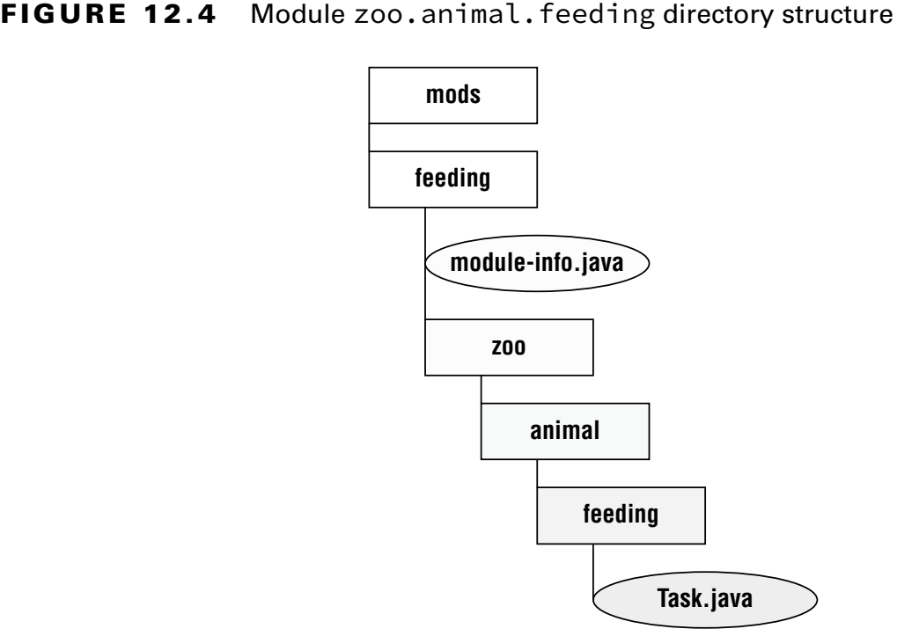

### _Modules_

---
### `Introducing Modules`

### Exploring a Module

Bir _module_ bir veya daha fazla paketten ve _module-info.java_ isimli dosyadan oluşur.

**Figure 12.1** Design of a modular system

**Figure 12.2** Looking inside a module

---
### `Creating and Running a Modular Program`

**Figure 12.3** Contents of zoo.animal.feeding

**Figure 12.4** Module zoo.animal.feeding directory structure

### Compiling Our First Module

Modulü derlemek için:

`javac --module-path mods -d feeding feeding/zoo/animal/feeding/*.java feeding/module-info.java`

- _-d_ seçeneği sınıf dosyalarının yerleştirileceği dizini belirtir.
- _--module-path_ ve _-p_ aynı anlama gelir.
- _--module_ ve _-m_ aynı anlama gelir.

Aşağıda ki komutların hepsi aynı anlama gelir.

`javac -p mods -d feeding feeding/zoo/animal/feeding/*.java feeding/*.java`

`javac -p mods -d feeding feeding/zoo/animal/feeding/*.java feeding/module-info.java`

`javac -p mods -d feeding feeding/zoo/animal/feeding/Task.java feeding/*.java`

`javac -p mods -d feeding feeding/zoo/animal/feeding/Task.java feeding/module-info.java`

**Table 12.1** Options you need to know for using modules with java

### Running Our First Module

**Figure 12.5** Running a module using _java_

`java --module-path feeding --module zoo.animal.feeding/zoo.animal.feeding.Task`

`java -p feeding -m zoo.animal.feeding/zoo.animal.feeding.Task`

**Table 12.2** Options you need to know for using modules with _java_ 

### Packaging Our First Module

_jar_ dosyasnını oluştur:

`jar -cvf mods/zoo.animal.feeding.jar -C feeding/ .`

Kodu _jar_ üzerinden çalıştır:

`java -p mods -m zoo.animal.feeding/zoo.animal.feeding.Task`