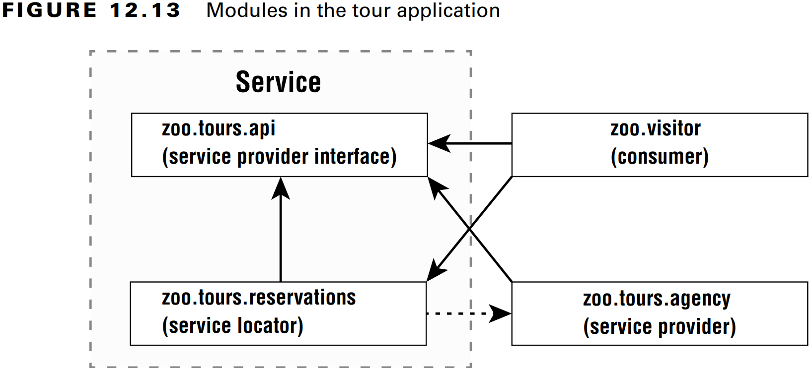

### _Modules_

---
### `Creating and Running a Modular Program`

**Figure 12.3** Contents of `zoo.animal.feeding`


**Figure 12.4** Module `zoo.animal.feeding` directory structure


### Compiling Our First Module

Bir modulu derlemek için:

- `javac --module-path mods -d target feeding/zoo/animal/feeding/Task.java feeding/module-info.java`
- `javac -p mods -d target feeding/zoo/animal/feeding/*.java feeding/*.java`

> **Abbreviations**
> - `-d` derlenen dosyaların yerleştirileceği hedef dizini belirtir.
> - `--module-path` ve `-p` aynı anlama gelir.
> - `--module` ve `-m` aynı anlama gelir.

**Figure 12.5** Running a module using _java_


Derlenen bir modulu çalıştırmak için:

- `java --module-path target --module zoo.animal.feeding/zoo.animal.feeding.Task`
- `java -p target -m zoo.animal.feeding/zoo.animal.feeding.Task`

_Jar_ oluşturmak için:
- `jar -cvf mods/zoo.animal.feeding.jar -C feeding/ .`

_Jar_ üzerinden çalıştır:
- `java -p mods -m zoo.animal.feeding/zoo.animal.feeding.Task`

#### Bir Module İçin Uygulanacak Adımlar (_ex01_1_)

1. **Compile**: `javac -p mods -d feeding feeding/zoo/animal/feeding/*.java feeding/*.java`
2. **Run**: `java -p feeding -m feeding/zoo.animal.feeding.Task`
3. **Jar**: `jar -cvf mods/feeding.jar -C feeding/ .`
4. **Run with Jar**: `java -p mods -m feeding/zoo.animal.feeding.Task`

---
### `Diving into the Module Declaration`

### Exporting a Package

Bir paketi spesific bir module açabiliriz. Bunu `to` anahtar kelimesi ile yapabiliriz.

`zoo.animal.talks.content` paketi sadece `zoo.staff` modulune açılmaktadır. 

```java
module zoo.animal.talks {
    exports zoo.animal.talks.content to zoo.staff;
    exports zoo.animal.talks.media;
    exports zoo.animal.talks.schedule;
    
    requires zoo.animal.feeding;
    requires zoo.animal.care;
}
```

### Requiring a Module Transitively

`require transive` ile geçişli bir ilişki kurabiliriz. Yani bu tanım ile işaretlenen moduller alt moduller tarafından da 
kullanılabilecek.

**Figure 12.12** Transitive dependency version of our modules


```java
module zoo.animal.feeding {
    exports zoo.animal.feeding;
}
```

```java
module zoo.animal.care {
    exports zoo.animal.care.medical;
    
    // requires zoo.animal.feeding;
    requires transitive zoo.animal.feeding;
}
```

```java
module zoo.animal.talks {
    exports zoo.animal.talks.content to zoo.staff;
    exports zoo.animal.talks.media;
    exports zoo.animal.talks.schedule;

    // no longer needed requires zoo.animal.feeding;
    // no longer needed requires zoo.animal.care;
    requires transitive zoo.animal.care;
}
```

```java
module zoo.staff {
    // no longer needed requires zoo.animal.feeding;
    // no longer needed requires zoo.animal.care;
    requires zoo.animal.talks;
}
```

> Java tekrarlı bir şekilde `requires` ifadesinin kullanılmasına izin vermez.
> ```java
> module bad.module {
>     requires zoo.animal.talks;
>     requires transitive zoo.animal.talks; // DOES NOT COMPILE
> }
> ```

### Opening a Package

`opens` anahtar kelimesi kodu _reflection_ için açar.

Herhangi bir module `zoo.animal.talks.schedule` paketini _reflection_ ile kullanabilir.

Sadece `zoo.staff` modulu `zoo.animal.talks.media` paketini _reflection_ ile kullanabilir.

```java
module zoo.animal.talks {
 opens zoo.animal.talks.schedule;
 opens zoo.animal.talks.media to zoo.staff;
}
```


> Opening an Entire Module
> 
> Module'de ki tüm paketleri reflection için açar.
> 
> ```java
> open module zoo.animal.talks {
> }
> ```
> 
> Java `open` ve `opens` anahtar kelimerini aynı anda kullanmaya izin vermez.
> ```java
> open module zoo.animal.talks {
>    opens zoo.animal.talks.schedule; // DOES NOT COMPILE
> }
> ```

---
### `Creating a Service`

**Figure 12.13** Modules in the tour application



1. `service-provider-interface` modulunu derle ve jar oluştur.

- `> javac -d service-provider-interface service-provider-interface/zoo/tours/api/*.java service-provider-interface/module-info.java`
- `> jar -cvf mods/zoo.tours.api.jar -C service-provider-interface/ .`

2. `service-locator` modulunu derle ve jar oluştur.
- `> javac -p mods -d service-locator service-locator/zoo/tours/reservations/*.java service-locator/module-info.java`
- `> jar -cvf mods/zoo.tours.reservations.jar -C service-locator/ .`

3. `service-consumer` modulunu derle, jar oluştur ve çalıştır.
- `> javac -p mods -d service-consumer service-consumer/zoo/visitor/*.java service-consumer/module-info.java`
- `> jar -cvf mods/zoo.tours.visitor.jar -C service-consumer/ .`
- `> java -p mods -m zoo.visitor/zoo.visitor.Tourist`

4. `service-provider` modulunu derle, jar oluştur ve çalıştır.
- `> javac -p mods -d service-provider service-provider/zoo/tours/agency/*.java service-provider/module-info.java`
- `> jar -cvf mods/zoo.tours.agency.jar -C service-provider/ .`
- `> java -p mods -m zoo.visitor/zoo.visitor.Tourist`

---
### `Discovering Modules`

Tüm Java modulleri varsayılan olarak `java.base` modulunu `requires` eder.

### Getting Details with java

#### Describing a Module

`--describe-module` veya `-d` kullanılarak module bilgisi bastırılır.

`> java -p mods -d zoo.animal.feeding` komutu çalıştırıldığında:

```text
zoo.animal.feeding file:///C:/Users/mtopgul/IdeaProjects/java-ocp/jpms/ex02/mods/zoo.animal.feeding.jar
exports zoo.animal.feeding
requires java.base mandated
```

#### Listing Available Modules

JDK da bulunan tüm modulleri listelemek için kullanılır.

`> java --list-modules`

Ayrıca kendi istediğimiz bir dizinide verebiliriz. Bu şekilde bizim modulleride yazdırır.

`> java -p mods --list-module`

#### Showing Module Resolution

`--show-module-resolution` modulu debug etmenin bir başka yolu olarak düşünebiliriz.

Tüm modulleri listeler ve en sonunda programı çalıştırır.

`> java --show-module-resolution -p feeding -m zoo.animal.feeding/zoo.animal.feeding.Task`

#### Describing with jar

`java` komutu gibi `jar` komutuda modulu describe edebilir.

`> jar -f mods/zoo.animal.feeding.jar -d`

`> jar --file mods/zoo.animal.feeding.jar --describe-module`

`java` komutundan farklı olarak sadece `module-info.java` sınıf bilgisini de bastırır.

```text
zoo.animal.feeding jar:file:///C:/Users/muham/IdeaProjects/java-ocp/jpms/ex02/mods/zoo.animal.feeding.jar!/module-info.class
exports zoo.animal.feeding
requires java.base mandated
```

#### Learning about Dependencies with jdeps

Öncesinde paketi derle `> javac zoo/dinos/*.java` ve jar oluştur `> jar -cvf zoo.dino.jar .`.

`jdeps` komutu hangi modullerin ve paketlerin kullanıdığını, hangi paketlerin hangi modullerde yer aldığı bilgisini bastırır.
 
`> jdeps zoo.dino.jar` komutu ile dependency'lere bak.
```text
zoo.dino.jar -> java.base
zoo.dino.jar -> jdk.unsupported
   zoo.dinos                        -> java.lang                                          java.base
   zoo.dinos                        -> java.time                                          java.base
   zoo.dinos                        -> java.util                                          java.base
   zoo.dinos                        -> sun.misc                                           JDK internal API (jdk.unsupported)
```

Eğer sadece module bilgisini bastırmak ve paketleri görmek istemiyorsak.

`> jdeps -s zoo.dino.jar` veya `> jdeps -summary zoo.dino.jar` komutunu kullanabiliriz.

```text
zoo.dino.jar -> java.base
zoo.dino.jar -> jdk.unsupported
```

#### Using the --jdk-internals Flag

`jdeps` komutu desteklenmeyenm _API_'ler hakkında detaylar verebilir.

`> jdeps --jdk-internals zoo.dino.jar`

```text
zoo.dino.jar -> jdk.unsupported
 zoo.dinos.Animatronic -> sun.misc.Unsafe
 JDK internal API (jdk.unsupported)
 
Warning: <omitted warning>
JDK Internal API Suggested Replacement

sun.misc.Unsafe See http://openjdk.java.net/jeps/260
```