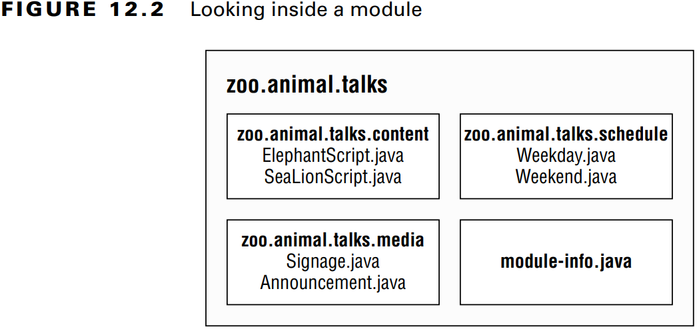
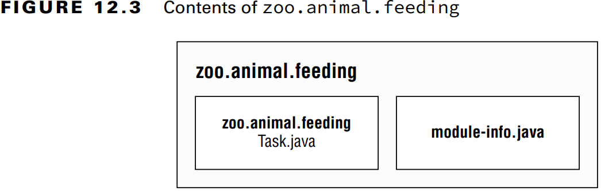
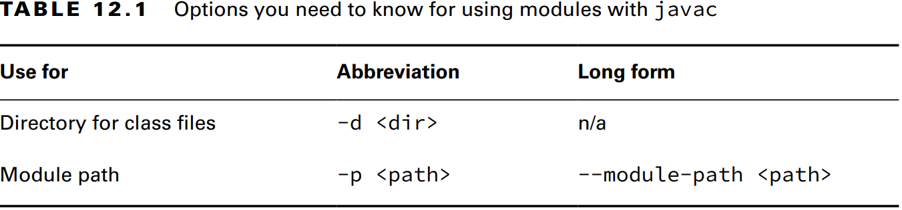
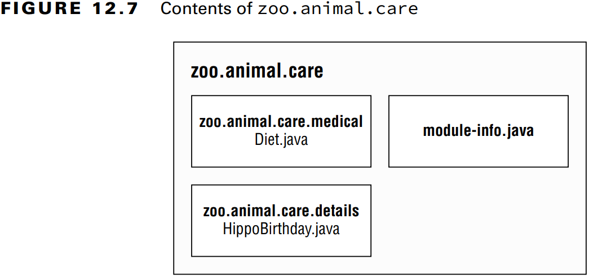
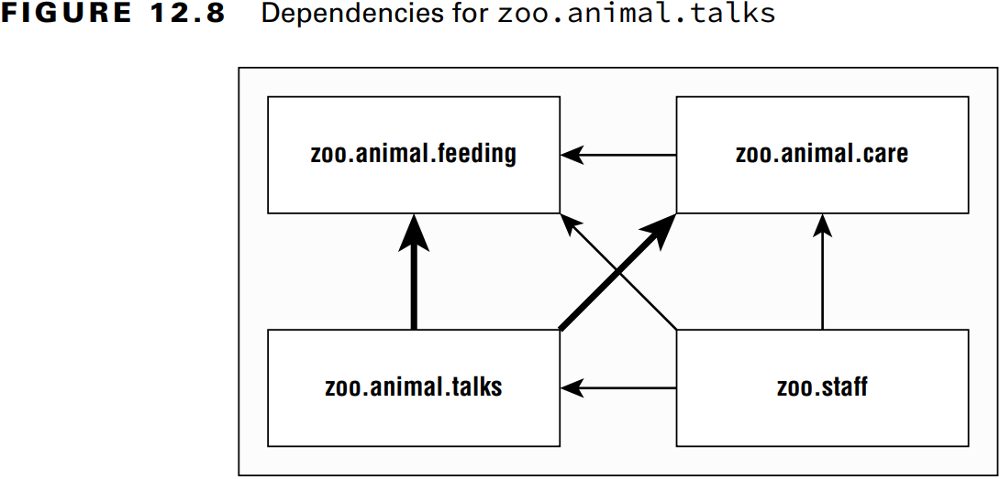
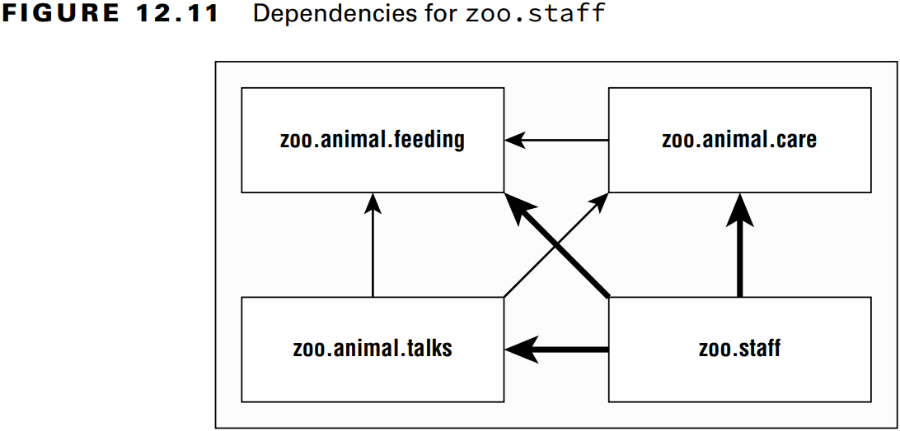

### _Modules_

---
### `Introducing Modules`

### Exploring a Module

Bir _module_ bir veya daha fazla paketten ve _module-info.java_ isimli dosyadan oluşur.

**Figure 12.1** Design of a modular system


**Figure 12.2** Looking inside a module



---
### `Creating and Running a Modular Program`

**Figure 12.3** Contents of zoo.animal.feeding



**Figure 12.4** Module zoo.animal.feeding directory structure


### Compiling Our First Module

Modulü derlemek için:

`javac --module-path mods -d feeding feeding/zoo/animal/feeding/*.java feeding/module-info.java`

- _-d_ seçeneği sınıf dosyalarının yerleştirileceği dizini belirtir.
- _--module-path_ ve _-p_ aynı anlama gelir.
- _--module_ ve _-m_ aynı anlama gelir.

Aşağıda ki komutların hepsi aynı anlama gelir.

`javac -p mods -d feeding feeding/zoo/animal/feeding/*.java feeding/*.java`

`javac -p mods -d feeding feeding/zoo/animal/feeding/*.java feeding/module-info.java`

`javac -p mods -d feeding feeding/zoo/animal/feeding/Task.java feeding/*.java`

`javac -p mods -d feeding feeding/zoo/animal/feeding/Task.java feeding/module-info.java`

**Table 12.1** Options you need to know for using modules with java


### Running Our First Module

**Figure 12.5** Running a module using _java_


`java --module-path feeding --module zoo.animal.feeding/zoo.animal.feeding.Task`

`java -p feeding -m zoo.animal.feeding/zoo.animal.feeding.Task`

**Table 12.2** Options you need to know for using modules with _java_ 


### Packaging Our First Module

_jar_ dosyasnını oluştur:

`jar -cvf mods/zoo.animal.feeding.jar -C feeding/ .`

Kodu _jar_ üzerinden çalıştır:

`java -p mods -m zoo.animal.feeding/zoo.animal.feeding.Task`

---
### `Updating Our Example for Multiple Modules`

**Figure 12.6** Modules depending on _zoo.animal.feeding_


### Updating the Feeding Module

**exports** komutu ile belirlenen paketleri modül dışına açar. 

```java
module zoo.animal.feeding {
    exports zoo.animal.feeding;
}
```

- Derleme: `javac -p mods -d feeding feeding/zoo/animal/*.java feeding/module-info.java`
- Jar oluşturma: `jar -cvf mods/zoo.animal.feeding.jar -C feeding/ .`

### Creating a Care Module

Bu modül içinde iki tane paket bulunur. Birinci _zoo.animal.care.medical_ paketi diğer modüllerde bulunan sınıflar tarafından
kullanılabilir. _zoo.animal.care.details_ paketi ise sadece kendi modülü içinde ki sınıflar tarafından kullanılabilir.

**Figure 12.7** Contents of _zoo.animal.care_



```java
package zoo.animal.care.details;
import zoo.animal.feeding.*;

public class HippoBirthday {
    private Task task;
}
```

```java
package zoo.animal.care.medical;

public class Diet { }
```

**module-info.java**
```java
module zoo.animal.care {
    exports zoo.animal.care.medical;
    requires zoo.animal.feeding;
}
```

- Derleme: `javac -p mods -d care care/zoo/animal/care/details/*.java care/zoo/animal/care/medical/*.java care/module-info.java`
- Jar oluşturma: `jar -cvf mods/zoo.animal.care.jar -C care/ .`

### Creating the Talks Module

**Figure 12.8** Dependencies for _zoo.animal.talks_



**Figure 12.9** Contents of _zoo.animal.talks_


**module-info.java**
```java
module zoo.animal.talks {
    exports zoo.animal.talks.content;
    exports zoo.animal.talks.media;
    exports zoo.animal.talks.schedule;
    
    requires zoo.animal.feeding;
    requires zoo.animal.care;
}
```

```java
package zoo.animal.talks.content;

public class ElephantScript { }
```

```java
package zoo.animal.talks.content;

public class SeaLionScript { }
```

```java
package zoo.animal.talks.media;

public class Announcement {
    public static void main(String[] args) {
        System.out.println("We will be having talks");
    }
}
```

```java
package zoo.animal.talks.media;

public class Signage { }
```

```java
package zoo.animal.talks.schedule;

public class Weekday { }
```

```java
package zoo.animal.talks.schedule;

public class Weekend { }
```

- Derleme: `javac -p mods -d talks talks/zoo/animal/talks/content/*.java talks/zoo/animal/talks/media/*.java talks/zoo/animal/talks/schedule/*.java talks/module-info.java`
- Jar oluşturma: `jar -cvf mods/zoo.animal.talks.jar -C talks/ .`

### Creating the Staff Module

**Figure 12.10** Contents of _zoo.staff_


**Figure 12.11** Dependencies for _zoo.staff_



**module-info.java**
```java
module zoo.staff {
    requires zoo.animal.feeding;
    requires zoo.animal.care;
    requires zoo.animal.talks;
}
```

```java
package zoo.staff;

public class Jobs { }
```

- Derleme: `javac -p mods -d staff staff/zoo/staff/*.java staff/module-info.java`
- Jar oluşturma: `jar -cvf mods/zoo.staff.jar -C staff/ .`

---
### `Diving into the Module Declaration`

### Exporting a Package

Zaten **exports** ile paketi diğer modüllere açmayı gördük. Aynı zamanda paketi sadece belirli bir modüle de açabiliriz.

<pre>
module zoo.animal.talks {
    <b><i>exports</i> zoo.animal.talks.content <i>to</i> zoo.staff;</b>
    exports zoo.animal.talks.media;
    exports zoo.animal.talks.schedule;

    requires zoo.animal.feeding;
    requires zoo.animal.care;    
}
</pre>

_zoo.animal.talks.content_ paketini sadece _zoo.staff_ modülüne açıyoruz.