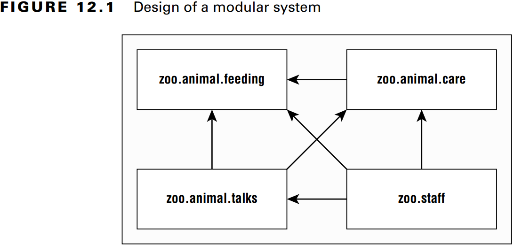
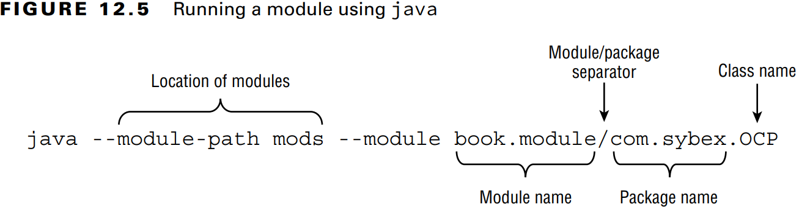
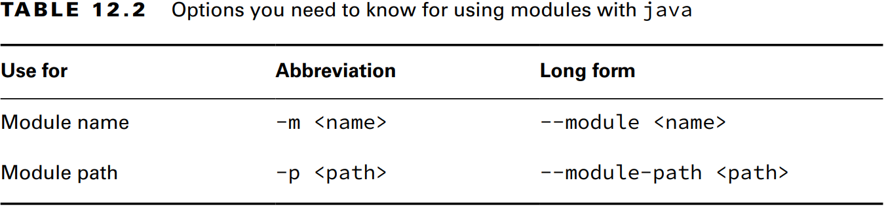
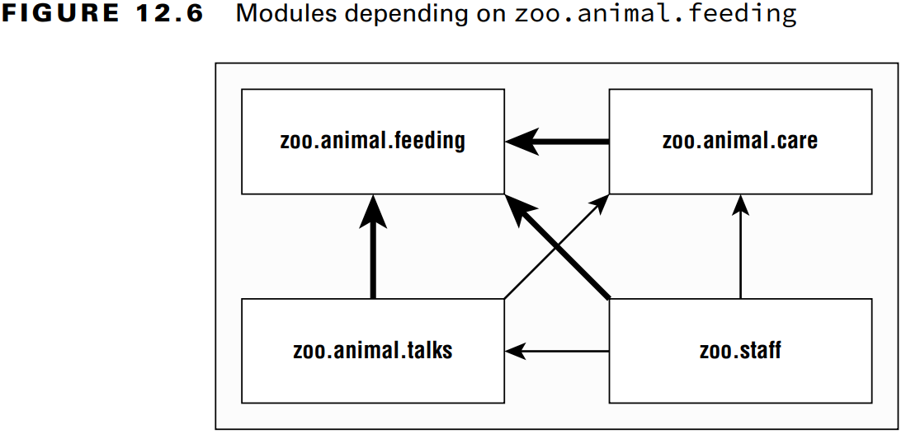
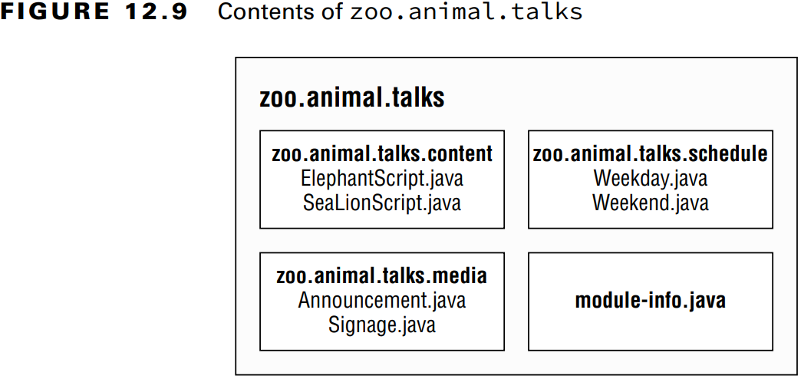
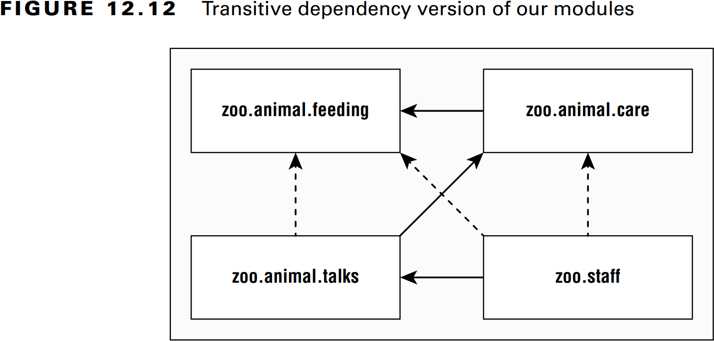

### _Modules_

---
### `Introducing Modules`

### Exploring a Module

Bir _module_ bir veya daha fazla paketten ve _module-info.java_ isimli dosyadan oluşur.

**Figure 12.1** Design of a modular system



**Figure 12.2** Looking inside a module


---
### `Creating and Running a Modular Program`

**Figure 12.3** Contents of zoo.animal.feeding


**Figure 12.4** Module zoo.animal.feeding directory structure


### Compiling Our First Module

Modulü derlemek için:

`javac --module-path mods -d feeding feeding/zoo/animal/feeding/*.java feeding/module-info.java`

- _-d_ seçeneği sınıf dosyalarının yerleştirileceği dizini belirtir.
- _--module-path_ ve _-p_ aynı anlama gelir.
- _--module_ ve _-m_ aynı anlama gelir.

Aşağıda ki komutların hepsi aynı anlama gelir.

`javac -p mods -d feeding feeding/zoo/animal/feeding/*.java feeding/*.java`

`javac -p mods -d feeding feeding/zoo/animal/feeding/*.java feeding/module-info.java`

`javac -p mods -d feeding feeding/zoo/animal/feeding/Task.java feeding/*.java`

`javac -p mods -d feeding feeding/zoo/animal/feeding/Task.java feeding/module-info.java`

**Table 12.1** Options you need to know for using modules with java


### Running Our First Module

**Figure 12.5** Running a module using _java_



`java --module-path feeding --module zoo.animal.feeding/zoo.animal.feeding.Task`

`java -p feeding -m zoo.animal.feeding/zoo.animal.feeding.Task`

**Table 12.2** Options you need to know for using modules with _java_ 



### Packaging Our First Module

_jar_ dosyasnını oluştur:

`jar -cvf mods/zoo.animal.feeding.jar -C feeding/ .`

Kodu _jar_ üzerinden çalıştır:

`java -p mods -m zoo.animal.feeding/zoo.animal.feeding.Task`

---
### `Updating Our Example for Multiple Modules`

**Figure 12.6** Modules depending on _zoo.animal.feeding_



### Updating the Feeding Module

**exports** komutu ile belirlenen paketleri modul dışına açar. 

```java
module zoo.animal.feeding {
    exports zoo.animal.feeding;
}
```

- Derleme: `javac -p mods -d feeding feeding/zoo/animal/*.java feeding/module-info.java`
- Jar oluşturma: `jar -cvf mods/zoo.animal.feeding.jar -C feeding/ .`

### Creating a Care Module

Bu modul içinde iki tane paket bulunur. Birinci _zoo.animal.care.medical_ paketi diğer modullerde bulunan sınıflar tarafından
kullanılabilir. _zoo.animal.care.details_ paketi ise sadece kendi modulü içinde ki sınıflar tarafından kullanılabilir.

**Figure 12.7** Contents of _zoo.animal.care_


```java
package zoo.animal.care.details;
import zoo.animal.feeding.*;

public class HippoBirthday {
    private Task task;
}
```

```java
package zoo.animal.care.medical;

public class Diet { }
```

**module-info.java**
```java
module zoo.animal.care {
    exports zoo.animal.care.medical;
    requires zoo.animal.feeding;
}
```

- Derleme: `javac -p mods -d care care/zoo/animal/care/details/*.java care/zoo/animal/care/medical/*.java care/module-info.java`
- Jar oluşturma: `jar -cvf mods/zoo.animal.care.jar -C care/ .`

### Creating the Talks Module

**Figure 12.8** Dependencies for _zoo.animal.talks_


**Figure 12.9** Contents of _zoo.animal.talks_



**module-info.java**
```java
module zoo.animal.talks {
    exports zoo.animal.talks.content;
    exports zoo.animal.talks.media;
    exports zoo.animal.talks.schedule;
    
    requires zoo.animal.feeding;
    requires zoo.animal.care;
}
```

```java
package zoo.animal.talks.content;

public class ElephantScript { }
```

```java
package zoo.animal.talks.content;

public class SeaLionScript { }
```

```java
package zoo.animal.talks.media;

public class Announcement {
    public static void main(String[] args) {
        System.out.println("We will be having talks");
    }
}
```

```java
package zoo.animal.talks.media;

public class Signage { }
```

```java
package zoo.animal.talks.schedule;

public class Weekday { }
```

```java
package zoo.animal.talks.schedule;

public class Weekend { }
```

- Derleme: `javac -p mods -d talks talks/zoo/animal/talks/content/*.java talks/zoo/animal/talks/media/*.java talks/zoo/animal/talks/schedule/*.java talks/module-info.java`
- Jar oluşturma: `jar -cvf mods/zoo.animal.talks.jar -C talks/ .`

### Creating the Staff Module

**Figure 12.10** Contents of _zoo.staff_


**Figure 12.11** Dependencies for _zoo.staff_


**module-info.java**
```java
module zoo.staff {
    requires zoo.animal.feeding;
    requires zoo.animal.care;
    requires zoo.animal.talks;
}
```

```java
package zoo.staff;

public class Jobs { }
```

- Derleme: `javac -p mods -d staff staff/zoo/staff/*.java staff/module-info.java`
- Jar oluşturma: `jar -cvf mods/zoo.staff.jar -C staff/ .`

---
### `Diving into the Module Declaration`

### Exporting a Package

Zaten **exports** ile paketi diğer modullere açmayı gördük. Aynı zamanda paketi sadece belirli bir module de açabiliriz.

<pre>
module zoo.animal.talks {
    <b><i>exports</i> zoo.animal.talks.content <i>to</i> zoo.staff;</b>
    exports zoo.animal.talks.media;
    exports zoo.animal.talks.schedule;

    requires zoo.animal.feeding;
    requires zoo.animal.care;    
}
</pre>

_zoo.animal.talks.content_ paketini sadece _zoo.staff_ modulüne açıyoruz.

### Requiring a Module Transitively

**Figure 12.12** Transitive dependency version of our modules



Dependency'leri transitive olarak güncelleyelim. 

<pre>
module zoo.animal.feeding {
    exports zoo.animal.feeding;
}
</pre>

<pre>
module zoo.animal.care {
    exports zoo.animal.care.medical;

    <b>requires transitive</b> zoo.animal.feeding;
}
</pre>

<pre>
module zoo.animal.talks {
    exports zoo.animal.talks.content to zoo.staff;
    exports zoo.animal.talks.media;
    exports zoo.animal.talks.schedule;

    // <b>no longer needed</b> requires zoo.animal.feeding;
    // <b>no longer needed</b> requires zoo.animal.care;
    requires <b>transitive</b> zoo.animal.care;
}
</pre>

<pre>
module zoo.staff {
    // <b>no longer needed</b> requires zoo.animal.feeding;
    // <b>no longer needed</b> requires zoo.animal.care;
    requires zoo.animal.talks;
}
</pre>

**Duplicate requires Statements**

Modül tanımında Java aynı modul ismi için **requires** anahtar kelimesini birden fazla kullanmaya izin vermez.

<pre>
module bad.module {
    requires zoo.animal.talks;
    requires transitive zoo.animal.talks;
}
</pre>

### Opening a Package

**opens** anahtar kelimesi paketi Java _reflection_ denilen bir tekniğe açmaya izin verir.

<pre>
module zoo.animal.talks {
    <b>opens</b> zoo.animal.talks.schedule;
    <b>opens</b> zoo.animal.talks.media <b>to</b> zoo.staff;
}
</pre>

- İlk _**opens**_ ifadesi, _zoo.animal.talks.schedule_ paketi için tüm modullerde _reflection_'a izin verir.
- İkinci _**opens**_ ifadesi, _zoo.animal.talks.media_ paketine sadece _zoo.staff_ modulünde _reflection_'a izin verir. 

> **Tüm Modülü Reflection için Açmak**
> 
> <pre>
> <b>open</b> module zoo.animal.talks {
> }
> </pre>
> 
> **open** direktifi ile **opens** aynı anda kullanılamaz. Çünkü **open** zaten tüm paketleri açar.
> <pre>
> <b>open</b> module zoo.animal.talks {
>    <b>opens</b> zoo.animal.talks.schedule; // DOES NOT COMPILE
> }
> </pre>

---
### `Discovering Modules`

### Built-in Modules

_java.base_ modulü en önemli moduldür. Java otomatik olarak, _**requires**_'a gerek kalmadan module ekler. Açık bir şekilde
ekleyebiliriz fakat bu gereksiz bir işlem olur.

### Getting Details with java

**Describing a Module**

_zoo.animal.feeding_ modulü içerisinde hangi direktifler kullanılmış görmek için aşağıda ki komutlar kullanılır.

`java -p mods -d zoo.animal.feeding`
`java -p mods --describe-module zoo.animal.feeding`

_Output:_
<pre>
zoo.animal.feeding file:///<i>absolutePath</i>/mods/zoo.animal.feeding.jar
exports zoo.animal.feeding
requires java.base mandated
</pre>

**Listing Available Modules**

Komut: `java --list-modules`

_Output:_
<pre>
java.base@17
java.compiler@17
java.datatransfer@17
</pre>

`java -p mods --list-modules` komutu ile kendi dizinimizin altında ki tüm modulleri de listeleyebiliriz.

_Output:_
<pre>
java.base@17
java.compiler@17
java.datatransfer@17
zoo.animal.care file:///<i>absolutePath</i>/mods/zoo.animal.care.jar
zoo.animal.feeding file:///<i>absolutePath</i>/mods/zoo.animal.feeding.jar
zoo.animal.talks file:///<i>absolutePath</i>/mods/zoo.animal.talks.jar
zoo.staff file:///<i>absolutePath</i>/mods/zoo.staff.jar
</pre>

### Learning about Dependencies with jdeps

```java
package zoo.dinos;

import java.time.*;
import java.util.*;

import sun.misc.Unsafe;

public class Animatronic {
    private List<String> names;
    private LocalDate visitDate;

    public Animatronic(List<String> names, LocalDate visitDate) {
        this.names = names;
        this.visitDate = visitDate;
    }

    public void unsafeMethod() {
        Unsafe unsafe = Unsafe.getUnsafe();
    }
}
```

Derleme: `javac zoo/dinos/*.java`
Jar oluşturma: `jar -cvf zoo.dino.jar .`

`jdeps` komutu ile modul içerisinde hangi bağımlılıkların gerçekte kullanıldığını gösterir.

Komut: `jdeps zoo.dino.jar`

_Output:_
<pre>
zoo.dino.jar -> java.base
zoo.dino.jar -> jdk.unsupported
   zoo.dinos                                          -> java.lang                                          java.base
   zoo.dinos                                          -> java.time                                          java.base
   zoo.dinos                                          -> java.util                                          java.base
   zoo.dinos                                          -> sun.misc                                           JDK internal API (jdk.unsupported)
</pre>

Sadece kullanılan modulleri görmek için:
`jdeps -s zoo.dino.jar` veya `jdeps -summary zoo.dino.jar`

_Output:_
<pre>
zoo.dino.jar -> java.base
zoo.dino.jar -> jdk.unsupported
</pre>

### Using the --jdk-internals Flag

Modul içerisinde bulunan _warning_'ler hakkında uyarılar verir.

Komut: `jdeps --jdk-internals zoo.dino.jar`

_Output:_
<pre>
zoo.dino.jar -> jdk.unsupported
   zoo.dinos.Animatronic                              -> sun.misc.Unsafe                                    JDK internal API (jdk.unsupported)

Warning: JDK internal APIs are unsupported and private to JDK implementation that are
subject to be removed or changed incompatibly and could break your application.
Please modify your code to eliminate dependence on any JDK internal APIs.
For the most recent update on JDK internal API replacements, please check:
https://wiki.openjdk.java.net/display/JDK8/Java+Dependency+Analysis+Tool

JDK Internal API                         Suggested Replacement
----------------                         ---------------------
sun.misc.Unsafe                          See http://openjdk.java.net/jeps/260
</pre>