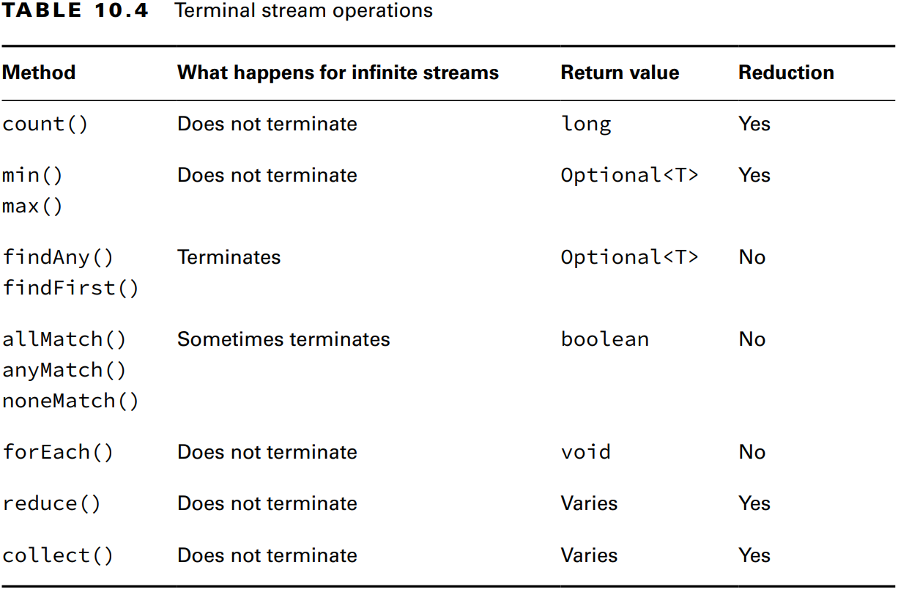

## _Chapter 10: Streams_

---
## `Returning an Optional`

### Creating an Optional

```java
public static void main(String[] args) throws Exception {
    System.out.println(average(90, 100));
    System.out.println(average());
}

public static Optional<Double> average(int... scores) {
    if (scores.length == 0) {
        return Optional.empty();
    }
    int sum = Arrays.stream(scores).sum();
    return Optional.of((double) sum / scores.length);
}
```
_Output:_
<pre>
Optional[95.0]
Optional.empty
</pre>

Önce _Optional_ değer içeriyor mu diye kontrol ettik sonra ekrana bastırdık.
```java
Optional<Double> opt = average(90, 10);
if (opt.isPresent()) {
    System.out.println(opt.get());
}
```
_Output:_
<pre>
95.0
</pre>

Eğer _Optional_'ı kontrol etmeden değeri bastırsaydık _NoSuchElementException_ hatası alabilirdik.

```java
Optional<Double> opt = average();
System.out.println(opt.get()); // NoSuchElementException
```

_Output:_
<pre style="color: red">
java.util.NoSuchElementException: No value present
</pre>

_Optional.of()_ methodu **null** değer ile çağrılırsa _NullPointerException_ fırlatır. Bunun önüne geçmek için iki çözüm 
vardır. Birincisi _if condition_ ile değerin **null** olup olmadığını kontrol etmek. İkincisi ve daha doğru olanı
_Optional.ofNullable()_ kullanmak.

```java
String value = null;

// 1. Solution
Optional<String> opt = (value == null) ? Optional.empty() : Optional.of(value);

// 2. Solution
Optional<String> opt = Optional.ofNullable(value);
```

_**Table 10.1** Common Optional instance methods_


### Dealing with an Empty Optional

```java
Optional<Double> opt = average();

Double orElse = opt.orElse(0.0);
Double orElseGet = opt.orElseGet(() -> Math.random());
Double orElseThrow = opt.orElseThrow();                             // NoSuchElementException
Double orElseThrow = opt.orElseThrow(() -> new RuntimeException()); // RuntimeException
```

---
## `Using Streams`

### Understanding the Pipeline Flow

_Stream_'ler 3 parçadan oluşur. _Source_, _Intermediate operations_ ve _Terminal operations_.

_Stream_'ler _lazy evaluate_ yapıdadırlar. _Terminal operation_ çalıştırılana kadar _intermediate operations_'lar 
çalıştırılmazlar. 

_**Figure 10.2** Stream pipeline_


_**Table 10.2** Intermediate vs. terminal operations_


### Creating Stream Sources

Java'da streamler _java.util.stream.Stream_ arayüzü tarafından temsil edilir.

#### Creating Finite Streams

```java
Stream<String> empty = Stream.empty();          // count = 0
Stream<Integer> singleElement = Stream.of(1);   // count = 1
Stream<Integer> fromArray = Stream.of(1, 2, 3); // count = 3

var list = List.of("a", "b", "c");
Stream<String> fromList = list.stream();
```

#### Creating Infinite Streams

Sonsuz stream oluşturmak için _Stream_ üzerinde iki **static** method bulunur. _Stream.generate()_ ve _Stream.iterate()_.

```java
Stream<Double> randoms = Stream.generate(Math::random);
Stream<Integer> oddNumbers = Stream.iterate(1, n -> n + 2);
Stream<Integer> oddNumbersUnder100 = Stream.iterate(
        1,            // Seed
        n -> n < 100, // Predicate
        n -> n + 2    // UnaryOperator
);

System.out.println(randoms); // java.util.stream.ReferencePipeline$Head@34c45dca
```

_**Table 10.3** Creating a source_


### Using Common Terminal Operations

_Reduction_ stream'in tek bir sonuca indirgendiği işleme türüdür.

_**Table 10.4** Terminal stream operations_



#### Counting

Sonsuz bir stream'i sonlandırmaz. Bir _reduction_ işlemidir çünkü stream'de ki tüm elemanlara bakar ve geriye tek bir 
değer döner.

```java
// Method signature
public long count();
```

```java
Stream<String> stream = Stream.of("monkey", "gorilla", "bonobo");
System.out.println(stream.count()); // ape
```

#### Min and Max

Bir _comparator_ ile stream de ki minimum ve maximum elemanları bulur. Sonsuz streamlerde kod askıda kalır.

```java
Stream<String> stream = Stream.of("monkey", "ape", "bonobo");

Optional<String> min = stream.min((s1, s2) -> s1.length() - s2.length());
min.ifPresent(System.out::println); // 
```

### Finding a Value

_findAny()_ ve _findFirst()_ methodları stream boş değilse bir sonuç dönerler. Stream boş ise _Optional_ dönerler. 
_findAny()_ methodu büyük olasılıkla streamde ki ilk elemanı dönecektir ama bu kesin değildir. _findFirst()_ dizide ki
ilk elemanı döner.

```java
Stream<String> stream = Stream.of("monkey", "ape", "bonobo");
Stream<String> infinite = Stream.generate(() -> "chimp");

stream.findAny().ifPresent(System.out::println);   // monkey
infinite.findAny().ifPresent(System.out::println); // chimp
```

### Matching

_allMatch()_, _anyMatch()_ and _noneMatch()_ methodları ilgili veriyi stream üzerinde ararlar. Aranan veriye göre _infinite_
streami bitirebilir veya bitiremez. _Find_ methodları gibi _reduction_ değildir. Çünkü tüm streami dolaşmak zorunde degildirler.


```java
var list = List.of("monkey", "2", "bonobo");
Stream<String> infinite = Stream.generate(() -> "chimp");
Predicate<String> pred = x -> Character.isLetter(x.charAt(0));

boolean anyMatch1 = list.stream().anyMatch(pred);
boolean anyMatch2 = infinite.anyMatch(pred);
boolean allMatch = list.stream().allMatch(pred);
boolean noneMatch = list.stream().noneMatch(pred);

System.out.println(anyMatch1); // true
System.out.println(anyMatch2); // true
System.out.println(allMatch);  // false
System.out.println(noneMatch); // false
```

Eğer _infinite_ stream _allMatch()_ ile çalıştırlırsa uygulama askıda kalır.

_Output:_
<pre>
true
true
false
false
</pre>

### Iterating

Streamler üzerinde _for-each_ döngüsü yapılamaz çünkü _Stream_ sınıfı _Iterable_ arayüzünü uygulamaz.

### Reducing

_reduce()_ methodu streami tek bir nesnede birleştirir. Bir _reduction_ işlemidir çünkü tüm elemanları işler. Üç adet 
method imzası vardır.

```java
public T reduce(T identity, BinaryOperator<T> accumulator)

public Optional<T> reduce(BinaryOperator<T> accumulator)

public <U> U reduce(U identity,
                    BiFunction<U,? super T,U> accumulator,
                    BinaryOperator<U> combiner)
```

```java
var array = new String[] { "w", "o", "l", "f" };

var result = "";
for (String s : array) {
    result += s;
}
System.out.println(result); // wolf

Optional<String> optString = Arrays.stream(array)
        .reduce((a, b) -> a + b);
System.out.println(optString.get()); // wolf

result = Arrays.stream(array)
        .reduce("", String::concat);
System.out.println(result); // wolf
```

_Output:_
<pre>
wolf
wolf
wolf
</pre>

_Identity_ değeri zorunlu değildir. _identity_ değeri vermezsek sonuç _Optional_ döner fakat değer verirsek sonuç _identity_
tipinde olur.

Üçüncü method, stream üzerinde farklı tiplerle uğraştığımızda kullanılır. Java'nın ara _reduction_'lar oluşturmasına ve 
en sonda bunları birleştirmesine olanak sağlar.

```java
Stream<String> stream = Stream.of("java", "se", "17", "ocp");

Integer length = stream.reduce(
                                0,                        // Identity
                                (i, s) -> i + s.length(), // Accumulator 
                                (i1, i2) -> i1 + i2);     // Combiner
System.out.println(length); // 11
```

Ayrıca üç parametreli _reduce()_ methodu paralel streamlerle çalışırken faydalıdır. Streamin _Thread_'ler tarafından 
parçalanıp tekrar birleşitirilmesi olanak tanır.

---
### `Working with Primitive Streams`


---
### `Working with Advanced Stream Pipeline Concepts`