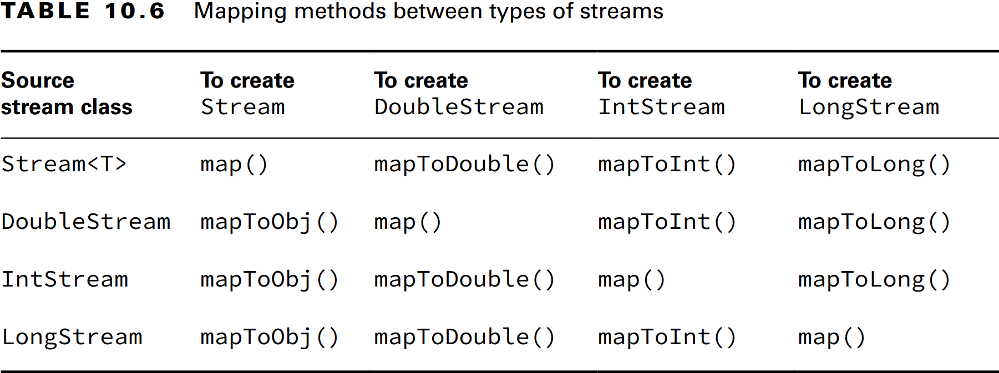
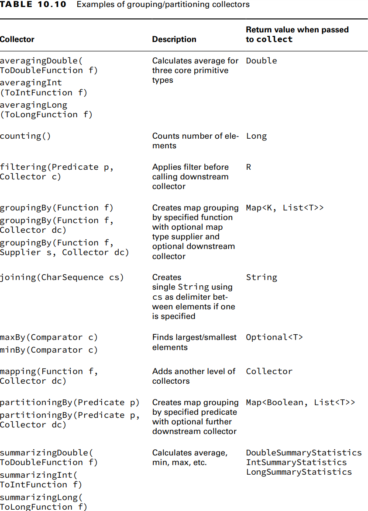

## _Chapter 10: Streams_

---
## `Returning an Optional`

### Creating an Optional

```java
public static void main(String[] args) throws Exception {
    System.out.println(average(90, 100));
    System.out.println(average());
}

public static Optional<Double> average(int... scores) {
    if (scores.length == 0) {
        return Optional.empty();
    }
    int sum = Arrays.stream(scores).sum();
    return Optional.of((double) sum / scores.length);
}
```
_Output:_
<pre>
Optional[95.0]
Optional.empty
</pre>

Önce _Optional_ değer içeriyor mu diye kontrol ettik sonra ekrana bastırdık.
```java
Optional<Double> opt = average(90, 10);
if (opt.isPresent()) {
    System.out.println(opt.get());
}
```
_Output:_
<pre>
95.0
</pre>

Eğer _Optional_'ı kontrol etmeden değeri bastırsaydık _NoSuchElementException_ hatası alabilirdik.

```java
Optional<Double> opt = average();
System.out.println(opt.get()); // NoSuchElementException
```

_Output:_
<pre style="color: red">
java.util.NoSuchElementException: No value present
</pre>

_Optional.of()_ methodu **null** değer ile çağrılırsa _NullPointerException_ fırlatır. Bunun önüne geçmek için iki çözüm 
vardır. Birincisi _if condition_ ile değerin **null** olup olmadığını kontrol etmek. İkincisi ve daha doğru olanı
_Optional.ofNullable()_ kullanmak.

```java
String value = null;

// 1. Solution
Optional<String> opt = (value == null) ? Optional.empty() : Optional.of(value);

// 2. Solution
Optional<String> opt = Optional.ofNullable(value);
```

_**Table 10.1** Common Optional instance methods_


### Dealing with an Empty Optional

```java
Optional<Double> opt = average();

Double orElse = opt.orElse(0.0);
Double orElseGet = opt.orElseGet(() -> Math.random());
Double orElseThrow = opt.orElseThrow();                             // NoSuchElementException
Double orElseThrow = opt.orElseThrow(() -> new RuntimeException()); // RuntimeException
```

---
## `Using Streams`

### Understanding the Pipeline Flow

_Stream_'ler 3 parçadan oluşur. _Source_, _Intermediate operations_ ve _Terminal operations_.

_Stream_'ler _lazy evaluate_ yapıdadırlar. _Terminal operation_ çalıştırılana kadar _intermediate operations_'lar 
çalıştırılmazlar. 

_**Figure 10.2** Stream pipeline_


_**Table 10.2** Intermediate vs. terminal operations_


### Creating Stream Sources

Java'da streamler _java.util.stream.Stream_ arayüzü tarafından temsil edilir.

#### Creating Finite Streams

```java
Stream<String> empty = Stream.empty();          // count = 0
Stream<Integer> singleElement = Stream.of(1);   // count = 1
Stream<Integer> fromArray = Stream.of(1, 2, 3); // count = 3

var list = List.of("a", "b", "c");
Stream<String> fromList = list.stream();
```

#### Creating Infinite Streams

Sonsuz stream oluşturmak için _Stream_ üzerinde iki **static** method bulunur. _Stream.generate()_ ve _Stream.iterate()_.

```java
Stream<Double> randoms = Stream.generate(Math::random);
Stream<Integer> oddNumbers = Stream.iterate(1, n -> n + 2);
Stream<Integer> oddNumbersUnder100 = Stream.iterate(
        1,            // Seed
        n -> n < 100, // Predicate
        n -> n + 2    // UnaryOperator
);

System.out.println(randoms); // java.util.stream.ReferencePipeline$Head@34c45dca
```

_**Table 10.3** Creating a source_


### Using Common Terminal Operations

_Reduction_ stream'in tek bir sonuca indirgendiği işleme türüdür.

_**Table 10.4** Terminal stream operations_


#### Counting

Sonsuz bir stream'i sonlandırmaz. Bir _reduction_ işlemidir çünkü stream'de ki tüm elemanlara bakar ve geriye tek bir 
değer döner.

```java
// Method signature
public long count();
```

```java
Stream<String> stream = Stream.of("monkey", "gorilla", "bonobo");
System.out.println(stream.count()); // ape
```

#### Min and Max

Bir _comparator_ ile stream de ki minimum ve maximum elemanları bulur. Sonsuz streamlerde kod askıda kalır.

```java
Stream<String> stream = Stream.of("monkey", "ape", "bonobo");

Optional<String> min = stream.min((s1, s2) -> s1.length() - s2.length());
min.ifPresent(System.out::println); // 
```

#### Finding a Value

_findAny()_ ve _findFirst()_ methodları stream boş değilse bir sonuç dönerler. Stream boş ise _Optional_ dönerler. 
_findAny()_ methodu büyük olasılıkla streamde ki ilk elemanı dönecektir ama bu kesin değildir. _findFirst()_ dizide ki
ilk elemanı döner.

```java
Stream<String> stream = Stream.of("monkey", "ape", "bonobo");
Stream<String> infinite = Stream.generate(() -> "chimp");

stream.findAny().ifPresent(System.out::println);   // monkey
infinite.findAny().ifPresent(System.out::println); // chimp
```

#### Matching

_allMatch()_, _anyMatch()_ and _noneMatch()_ methodları ilgili veriyi stream üzerinde ararlar. Aranan veriye göre _infinite_
streami bitirebilir veya bitiremez. _Find_ methodları gibi _reduction_ değildir. Çünkü tüm streami dolaşmak zorunde degildirler.


```java
var list = List.of("monkey", "2", "bonobo");
Stream<String> infinite = Stream.generate(() -> "chimp");
Predicate<String> pred = x -> Character.isLetter(x.charAt(0));

boolean anyMatch1 = list.stream().anyMatch(pred);
boolean anyMatch2 = infinite.anyMatch(pred);
boolean allMatch = list.stream().allMatch(pred);
boolean noneMatch = list.stream().noneMatch(pred);

System.out.println(anyMatch1); // true
System.out.println(anyMatch2); // true
System.out.println(allMatch);  // false
System.out.println(noneMatch); // false
```

Eğer _infinite_ stream _allMatch()_ ile çalıştırlırsa uygulama askıda kalır.

_Output:_
<pre>
true
true
false
false
</pre>

#### Iterating

Streamler üzerinde _for-each_ döngüsü yapılamaz çünkü _Stream_ sınıfı _Iterable_ arayüzünü uygulamaz.

#### Reducing

_reduce()_ methodu streami tek bir nesnede birleştirir. Bir _reduction_ işlemidir çünkü tüm elemanları işler. Üç adet 
method imzası vardır.

```java
public T reduce(T identity, BinaryOperator<T> accumulator)

public Optional<T> reduce(BinaryOperator<T> accumulator)

public <U> U reduce(U identity,
                    BiFunction<U,? super T,U> accumulator,
                    BinaryOperator<U> combiner)
```

```java
var array = new String[] { "w", "o", "l", "f" };

var result = "";
for (String s : array) {
    result += s;
}
System.out.println(result); // wolf

Optional<String> optString = Arrays.stream(array)
        .reduce((a, b) -> a + b);
System.out.println(optString.get()); // wolf

result = Arrays.stream(array)
        .reduce("", String::concat);
System.out.println(result); // wolf
```

_Output:_
<pre>
wolf
wolf
wolf
</pre>

_Identity_ değeri zorunlu değildir. _identity_ değeri vermezsek sonuç _Optional_ döner fakat değer verirsek sonuç _identity_
tipinde olur.

Üçüncü method, stream üzerinde farklı tiplerle uğraştığımızda kullanılır. Java'nın ara _reduction_'lar oluşturmasına ve 
en sonda bunları birleştirmesine olanak sağlar.

```java
Stream<String> stream = Stream.of("java", "se", "17", "ocp");

Integer length = stream.reduce(
                                0,                        // Identity
                                (i, s) -> i + s.length(), // Accumulator 
                                (i1, i2) -> i1 + i2);     // Combiner
System.out.println(length); // 11
```

Ayrıca üç parametreli _reduce()_ methodu paralel streamlerle çalışırken faydalıdır. Streamin _Thread_'ler tarafından 
parçalanıp tekrar birleşitirilmesi olanak tanır.

#### Collecting

_collect()_ methodu _mutable reduction_ olarak isimlendşrilen özel bir _reduction_ türüdür. Normal _reduction_'dan daha 
verimlidir çünkü aynı _mutable_ nesne üzerinde güncelleme işlemi yapılır. Yaygın kullanılan _mutable_ nesneler 
_StringBuilder_ ve _ArrayList_'dir. Çok kullanışlı bir yöntemdir çünkü verileri streamden çıkarıp başka bir forma 
sokmamızı sağlar.

Method imzaları aşağıda ki gibidir.

```java
public <R> R collect(Supplier<R> supplier,
                     BiConsumer<R, ? super T> accumulator,
                     BiConsumer<R, R> combiner)
    
public <R,A> R collect(Collector<? super T, A,R> collector)
```

```java
Stream<String> stream = Stream.of("w", "o", "l", "f");

StringBuilder word = stream.collect(
        () -> new StringBuilder(),
        (StringBuilder sb, String str) -> sb.append(str),
        (StringBuilder sb1, StringBuilder sb2) -> sb1.append(sb2)
);
System.out.println(word); // wolf
```

İlk parametre _supplier_, verileri toplayacağımız ve sonuç olarak döneceğimiz tip. İkinci parametre _accumulator_, 
_BiConsumer_ tipindedir. İki parametre alır ve geriye bir şey dönmez. String'i StringBuilder'a ekler. 

Son parametere _combiner_'dır. İki veri koleksiyonu alır ve birleştirir. Paralel streamlerde kullanışlıdır. Normal streamde
çalışmaz.

```java
TreeSet<String> treeSet = stream.collect(
        () -> new TreeSet<>(),
        (TreeSet<String> set, String str) -> set.add(str),
        (TreeSet<String> set1, TreeSet<String> set2) -> set1.addAll(set2)
);

System.out.println(treeSet); // [f, l, o, w]
```

Java' da built-in gelen _Collectors_ sınıfı vardır. Sık kullanılan collector'leri tanımlar.

```java
TreeSet<String> treeSet = stream.collect(Collectors.toCollection(TreeSet::new));
System.out.println(treeSet); // [f, l, o, w]

Set<String> set = stream.collect(Collectors.toSet());
System.out.println(set); // [f, w, l, o]
```

### Using Common Intermediate Operations

_Intermediate operations_'lar geriye _stream_ döner.

#### Filtering

```java
Stream<String> stream = Stream.of("monkey", "gorilla", "bonobo");
stream.filter(x -> x.startsWith("m"))
        .forEach(System.out::print); // monkey
```

#### Removing Duplicates

_distinct()_ methodu stream üzerinde ki _duplicate_ değerleri siler. Kopyaların silinmesi için ardışık olması gerekmez. 
Java nesnelerin eşit olup olmadığını anlamak için _equals()_ methodunu çağırır.

```java
Stream<String> stream = Stream.of("duck", "duck", "duck", "goose");
stream.distinct()
        .forEach(System.out::print); // duckgoose
```

#### Restricting by Position

_limit()_ ve _skip()_ methodları streami küçültür. _limit()_ methodu _infinite_ streami _finite_ yapar.

```java
Stream<Integer> stream = Stream.iterate(1, n -> n + 1);
stream.skip(5)
        .limit(2)
        .forEach(System.out::print); // 67
```

İlk 5 elemanı geçer ve streamden 2 adet eleman işler.

#### Mapping

Streamde ki her bir elemanı bire bir dönüştürür.

```java
Stream<String> stream = Stream.of("monkey", "gorilla", "bonobo");
stream.map(animal -> animal.length()) // Stream<Integer>
        .forEach(System.out::print);  // 676
```

#### Using flatMap

_flatMap()_ streamdki her elemanı alır ve içerdiği tüm elemanları tek bir akışta birleştirir. Bir streamden boş elemanları
silmek veya listelerde oluşan bir streami birleştirmek istediğimizde faydalıdır.

```java
List<String> zero = List.of();
var one = List.of("Bonobo");
var two = List.of("Mama Gorilla", "Baby Gorilla");

Stream<List<String>> animals = Stream.of(zero, one, two);

animals.flatMap(list -> list.stream())
        .forEach(System.out::println);
```

_Output:_
<pre>
Bonobo
Mama Gorilla
Baby Gorilla
</pre>

İki streami birleştirmek.
```java
var one = Stream.of("Bonobo");
var two = Stream.of("Mama Gorilla", "Baby Gorilla");
Stream<Stream<String>> animals = Stream.of(one, two);
animals.flatMap(s -> s)
        .forEach(System.out::println);
```

_Output:_
<pre>
Bonobo
Mama Gorilla
Baby Gorilla
</pre>

> **Concatenating Streams**
> 
> _flatMap()_ çoğu durumda kullanışlı olsa da, iki streami birleştirmenin daha iyi bir yolu vardır.
> 
> ```java
>  var one = Stream.of("Bonobo");
>  var two = Stream.of("Mama Gorilla", "Baby Gorilla");
>  Stream<String> concat = Stream.concat(one, two);
> ```

#### Sorting 

_sorted()_ methodu streami sıralar. Dizileri sıralamak gibi, Java da bir _Comparator_ belirtmediğimiz sürece doğal 
sıralamayı kullanır. Method imzaları aşağıda ki gibidir:

```java
public Stream<T> sorted()
    
public Stream<T> sorted(Comparator<? super T> comparator)
```

```java
Stream<String> stream = Stream.of("brown-", "bear-");
stream.sorted()
        .forEach(System.out::print); // bear-brown-
```

```java
Stream<String> stream = Stream.of("brown-", "bear-");
stream.sorted((a, b) -> a.length() - b.length())
        .forEach(System.out::print); // bear-brown-
```

```java
Stream<String> stream = Stream.of("brown-", "bear-");
stream.sorted(Comparator.reverseOrder())
        .forEach(System.out::print); // brown-bear-
```

#### Taking a Peek

Hata ayıklamak iöin faydalıdır. Çünkü akışı değiştirmeden işlem yapmamıza olanak tanır. 

```java
var stream = Stream.of("black bear", "brown bear", "grizzly");
long count = stream.filter(s -> s.startsWith("g"))
        .peek(System.out::println) // grizzly
        .count();
System.out.println(count); // 1
```

---
## `Working with Primitive Streams`

```java
Stream<Integer> stream = Stream.of(1, 2, 3);
System.out.println(stream.reduce(0, (s, n) -> s + n)); // 6
        
System.out.println(stream.mapToInt(x -> x).sum());     // 6
```

Üç adet primitive stream bulunur: **int**, **double** ve **long** stream. 

Primitive streamler çok fazla faydalı methoda sahiptiler. Örneğin _Stream<Integer>_ ile sayıların ortalamasını almak için 
iki kez stream çalıştırmak gerekirken _IntStream_ ile bunu doğrudan yapabiliriz.

```java
IntStream intStream = IntStream.of(1, 2, 3);
OptionalDouble avg = intStream.average();
System.out.println(avg.getAsDouble()); // 2.0
```

### Creating Primitive Streams

Üç adet primitive stream vardır:

- **IntStream**: **int**, **short**, **byte** ve **char** için kullanılır.
- **LongStream**: **long** için kullanılır.
- **DoubleStream**: **double** için kullanılır.

_**Table 10.5** Common primitive stream methods_


Primitive stream oluşturmak için kullanılan methodların bazıları normal _Stream_ methodlarına benzer.

```java
DoubleStream empty = DoubleStream.empty();

DoubleStream oneValue = DoubleStream.of(3.14);
oneValue.forEach(System.out::println);

DoubleStream varargs = DoubleStream.of(1.0, 1.1, 1.2);
varargs.forEach(System.out::println);
```

_Output:_
<pre>
3.14
1.0
1.1
1.2
</pre>

Infinite stream oluşturma methodlarıda aynıdır.

```java
DoubleStream random = DoubleStream.generate(Math::random);
DoubleStream fractions = DoubleStream.iterate(0.5, d -> d / 2);

random.limit(3).forEach(System.out::println);
fractions.limit(3).forEach(System.out::println);
```

_Output:_
<pre>
0.10989859419596859
0.015402908907186652
0.8187738229897128
0.5
0.25
0.125
</pre>

### Mapping Streams

Primitive stream olulturmanın diğer yolu da başka bir streamden _mapping()_ yapmaktır.

_**Table 10.6** Mapping methods between types of streams_



```java
Stream<String> objStream = Stream.of("penguin", "fish");
IntStream intStream = objStream.mapToInt(s -> s.length());
LongStream longStream = objStream.mapToLong(s -> s.length());
```

_**Table 10.7** Function parameters when mapping between types of streams_


_**mapToObj()**_ ve _**boxed()**_ methodları primitive streamleri _Stream_'e çevirir.

```java
private static Stream<Integer> mapping(IntStream stream) {
    return stream.mapToObj(x -> x);
}

private static Stream<Integer> boxing(IntStream stream) {
    return stream.boxed();
}
```

### Using Optional with Primitive Streams

```java
IntStream intStream = IntStream.rangeClosed(1, 10);
OptionalDouble avg = intStream.average();
```

_OptionalDouble_ primitiveler ve _Optional<Double>_ ise _Double_ wrapper sınıf için olmasıdır. Primitive optional sınıf 
ile çalışmak _Optional_ sınıfın kendisiyle çalışmak gibidir.

```java
IntStream intStream = IntStream.rangeClosed(1, 10);
OptionalDouble avg = intStream.average();

avg.ifPresent(System.out::println);           // 5.5
System.out.println(avg.getAsDouble());        // 5.5
System.out.println(avg.orElseGet(() -> 0.0)); // 5.5
```

Tek fark _get()_ yerine _getAsDouble()_ kullanmamızdır. Bu bir primitive ile çalıştığımızı gösterir. Ayrıca, _orElseGet()_
bir _Supplier_ yerine _DoubleSupplier_ alır.

_**Table 10.8** Optional types for primitives_


```java
LongStream longStream = LongStream.of(5, 10);
long sum = longStream.sum();
System.out.println(sum); // 15

DoubleStream doubleStream = DoubleStream.generate(() -> Math.PI);
OptionalDouble min = doubleStream.min(); // runs infinitely
```

### Summarizing Statistics

Primitive streamler üzerinde _count_, _average_ ve _sum_ gibi çok kullanılan işlemler yapmak için birden fazla sefer stream
çalıştırması yapmak zorunda değiliz. Java'da bunun için özel bir _Statistic_ sınıfı vardır.

```java
IntStream intStream = IntStream.rangeClosed(1, 10);
IntSummaryStatistics statistics = intStream.summaryStatistics();

long count = statistics.getCount();
double average = statistics.getAverage();
long sum = statistics.getSum();
int min = statistics.getMin();
int max = statistics.getMax();
```

```java
LongStream longStream = LongStream.rangeClosed(1, 10);
LongSummaryStatistics statistics = longStream.summaryStatistics();

long count = statistics.getCount();
double average = statistics.getAverage();
long sum = statistics.getSum();
long min = statistics.getMin();
long max = statistics.getMax();
```

```java
DoubleStream doubleStream = DoubleStream.of(1, 2, 3);
DoubleSummaryStatistics statistics = doubleStream.summaryStatistics();

long count = statistics.getCount();
double average = statistics.getAverage();
double sum = statistics.getSum();
double min = statistics.getMin();
double max = statistics.getMax();
```

---
## `Working with Advanced Stream Pipeline Concepts`

### Linking Streams to the Underlying Data

```java
var cats = new ArrayList<String>();
cats.add("Annie");
cats.add("Ripley");
var stream = cats.stream();

cats.add("KC");

System.out.println(stream.count()); // 3
```

Stream'ler _lazily evaluated_'dir. _stream.count()_ methodu çalıştırılana kadar streamler oluşturulmazlar.

### Chaining Optionals

```java
private static void treeDigits(Optional<Integer> optional) {
    if (optional.isPresent()) {
        var num = optional.get();
        var str = "" + num;
        if (str.length() == 3) {
            System.out.println(str);
        }
    }
}

private static void treeDigits(Optional<String> optional) {
    optional.map(n -> "" + n)
            .filter(s -> s.length() == 3)
            .ifPresent(System.out::println);
}
```

İki kod parçasıda aynı işlemi yapar. İkinci kod daha _expressive_'dir.

> **Checked Exceptions and Functional Interfaces**
> 
> Çoğu _functional interfaces_ _checked exception_ fırlatmaz. Ama fırlattığı durumlarda bu bir problemdir. Fırlatılan 
> hatanın ele alınması gerekir.
> 
> ```java
> class ExceptionCaseStudy {
>     private static List<String> create() throws IOException {
>         throw new IOException();
>     }
>     
>     public void good() throws IOException {
>         ExceptionCaseStudy.create().stream().count();
>     }
>     
>     public void bad() {
>         Supplier<List<String>> supplier = () -> ExceptionCaseStudy.create(); // DOES NOT COMPILE
>     }
>     
>     public void ugly() {
>         Supplier<List<String>> supplier = () -> {
>             try {
>                 return ExceptionCaseStudy.create();
>             } catch (IOException e) {
>                 throw new RuntimeException(e);
>             }
>         };
>     }
> 
>     private static List<String> createSafe() {
>         try {
>             return ExceptionCaseStudy.create();
>         } catch (IOException e) {
>             throw new RuntimeException(e);
>         }
>     }
> 
>     public void wrapped() {
>         Supplier<List<String>> supplier = ExceptionCaseStudy::createSafe;
>     }
> }
> ```

### Using a Spliterator

Diyelim ki iki çocuğun hayvanat bahçesindeki hayvanları beslemesi için bir torba yiyecek satın aldınız. Tartışmalardan 
kaçınmak için fazladan boş bir torba ile hazırlıklı geldiniz. Ana torbadaki yiyeceğin yaklaşık yarısını çıkarıp evden 
getirdiğiniz torbaya koyuyorsunuz. Orijinal torba yiyeceğin diğer yarısıyla birlikte hala duruyor.

_**Table 10.9** Spliterator methods_


```java
var stream = List.of("bird-", "bunny-", "cat-", "dog-", "fish-", "lamb-", "mouse-");

Spliterator<String> originalBagOfFood = stream.spliterator();
Spliterator<String> emmasBag = originalBagOfFood.trySplit();
emmasBag.forEachRemaining(System.out::print);   // bird-bunny-cat-

Spliterator<String> jillsBag = originalBagOfFood.trySplit();
jillsBag.tryAdvance(System.out::println);       // dog-
jillsBag.forEachRemaining(System.out::print);   // fish-

originalBagOfFood.forEachRemaining(System.out::print); // lamb-mouse-

Spliterator<String> nullBag = originalBagOfFood.trySplit();
System.out.println(nullBag);  // null
```

- _trySplit()_, mevcut _Spliterator_'dan verinin yarısını kaldırır ve yeni bir _Spliterator_ oluşturarak ona ekler. Bu method
birden çok sefer çağrılabilir ve sonunda veriler artık bölünemez olduğunda **null** döndürür.


- _forEachRemaining()_, _Spliterator_'da kalan elemanları işler.


- _tryAdvance()_, eğer kaldıysa _Spliterator_'da bulunan tek bir elemanı işler. Eğer işlem yaptıysa **true** yoksa **false**
 döndürür.

```java
var originalBag = Stream.iterate(1, n -> ++n)
        .spliterator();
Spliterator<Integer> newBag = originalBag.trySplit();

newBag.tryAdvance(System.out::println); // 1
newBag.tryAdvance(System.out::println); // 2
newBag.tryAdvance(System.out::println); // 3
```

_Spliterator_ streamin _infinite_ olduğunu farkeder ve size yarısını vermeye çalışmaz. Bunun yerine, _newBag_ çok sayıda 
eleman içerir. _tryAdvance()_'ı üç kez çağırdığımız için ilk üçünü elde ederiz. Sonsuz bir streamde _forEachRemaining()_'i
çağırmak kötü bir fikir olurdu.

### Collecting Results

#### Using Basic Collectors

```java
var ohMy = Stream.of("lions", "tigers", "bears");

String result = ohMy.collect(Collectors.joining());
System.out.println(result); // lionstigersbears

String result = ohMy.collect(Collectors.joining(","));
System.out.println(result); // lions,tigers,bears
```

_**Table 10.10** Examples of grouping/partitioning collectors_




```java
var ohMy = Stream.of("lions", "tigers", "bears");

Double result = ohMy.collect(Collectors.averagingInt(s -> s.length()));
System.out.println(result); // 5.333333333333333
```

```java
var ohMy = Stream.of("lions", "tigers", "bears");

TreeSet<String> result = ohMy.filter(s -> s.startsWith("t"))
        .collect(Collectors.toCollection(() -> new TreeSet<>()));
System.out.println(result); // [tigers]
```

#### Collecting into Maps

