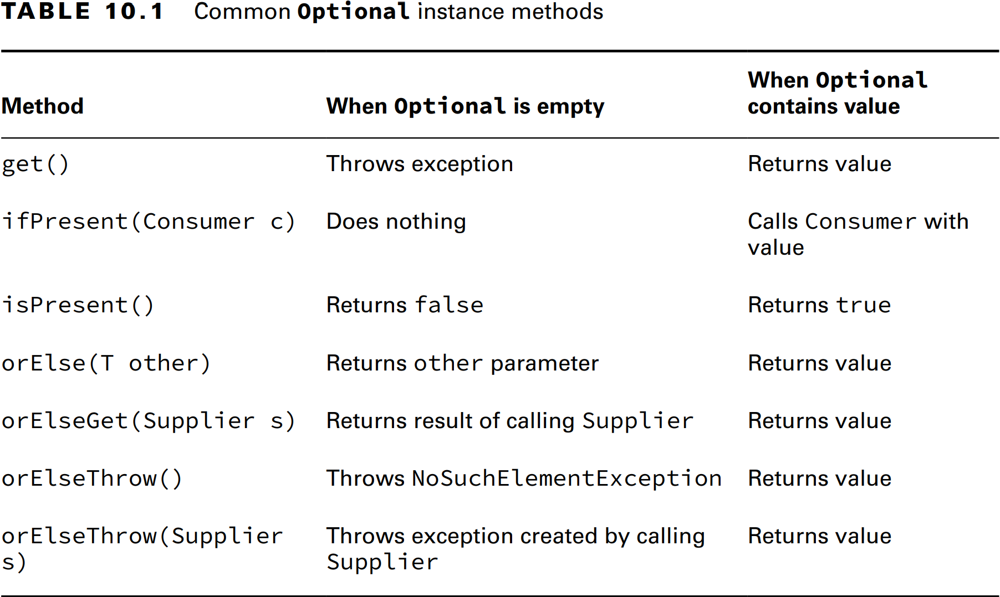

### _Chapter 10: Streams_

---
### `Optionals`

**Creating an Optional**
```java
public static void main(String[] args) {
    System.out.println(average(90, 100)); // Optional[95.0]
    System.out.println(average());                  // Optional.empty

    Optional<Double> average = average(90, 100);
    if (average.isPresent()) {
    System.out.println(average.get()); // 95.0
    }

    System.out.println(average().get()); // NoSuchElementException
}

public static Optional<Double> average(int... scores) {
    if (scores.length == 0)
        return Optional.empty();
    int sum = 0;
    for (int score : scores) {
        sum += score;
    }
    return Optional.of((double) (sum / scores.length));
}
```

- **Optional.ofNullable()**

_Optional.of()_' methodu **null** değere sahip bir değişken ile çağrılırsa _NullPointerException_ fırlatır.
Bunu engellemek için _Optional.ofNullable()_ kullanılır.
```java
public static Optional<String> getValue0(String value) {
    return Optional.of(value); // NullPointerException
}

public static Optional<String> getValue1(String value) {
    return value == null ? Optional.empty() : Optional.of(value); // Optional.empty
}

public static Optional<String> getValue2(String value) {
    return Optional.ofNullable(value); // Optional.empty
}
```

**Table 10.1** Common **Optional** instance methods


```java
public static void main(String[] args) {
    Optional<Double> average = average(90, 100);
    if (average.isPresent()) {
        System.out.println(average.get()); // 95.0
    }

    average.ifPresent(System.out::println); // 95.0
    average.ifPresentOrElse(System.out::println, () -> System.out.println("Empty")); // 95.0

    average = average();
    System.out.println(average.orElse(0.0)); // 0.0
    System.out.println(average.orElseGet(() -> Math.random())); // 0.52
    System.out.println(average.orElseThrow()); // NoSuchElementException
    System.out.println(average.orElseThrow(() -> new NullPointerException())); // NullPointerException
}

public static Optional<Double> average(int... scores) {
    if (scores.length == 0)
        return Optional.empty();
    int sum = 0;
    for (int score : scores) {
        sum += score;
    }
    return Optional.of((double) (sum / scores.length));
}
```

---
### `Using Streams`

_Stream_'ler 3 parçadan oluşur. _Source_, _Intermediate operations_ ve _Terminal operations_. 
Stream'ler <u>Lazy evaluate</u> yapıdadır. _Terminal operations_ çağrılana kadar _Intermediate operations_'lar çalışmaz.

Eğer bir stream tüketilmiş ise aynı streami tekrar kullanamayız.


**Table 10.2** Intermediate vs. Terminal operations


**Creating Stream Sources**

Java'da streamler **java.util.stream.Stream<T>** arayüzü tarafından temsil edilir.

- **Finite Streams**
```java
Stream<String> empty = Stream.empty();
Stream<Integer> singleElement = Stream.of(1);
Stream<Integer> fromArray = Stream.of(1, 2, 3);
Stream<String> fromList = List.of("a", "b", "c").stream();

System.out.println(empty.count());         // 0
System.out.println(singleElement.count()); // 1
System.out.println(fromArray.count());     // 3
System.out.println(fromList.count());      // 3
```

- **Infinite Streams**

Sonsuz bir stream oluşturmak için _**Stream.generate()**_ ve _**Stream.iterate()**_ methodlarını kullanailiriz.
```java
Stream<Double> randoms = Stream.generate(Math::random);
randoms.forEach(System.out::println);

Stream<Integer> iterate = Stream.iterate(0, i -> i + 1);
iterate.forEach(System.out::println);

// Generates from 0 to 99
Stream<Integer> iterateUntil100 = Stream.iterate(
        0,            // seed
        i -> i < 100, // Predicate
        i -> i + 1    // UnaryOperator
);
iterateUntil100.forEach(System.out::println);
```

**Table 10.3** Creating a source


**Common Terminal Operations**

**Table 10.3** Terminal stream operations


&#20; **Counting**
```java
Stream<String> s = Stream.of("monkey", "gorilla", "dog");
System.out.println(s.count()); // 3
```

&#20; **min() and max()**
```java
Stream<String> s = Stream.of("monkey", "gorilla", "dog");

s.min((s1, s2) -> s1.length() - s2.length())
        .ifPresent(System.out::println); // dog

s.max(Comparator.comparingInt(String::length))
        .ifPresent(System.out::println); // gorilla

Stream<Integer> s = Stream.of(1, 2, 3);
s.min((a, b) -> a.compareTo(b))
        .ifPresent(System.out::println); // 1

s.max(Integer::compareTo)
        .ifPresent(System.out::println); // 3

```

&#20; **findAny() and findFirst()**
```java
Stream<String> s = Stream.of("monkey", "gorilla", "dog");

s.findAny().ifPresent(System.out::println);   // monkey (usually)
s.findFirst().ifPresent(System.out::println); // monkey****
```

&#20; **anyMatch(), allMatch() and noneMatch()**
```java
var list = List.of("monkey", "2", "chimp");
Stream<String> infinite = Stream.generate(() -> "chimp");
Predicate<String> pred = x -> Character.isLetter(x.charAt(0));

System.out.println(list.stream().anyMatch(pred));  // true
System.out.println(list.stream().allMatch(pred));  // false
System.out.println(list.stream().noneMatch(pred)); // false
System.out.println(infinite.anyMatch(pred));       // true
```

&#20; **forEach()**
```java
Stream<String> stream = Stream.of("monkey", "gorilla", "dog");
stream.forEach(System.out::print); // monkeygorilladog

Stream<Integer> s = Stream.of(1);
for (Integer i : s) {} // DOES NOT COMPILE
```