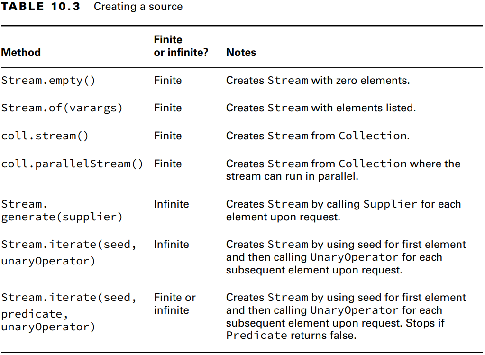
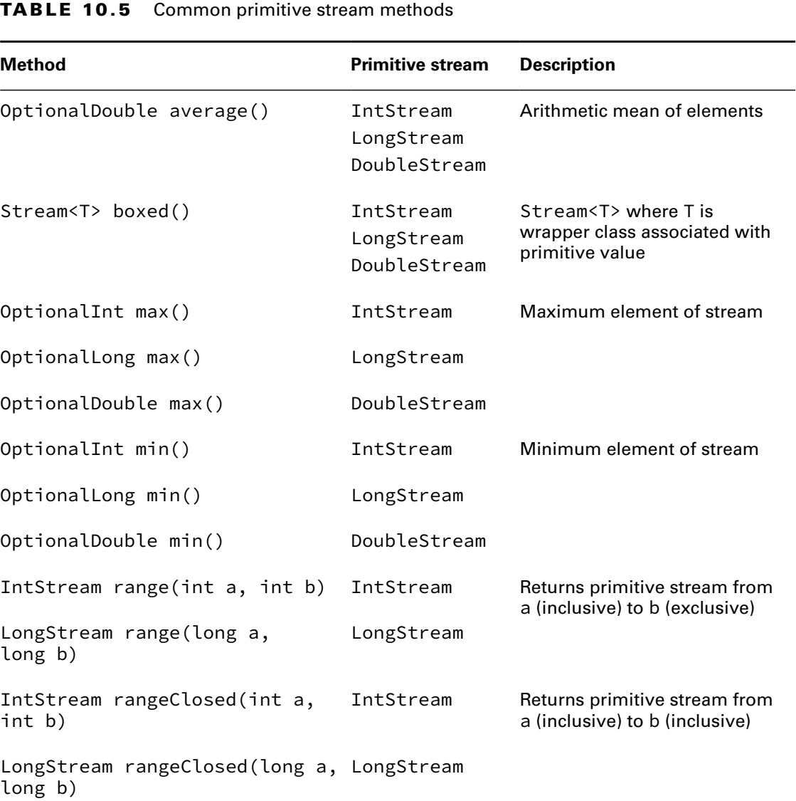

### _Chapter 10: Streams_

---
### `Optionals`

**Creating an Optional**
```java
public static void main(String[] args) {
    System.out.println(average(90, 100)); // Optional[95.0]
    System.out.println(average());                  // Optional.empty

    Optional<Double> average = average(90, 100);
    if (average.isPresent()) {
    System.out.println(average.get()); // 95.0
    }

    System.out.println(average().get()); // NoSuchElementException
}

public static Optional<Double> average(int... scores) {
    if (scores.length == 0)
        return Optional.empty();
    int sum = 0;
    for (int score : scores) {
        sum += score;
    }
    return Optional.of((double) (sum / scores.length));
}
```

- **Optional.ofNullable()**

_Optional.of()_' methodu **null** değere sahip bir değişken ile çağrılırsa _NullPointerException_ fırlatır.
Bunu engellemek için _Optional.ofNullable()_ kullanılır.
```java
public static Optional<String> getValue0(String value) {
    return Optional.of(value); // NullPointerException
}

public static Optional<String> getValue1(String value) {
    return value == null ? Optional.empty() : Optional.of(value); // Optional.empty
}

public static Optional<String> getValue2(String value) {
    return Optional.ofNullable(value); // Optional.empty
}
```

**Table 10.1** Common **Optional** instance methods


```java
public static void main(String[] args) {
    Optional<Double> average = average(90, 100);
    if (average.isPresent()) {
        System.out.println(average.get()); // 95.0
    }

    average.ifPresent(System.out::println); // 95.0
    average.ifPresentOrElse(System.out::println, () -> System.out.println("Empty")); // 95.0

    average = average();
    System.out.println(average.orElse(0.0)); // 0.0
    System.out.println(average.orElseGet(() -> Math.random())); // 0.52
    System.out.println(average.orElseThrow()); // NoSuchElementException
    System.out.println(average.orElseThrow(() -> new NullPointerException())); // NullPointerException
}

public static Optional<Double> average(int... scores) {
    if (scores.length == 0)
        return Optional.empty();
    int sum = 0;
    for (int score : scores) {
        sum += score;
    }
    return Optional.of((double) (sum / scores.length));
}
```

---
### `Using Streams`

_Stream_'ler 3 parçadan oluşur. _Source_, _Intermediate operations_ ve _Terminal operations_. 
Stream'ler <u>Lazy evaluate</u> yapıdadır. _Terminal operations_ çağrılana kadar _Intermediate operations_'lar çalışmaz.

Eğer bir stream tüketilmiş ise aynı streami tekrar kullanamayız.


**Table 10.2** Intermediate vs. Terminal operations


**Creating Stream Sources**

Java'da streamler **java.util.stream.Stream<T>** arayüzü tarafından temsil edilir.

- **Finite Streams**
```java
Stream<String> empty = Stream.empty();
Stream<Integer> singleElement = Stream.of(1);
Stream<Integer> fromArray = Stream.of(1, 2, 3);
Stream<String> fromList = List.of("a", "b", "c").stream();

System.out.println(empty.count());         // 0
System.out.println(singleElement.count()); // 1
System.out.println(fromArray.count());     // 3
System.out.println(fromList.count());      // 3
```

- **Infinite Streams**

Sonsuz bir stream oluşturmak için _**Stream.generate()**_ ve _**Stream.iterate()**_ methodlarını kullanailiriz.
```java
Stream<Double> randoms = Stream.generate(Math::random);
randoms.forEach(System.out::println);

Stream<Integer> iterate = Stream.iterate(0, i -> i + 1);
iterate.forEach(System.out::println);

// Generates from 0 to 99
Stream<Integer> iterateUntil100 = Stream.iterate(
        0,            // seed
        i -> i < 100, // Predicate
        i -> i + 1    // UnaryOperator
);
iterateUntil100.forEach(System.out::println);
```

**Table 10.3** Creating a source


**Common Terminal Operations**

**Table 10.3** Terminal stream operations


&#20; **Counting**
```java
Stream<String> s = Stream.of("monkey", "gorilla", "dog");
System.out.println(s.count()); // 3
```

&#20; **min() and max()**
```java
Stream<String> s = Stream.of("monkey", "gorilla", "dog");

s.min((s1, s2) -> s1.length() - s2.length())
        .ifPresent(System.out::println); // dog

s.max(Comparator.comparingInt(String::length))
        .ifPresent(System.out::println); // gorilla

Stream<Integer> s = Stream.of(1, 2, 3);
s.min((a, b) -> a.compareTo(b))
        .ifPresent(System.out::println); // 1

s.max(Integer::compareTo)
        .ifPresent(System.out::println); // 3

```

&#20; **findAny() and findFirst()**
```java
Stream<String> s = Stream.of("monkey", "gorilla", "dog");

s.findAny().ifPresent(System.out::println);   // monkey (usually)
s.findFirst().ifPresent(System.out::println); // monkey****
```

&#20; **anyMatch(), allMatch() and noneMatch()**
```java
var list = List.of("monkey", "2", "chimp");
Stream<String> infinite = Stream.generate(() -> "chimp");
Predicate<String> pred = x -> Character.isLetter(x.charAt(0));

System.out.println(list.stream().anyMatch(pred));  // true
System.out.println(list.stream().allMatch(pred));  // false
System.out.println(list.stream().noneMatch(pred)); // false
System.out.println(infinite.anyMatch(pred));       // true
```

&#20; **forEach()**
```java
Stream<String> stream = Stream.of("monkey", "gorilla", "dog");
stream.forEach(System.out::print); // monkeygorilladog

Stream<Integer> s = Stream.of(1);
for (Integer i : s) {} // DOES NOT COMPILE
```

&#20; **reduce()**
```java
public T reduce(T identity, BinaryOperator<T> accumulator);
public Optional<T> reduce(BinaryOperator<T> accumulator);
public <U> U reduce(U identity, BiFunction<U,? super T,U> accumulator, BinaryOperator<U> combiner);
```

```java
Stream<String> stream = Stream.of("w", "o", "l", "f");
String reduce = stream.reduce("", (a, b) -> a + b);
System.out.println(reduce);    // wolf

Optional<String> opt = stream.reduce((a, b) -> a + b);
System.out.println(opt.get()); // wolf
```

Parallel stream olmadığı sürece _BinaryOperator\<U> combiner_ parametresine ait kod yürütülmez.
```java
Stream<String> stream = Stream.of("monkey", "gorilla", "dog");
Integer length = stream.reduce(0, (i, s) -> i + s.length(), (a, b) -> {
    System.out.println("Not used. Not a parallel stream!");
    return a + b;
});
System.out.println(length); // 16


Stream<String> stream = Stream.of("monkey", "gorilla", "dog");
Integer length = stream.parallel().reduce(0, (i, s) -> i + s.length(), (a, b) -> {
    System.out.println("Now used: " + a + " " + b); // Now used: 7 3    Now used: 6 10
    return a + b;
});
System.out.println(length); // 16
```

Farklı tiplerde parametreler ile işlem yapabilmek için mutlaka 3. overloaded reduce'u kullanmak gerekiyor
```java
Stream<User> users = Stream.of(new User("John", 25), new User("Julie", 35));

// int total = users.reduce(0, (i, user) -> i + user.age()); // DOES NOT COMPILE

int total = users.reduce(0, (i, user) -> i + user.age(), Integer::sum);
System.out.println(total); // 60
```

&#20; **collect()**

- Reduction'ın belirli bir tipidir.
- _Mutable reduction_ olarak adlandırılabilir.
- Normal reductiona göre daha verimlidir. Çünkü accumulating işlemi sırasında aynı mutable objeyi kullanır.
- 3 paremetreli collect() methodunun 3. parametresi sadece parallel streamlerde yürütülür.
```java
public <R,A> R collect(Collector<? super T, A,R> collector);
public <R> R collect(Supplier<R> supplier, BiConsumer<R, ? super T> accumulator, BiConsumer<R, R> combiner);
```

```java
Stream<String> stream = Stream.of("monkey", "gorilla", "dog");
// StringBuilder result = stream.collect(() -> new StringBuilder(), (a, b) -> a.append(b), (a, b) -> a.append(b));
StringBuilder result = stream.collect(StringBuilder::new, StringBuilder::append, StringBuilder::append);
System.out.println(result); // monkeygorilladog
```

```java
Stream<String> stream = Stream.of("monkey", "gorilla", "dog");

Supplier<StringBuilder> supplier = () -> new StringBuilder();
BiConsumer<StringBuilder, String> accumulator = (StringBuilder sb, String s) -> sb.append(s);
BiConsumer<StringBuilder, StringBuilder> combiner = (StringBuilder sb1, StringBuilder sb2) -> sb1.append(sb2);

StringBuilder result = stream.parallel()
                             .collect(supplier, accumulator, combiner);
System.out.println(result); // monkeygorilladog
```

```java
Stream<String> stream = Stream.of("monkey", "gorilla", "dog");
TreeSet<String> set = stream.collect(
        TreeSet::new,
        TreeSet::add, // (TreeSet<String> ts, String s) -> ts.add(s),
        TreeSet::addAll
);
System.out.println(set); // [dog, gorilla, monkey]
```

```java
public static void main(String[] args) {
    List<String> list1 = stream().collect(Collectors.toList());
    List<String> list2 = stream().toList();
    Set<String> set = stream().collect(Collectors.toSet());
    TreeSet<String> treeSet = stream().collect(Collectors.toCollection(TreeSet::new));
}

private static Stream<String> stream() {
    return Stream.of("monkey", "gorilla", "dog");
}
```

**Common Intermediate Operations**

&#20; **filter()**
```java
Stream<String> stream = Stream.of("monkey", "gorilla", "donkey");
stream.filter(s -> s.contains("e"))
        .forEach(System.out::print); // monkeydonkey

Stream<Integer> stream = Stream.iterate(0, i -> i < 10, i -> i + 1);
stream.filter(i -> i % 2 == 0)
        .forEach(System.out::print); // 02468
```

&#20; **distinct()**
```java
Stream<String> stream = Stream.of("duck", "duck", "duck", "goose");
stream.distinct()
    .forEach(System.out::print); // duckgoose
```

&#20; **skip()** and **limit()**
```java
Stream.iterate(1, n -> n + 1)
        .skip(5)
        .limit(2)
        .forEach(System.out::print); // 67
```

&#20; **map()**
```java
Stream<String> stream = Stream.of("monkey", "gorilla", "dog");
stream.map(String::length)
        .forEach(System.out::print); // 673

Stream.iterate(1, i -> i < 5, i -> ++i)
        .map(i -> i * 10)
        .forEach(System.out::print); // 10203040

Stream.of("1", "2", "3", "4")
        .map(Integer::parseInt)
        .map(i -> i * 10)
        .forEach(System.out::print); // 10203040
```

&#20; **flatMap()**

flatMap() paremetre olarak stream alır.
```java
var zero = List.of();
var one = List.of("Bonobo");
var two = List.of("Mama Gorilla", "Baby Gorilla");

Stream<List<?>> listStream = Stream.of(zero, one, two);
listStream.flatMap(s -> s.stream())
        .forEach(System.out::println);
/*
Bonobo
Mama Gorilla
Baby Gorilla
*/
```

```java
String[] text = "java is the best over the world!".split(" ");
Arrays.stream(text)
        .map(w -> w.split("")) // Stream<String[]>
        .distinct()
        .forEach(System.out::print); // [Ljava.lang.String;@448139f0[Ljava.lang.String;@7cca494b ...

Arrays.stream(text)
        .flatMap(w -> Arrays.stream(w.split("")))
        .distinct()
        .forEach(System.out::print); // javistheborwld!
```

```java
Stream.of(List.of(1, 2), List.of(3, 4), List.of(5))
        .forEach(System.out::print); // [1, 2][3, 4][5]

Stream.of(List.of(1, 2), List.of(3, 4), List.of(5))
        .flatMap(List::stream)
        .forEach(System.out::print); // 12345
```

```java
String[] a1 = {"1", "2"};
String[] a2 = {"3", "4"};
String[] a3 = {"5"};

List<String[]> list = List.of(a1, a2, a3);
list.stream()
        .forEach(System.out::print); // [Ljava.lang.String;@404b9385[Ljava.lang.String;...

list.stream()
        .flatMap(Arrays::stream)
        .forEach(System.out::print); // 12345
```

&#20; **Stream.concat()**

Sadece iki streami concat edebiliriz.
```java
var one = Stream.of("a");
var two = Stream.of("b", "c");

Stream.concat(one, two)
        .forEach(System.out::print); // abc
```

&#20; **sorted()**

```java
public Stream<T> sorted();
public Stream<T> sorted(Comparator<? super T> comparator);
```

```java
Stream.of("d", "c", "a", "b")
        .sorted()
        .forEach(System.out::print); // abcd

Stream.of("d", "c", "a", "b")
        .sorted(Comparator.reverseOrder())
        .forEach(System.out::print); // dcba
```

```java
String text = "java is the best over the world!";
Comparator<String> byLength = (s1, s2) -> s1.length() - s2.length();
        Arrays.stream(text.split(" "))
        .distinct()
        .sorted(byLength.thenComparing(Comparator.naturalOrder()))
        .forEach(System.out::println);
```

&#20; **peek()**
```java
public Stream<T> peek(Consumer<? super T> action);
```

Java'nın yeni versiyonlarında **peek()** methodu **filter()** olmadan **count()** methodu ile çalışmıyor.
```java
long count = Stream.of("black bear", "brown bear", "grizzly")
        .filter(s -> s.contains("a"))
        .peek(System.out::println)
         /*
         black bear
         brown bear
         */
        .count();
System.out.println(count); // 2
```

---
### `Primitive Streams`

Üç adet primitive stream vardır. **IntStream**, **LongStream** ve **DoubleStream**.

**IntStream**: **int**, **short**, **byte** ve **char** için kullanılır.<br/>
**LongStream**: **long** için kullanılır.<br/>
**DoubleStream**: **double** ve **float** için kullanılır.
```java
Integer reduce = Stream.of(1, 2, 3)
        .reduce(0, (a, b) -> a + b);

int sum = Stream.of(1, 2, 3)
        .mapToInt(x -> x)
        .sum();

OptionalDouble average = Stream.of(1, 2, 3)
        .mapToInt(x -> x)
        .average();

System.out.println(reduce);                // 6
System.out.println(sum);                   // 6
System.out.println(average.getAsDouble()); // 2.0
```

**Table 10.5** Common primitive stream methods<br/>
<br/>


```java
DoubleStream empty = DoubleStream.empty();
System.out.println(empty);             // java.util.stream.DoublePipeline$Head@41629346

DoubleStream oneValue = DoubleStream.of(3.14);
oneValue.forEach(System.out::println); // 3.14

DoubleStream varargs = DoubleStream.of(1.0, 1.1, 1.2);
varargs.forEach(System.out::println);  // 1.0 1.1 1.2

IntStream.range(1, 5)
        .forEach(System.out::print); // 1234
        
LongStream.rangeClosed(1, 5)
        .forEach(System.out::print); // 12345
```

**Mapping Streams**

**Table 10.6** Mapping methods between types of streams


```java
Stream.of("Java", "Spring", "Hibernate")
        .mapToInt(String::length)
        .forEach(System.out::println); // 4 6 9

Stream.of("Java", "Spring", "Hibernate")
        .mapToDouble(String::length)
        .forEach(System.out::println); // 4 6 9

Stream.of("Java", "Spring", "Hibernate")
        .mapToLong(String::length)
        .forEach(System.out::println); // 4 6 9

private static Stream<Integer> mapping(IntStream intStream) {
    return intStream.mapToObj(x -> x);
}

private static Stream<Integer> boxing(IntStream intStream) {
    return intStream.boxed();
}
```

**Optional with Primitive Streams**

Optional<Double> ile OptionalDouble arasında ki fark; Optional<Double> wrapper sınıflar için OptionalDouble ise 
primitive'ler için.
```java
OptionalDouble average = IntStream.rangeClosed(1, 10)
                .average();
average.ifPresent(System.out::println);
System.out.println(average.getAsDouble());
System.out.println(average.orElseGet(() -> Double.NaN));
```

**Table 10.8** Optional types for primitives


**Summarizing Statistic**
```java
IntStream intStream = IntStream.rangeClosed(1, 10);
IntSummaryStatistics statistics = intStream.summaryStatistics();

System.out.println(statistics.getCount());   // 10
System.out.println(statistics.getAverage()); // 5.5
System.out.println(statistics.getSum());     // 55
System.out.println(statistics.getMin());     // 1
System.out.println(statistics.getMax());     // 10
```

---
### `Advanced Stream Pipeline Concepts`

Stream'ler _lazy evaluate_'dir. Yani terminal operasyon çağrılanan kadar oluşturulmazlar. Aşağıda ki kodda 4. satırda
stream ifadesi olsa bile oluşturulmaz. Stream 6. satırda terminal operation çağrıldığında oluşturulur. Bu yüzden count()
methodu konsola 3 yazdırır.
```java
1: var cats = new ArrayList<String>();
2: cats.add("Annie");
3: cats.add("Ripley");
4: var stream = cats.stream();
5: cats.add("KC");
6: System.out.println(stream.count()); // 3
```

**Chaining Optionals**

_map()_, _flatMap()_ ve _filter()_'ı optional ile birlikte kullanabiliriz.
```java
private static void threeDigit(Optional<Integer> optional) {
    if (optional.isPresent()) {
        var num = optional.get();
        var string = "" + num;
        if (string.length() == 3) {
            System.out.println(string);
        }
    }
}

private static void threeDigitV1(Optional<Integer> optional) {
    optional.map(x -> "" + x)
            .filter(x -> x.length() == 3)
            .ifPresent(System.out::println);
}

private static void stringLength(Optional<String> optional) {
    Optional<Integer> result = optional.map(String::length);
    result.ifPresent(System.out::println);
}
```

```java
public static void main(String[] args) {
    Optional<Integer> optional = Optional.of(100);

    Optional<Integer> result = optional.flatMap(Test::calculator);
    System.out.println(result.get());        // 1000

    Optional<Optional<Integer>> result1 = optional.map(Test::calculator);
    System.out.println(result1.get().get()); // 1000
}

private static Optional<Integer> calculator(Integer opt) {
    return Optional.of(opt * 10);
}
```

> **Checked Exceptions and Functional Interfaces**
>```java
>public class ExceptionCaseStudy {
>    private static List<String> create() throws IOException {
>        throw new IOException();
>    }
>
>    private static List<String> createSafe() {
>        try {
>            return create();
>        } catch (IOException e) {
>            throw new RuntimeException(e);
>        }
>    }
>
>    private void good() throws IOException {
>        ExceptionCaseStudy.create().stream().count();
>    }
>
>    public void bad() throws IOException {
>        Supplier<List<String>> supplier = ExceptionCaseStudy::create; // DOES NOT COMPILE
>    }
>
>    public void ugly() {
>        Supplier<List<String>> supplier = () -> {
>            try {
>                return ExceptionCaseStudy.create();
>            } catch (IOException e) {
>                throw new RuntimeException();
>            }
>        };
>    }
>
>    public void best() {
>        Supplier<List<String>> supplier = ExceptionCaseStudy::createSafe;
>    }
>}
>```

**Spliterator**

Spliterator, list, Arrays veya stream üzerinden çağrılabilir.

**Table 10.9** Spliterator methods


&#20; **trySplit()**: Datanın yarısını içeren bir Spliterator döner. Birden çok sefer çağrılabilir. Split edilebilecek
bir veri kalmadığında ise **null** döner.

&#20; **tryAdvance()**: Spliterator' de kalan eleman varsa tek bir elemanı işler. Elemen işlenme durumuna göre 
**true** veya **false** döner.

&#20; **forEachRemaining()**: Spliterator' de kalan elemanları işler.

```java
var stream = List.of("bird-", "bunny-", "cat-", "dog-", "fish-", "lamb-", "mouse-");

Spliterator<String> originalBagOfFood = stream.spliterator();

Spliterator<String> emmasBag = originalBagOfFood.trySplit();
emmasBag.forEachRemaining(System.out::print); // bird-bunny-cat-

System.out.println();

Spliterator<String> jillsBag = originalBagOfFood.trySplit();
jillsBag.tryAdvance(System.out::println);     // dog-
jillsBag.forEachRemaining(System.out::print); // fish-
```


---
### `Collecting Results`

&#20; **joining()**

```java
public static Collector<CharSequence, ?, String> joining()
public static Collector<CharSequence, ?, String> joining(CharSequence delimiter)
public static Collector<CharSequence, ?, String> joining(CharSequence delimiter, CharSequence prefix, CharSequence suffix)

    
public static void main(String[] args) {
    String s1 = stream()
             .collect(Collectors.joining());

    String s2 = stream()
            .collect(Collectors.joining(", "));

    String s3 = stream()
            .collect(Collectors.joining(",", "{", "}"));

    System.out.println(s1); // lionstigersbears
    System.out.println(s2); // lions, tigers, bears
    System.out.println(s3); // {lions,tigers,bears}
}

private static Stream<String> stream() {
    return Stream.of("lions", "tigers", "bears");
}
```