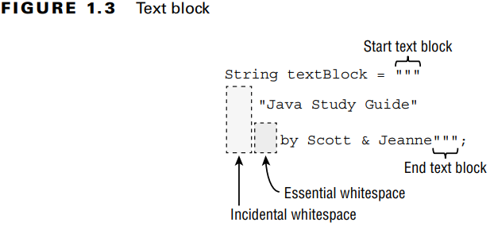
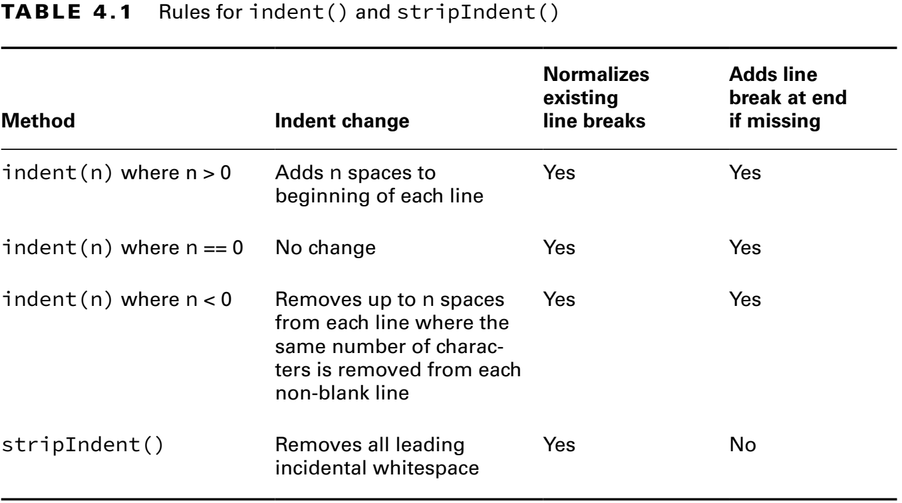

### The Final Notes

```diff
- Text Blocks
````
---
### `@Text Blocks (ch01)`

* _Incidental Whitespace_: Sonuca bir etkisi yoktur. Sadece kod okunabilirliğini artırmak için eklenebilir.
* _Essential Whitespace_: Çıktıya etki eder.

Text içerisinde en solda ki karakterden bir çizgi çekilir (IDE üzerinde görlebilir). Bu çizginin solunda kalan kısım
_incidental_ sağında kalan kısım ise _essential_ whitespace olur.

**Figure 1.3** Text Block



* Text block içerisinde _\\"""_ ve _\\"\\"\\"_ aynı anlama gelir (_"""_). Ama tek başına _"""_ tanımlaması derlenemez.

---
#### `@Text Blocks (ch01)`
-  **indent()** _and_ **stripIndent()**
   **indent()** methodu;
  - Pozitif bir sayı ile çağrılırsa, her satırın başına eşit sayıda boşluk ekler.
  - Negatif bir sayı ile çağrılırsa, her satırın başından o sayıdaki boşluk karakterini silmeye çalışır.
  - 0 ile çağrılırsa bir etkisi olmayacaktır.
  - Boşluk karakterlerini normalize eder.
  - Satır sonu karakteri (Windows için satır sonu **_\r\n_**, Mac için satır sonu **_\n_**) var ise normalize eder. (_Normalize_: **_\n_**)
  - Satır sonu karakteri (**_\n_**) yoksa ekler.

- **stripIndent()** methodu;
  - Başta bulunan tüm tesadüfi boşlukları siler.
  - Satır sonu karakteri var ise normalize eder.
  - Satır sonu karakteri yok ise <u>eklemez</u>.

_**Table 4.1** Rules for indent() and stripIndent()_



```diff
- text in red
+ text in green
! text in orange
# text in gray
@@ text in purple (and bold)@@
```